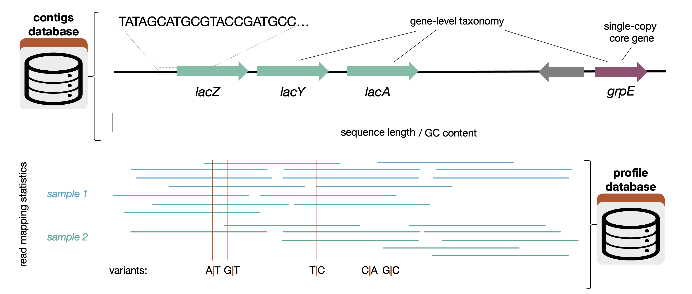




A DB-type anvi'o artifact. This artifact is typically generated, used, and/or exported **by anvi'o** (and not provided by the user)..

🔙 **[To the main page](../../)** of anvi'o programs and artifacts.

## Provided by


<p style="text-align: left" markdown="1"><span class="artifact-p">[anvi-gen-contigs-database](../../programs/anvi-gen-contigs-database)</span></p>


## Required or used by


<p style="text-align: left" markdown="1"><span class="artifact-r">[anvi-cluster-contigs](../../programs/anvi-cluster-contigs)</span> <span class="artifact-r">[anvi-compute-completeness](../../programs/anvi-compute-completeness)</span> <span class="artifact-r">[anvi-db-info](../../programs/anvi-db-info)</span> <span class="artifact-r">[anvi-delete-functions](../../programs/anvi-delete-functions)</span> <span class="artifact-r">[anvi-delete-hmms](../../programs/anvi-delete-hmms)</span> <span class="artifact-r">[anvi-display-contigs-stats](../../programs/anvi-display-contigs-stats)</span> <span class="artifact-r">[anvi-display-metabolism](../../programs/anvi-display-metabolism)</span> <span class="artifact-r">[anvi-display-structure](../../programs/anvi-display-structure)</span> <span class="artifact-r">[anvi-estimate-genome-completeness](../../programs/anvi-estimate-genome-completeness)</span> <span class="artifact-r">[anvi-estimate-metabolism](../../programs/anvi-estimate-metabolism)</span> <span class="artifact-r">[anvi-estimate-scg-taxonomy](../../programs/anvi-estimate-scg-taxonomy)</span> <span class="artifact-r">[anvi-estimate-trna-taxonomy](../../programs/anvi-estimate-trna-taxonomy)</span> <span class="artifact-r">[anvi-export-contigs](../../programs/anvi-export-contigs)</span> <span class="artifact-r">[anvi-export-functions](../../programs/anvi-export-functions)</span> <span class="artifact-r">[anvi-export-gene-calls](../../programs/anvi-export-gene-calls)</span> <span class="artifact-r">[anvi-export-gene-coverage-and-detection](../../programs/anvi-export-gene-coverage-and-detection)</span> <span class="artifact-r">[anvi-export-locus](../../programs/anvi-export-locus)</span> <span class="artifact-r">[anvi-export-misc-data](../../programs/anvi-export-misc-data)</span> <span class="artifact-r">[anvi-export-splits-and-coverages](../../programs/anvi-export-splits-and-coverages)</span> <span class="artifact-r">[anvi-export-splits-taxonomy](../../programs/anvi-export-splits-taxonomy)</span> <span class="artifact-r">[anvi-gen-fixation-index-matrix](../../programs/anvi-gen-fixation-index-matrix)</span> <span class="artifact-r">[anvi-gen-gene-consensus-sequences](../../programs/anvi-gen-gene-consensus-sequences)</span> <span class="artifact-r">[anvi-gen-gene-level-stats-databases](../../programs/anvi-gen-gene-level-stats-databases)</span> <span class="artifact-r">[anvi-gen-structure-database](../../programs/anvi-gen-structure-database)</span> <span class="artifact-r">[anvi-gen-variability-profile](../../programs/anvi-gen-variability-profile)</span> <span class="artifact-r">[anvi-get-aa-counts](../../programs/anvi-get-aa-counts)</span> <span class="artifact-r">[anvi-get-codon-frequencies](../../programs/anvi-get-codon-frequencies)</span> <span class="artifact-r">[anvi-get-codon-usage-bias](../../programs/anvi-get-codon-usage-bias)</span> <span class="artifact-r">[anvi-get-metabolic-model-file](../../programs/anvi-get-metabolic-model-file)</span> <span class="artifact-r">[anvi-get-pn-ps-ratio](../../programs/anvi-get-pn-ps-ratio)</span> <span class="artifact-r">[anvi-get-sequences-for-gene-calls](../../programs/anvi-get-sequences-for-gene-calls)</span> <span class="artifact-r">[anvi-get-sequences-for-hmm-hits](../../programs/anvi-get-sequences-for-hmm-hits)</span> <span class="artifact-r">[anvi-get-short-reads-from-bam](../../programs/anvi-get-short-reads-from-bam)</span> <span class="artifact-r">[anvi-get-short-reads-mapping-to-a-gene](../../programs/anvi-get-short-reads-mapping-to-a-gene)</span> <span class="artifact-r">[anvi-get-split-coverages](../../programs/anvi-get-split-coverages)</span> <span class="artifact-r">[anvi-import-collection](../../programs/anvi-import-collection)</span> <span class="artifact-r">[anvi-import-functions](../../programs/anvi-import-functions)</span> <span class="artifact-r">[anvi-import-misc-data](../../programs/anvi-import-misc-data)</span> <span class="artifact-r">[anvi-import-taxonomy-for-genes](../../programs/anvi-import-taxonomy-for-genes)</span> <span class="artifact-r">[anvi-inspect](../../programs/anvi-inspect)</span> <span class="artifact-r">[anvi-interactive](../../programs/anvi-interactive)</span> <span class="artifact-r">[anvi-merge](../../programs/anvi-merge)</span> <span class="artifact-r">[anvi-migrate](../../programs/anvi-migrate)</span> <span class="artifact-r">[anvi-profile](../../programs/anvi-profile)</span> <span class="artifact-r">[anvi-profile-blitz](../../programs/anvi-profile-blitz)</span> <span class="artifact-r">[anvi-reaction-network](../../programs/anvi-reaction-network)</span> <span class="artifact-r">[anvi-refine](../../programs/anvi-refine)</span> <span class="artifact-r">[anvi-rename-bins](../../programs/anvi-rename-bins)</span> <span class="artifact-r">[anvi-run-cazymes](../../programs/anvi-run-cazymes)</span> <span class="artifact-r">[anvi-run-hmms](../../programs/anvi-run-hmms)</span> <span class="artifact-r">[anvi-run-interacdome](../../programs/anvi-run-interacdome)</span> <span class="artifact-r">[anvi-run-kegg-kofams](../../programs/anvi-run-kegg-kofams)</span> <span class="artifact-r">[anvi-run-ncbi-cogs](../../programs/anvi-run-ncbi-cogs)</span> <span class="artifact-r">[anvi-run-pfams](../../programs/anvi-run-pfams)</span> <span class="artifact-r">[anvi-run-scg-taxonomy](../../programs/anvi-run-scg-taxonomy)</span> <span class="artifact-r">[anvi-run-trna-taxonomy](../../programs/anvi-run-trna-taxonomy)</span> <span class="artifact-r">[anvi-scan-trnas](../../programs/anvi-scan-trnas)</span> <span class="artifact-r">[anvi-search-functions](../../programs/anvi-search-functions)</span> <span class="artifact-r">[anvi-search-palindromes](../../programs/anvi-search-palindromes)</span> <span class="artifact-r">[anvi-search-sequence-motifs](../../programs/anvi-search-sequence-motifs)</span> <span class="artifact-r">[anvi-show-misc-data](../../programs/anvi-show-misc-data)</span> <span class="artifact-r">[anvi-split](../../programs/anvi-split)</span> <span class="artifact-r">[anvi-summarize](../../programs/anvi-summarize)</span> <span class="artifact-r">[anvi-summarize-blitz](../../programs/anvi-summarize-blitz)</span> <span class="artifact-r">[anvi-update-db-description](../../programs/anvi-update-db-description)</span> <span class="artifact-r">[anvi-update-structure-database](../../programs/anvi-update-structure-database)</span> <span class="artifact-r">[anvi-script-add-default-collection](../../programs/anvi-script-add-default-collection)</span> <span class="artifact-r">[anvi-script-estimate-metabolic-independence](../../programs/anvi-script-estimate-metabolic-independence)</span> <span class="artifact-r">[anvi-script-filter-hmm-hits-table](../../programs/anvi-script-filter-hmm-hits-table)</span> <span class="artifact-r">[anvi-script-gen-distribution-of-genes-in-a-bin](../../programs/anvi-script-gen-distribution-of-genes-in-a-bin)</span> <span class="artifact-r">[anvi-script-gen-genomes-file](../../programs/anvi-script-gen-genomes-file)</span> <span class="artifact-r">[anvi-script-gen_stats_for_single_copy_genes.py](../../programs/anvi-script-gen_stats_for_single_copy_genes.py)</span> <span class="artifact-r">[anvi-script-get-hmm-hits-per-gene-call](../../programs/anvi-script-get-hmm-hits-per-gene-call)</span> <span class="artifact-r">[anvi-script-merge-collections](../../programs/anvi-script-merge-collections)</span> <span class="artifact-r">[anvi-script-permute-trnaseq-seeds](../../programs/anvi-script-permute-trnaseq-seeds)</span></p>


## Description

A contigs database is an anvi'o database that **contains key information associated with your sequences**.

In a way, **an anvi'o contigs database is a modern, more talented form of a FASTA file**, where you can store additional information about your sequences in it and others can query and use it. Information storage and access is primarily done by anvi'o programs, however, it can also be done through the command line interface or programmatically.

The information a contigs database contains about its sequences can include the positions of open reading frames, tetra-nucleotide frequencies, functional and taxonomic annotations, information on individual nucleotide or amino acid positions, and more.

Here is a graphic that shows what sort of information goes into the contigs database (and also the <span class="artifact-n">[profile-db](/help/8/artifacts/profile-db)</span>):



### Another (less computation-heavy) way of thinking about it

When working in anvi'o, you'll need to be able to access previous analysis done on a genome or transcriptome. To do this, anvi'o uses tools like contigs databases instead of regular fasta files. So, you'll want to convert the data that you have into a contigs database to use other anvi'o programs (using <span class="artifact-p">[anvi-gen-contigs-database](/help/8/programs/anvi-gen-contigs-database)</span>). As seen on the page for <span class="artifact-n">[metagenomes](/help/8/artifacts/metagenomes)</span>, you can then use this contigs database instead of your fasta file for all of your anvi'o needs.

In short, to get the most out of your data in anvi'o, you'll want to use your data (which was probably originally in a <span class="artifact-n">[fasta](/help/8/artifacts/fasta)</span> file) to create both a <span class="artifact-n">[contigs-db](/help/8/artifacts/contigs-db)</span> and a <span class="artifact-n">[profile-db](/help/8/artifacts/profile-db)</span>. That way, anvi'o is able to keep track of many different kinds of analysis and you can easily interact with other anvi'o programs.

## Usage Information

### Creating and populating a contigs database

Contigs databases will be initialized using **<span class="artifact-p">[anvi-gen-contigs-database](/help/8/programs/anvi-gen-contigs-database)</span>** using a <span class="artifact-n">[contigs-fasta](/help/8/artifacts/contigs-fasta)</span>. This will compute the k-mer frequencies for each contig, soft-split your contigs, and identify open reading frames. To populate a contigs database with more information, you can then run various other programs.

**Key programs that populate an anvi'o contigs database with essential information** include,

* <span class="artifact-p">[anvi-run-hmms](/help/8/programs/anvi-run-hmms)</span> (which uses HMMs to annotate your genes against an <span class="artifact-n">[hmm-source](/help/8/artifacts/hmm-source)</span>)
* <span class="artifact-p">[anvi-run-scg-taxonomy](/help/8/programs/anvi-run-scg-taxonomy)</span> (which associates its single-copy core gene with taxonomic data)
* <span class="artifact-p">[anvi-scan-trnas](/help/8/programs/anvi-scan-trnas)</span> (which identifies the tRNA genes)
* <span class="artifact-p">[anvi-run-ncbi-cogs](/help/8/programs/anvi-run-ncbi-cogs)</span> (which tries to assign functions to your genes using the COGs database)

Once an anvi'o contigs database is generated and populated with information, it is **always a good idea to run <span class="artifact-p">[anvi-display-contigs-stats](/help/8/programs/anvi-display-contigs-stats)</span>** to see a numerical summary of its contents.

Other programs you can run to populate a contigs database with functions include,

* <span class="artifact-p">[anvi-run-kegg-kofams](/help/8/programs/anvi-run-kegg-kofams)</span> (which annotates the genes in the database with the KEGG KOfam database)

### Analysis on a populated contigs database

Other essential programs that read from a contigs database and yield key information include <span class="artifact-p">[anvi-estimate-genome-completeness](/help/8/programs/anvi-estimate-genome-completeness)</span>, <span class="artifact-p">[anvi-get-sequences-for-hmm-hits](/help/8/programs/anvi-get-sequences-for-hmm-hits)</span>, and <span class="artifact-p">[anvi-estimate-scg-taxonomy](/help/8/programs/anvi-estimate-scg-taxonomy)</span>.

If you wish to run programs like <span class="artifact-p">[anvi-cluster-contigs](/help/8/programs/anvi-cluster-contigs)</span>, <span class="artifact-p">[anvi-estimate-metabolism](/help/8/programs/anvi-estimate-metabolism)</span>, and <span class="artifact-p">[anvi-gen-gene-level-stats-databases](/help/8/programs/anvi-gen-gene-level-stats-databases)</span>, or view your database with <span class="artifact-p">[anvi-interactive](/help/8/programs/anvi-interactive)</span>, you'll need to first use your contigs database to create a <span class="artifact-n">[profile-db](/help/8/artifacts/profile-db)</span>.

## Variants

Contigs databases, like <span class="artifact-n">[profile-db](/help/8/artifacts/profile-db)</span>s, are allowed have different variants, though the only currently implemented variant, the <span class="artifact-n">[trnaseq-contigs-db](/help/8/artifacts/trnaseq-contigs-db)</span>, is for tRNA transcripts from tRNA-seq experiments. The default variant stored for "standard" contigs databases is `unknown`. Variants should indicate that substantially different information is stored in the database. For instance, open reading frames are applicable to protein-coding genes but not tRNA transcripts, so ORF data is not recorded for the `trnaseq` variant. The $(trnaseq-workflow)s generates <span class="artifact-n">[trnaseq-contigs-db](/help/8/artifacts/trnaseq-contigs-db)</span>s using a very different approach to <span class="artifact-p">[anvi-gen-contigs-database](/help/8/programs/anvi-gen-contigs-database)</span>.

## For power users

Since the anvi'o contigs database is a stand-alone SQLite database, it is accessible to users to perform very complex queries using SQL, or [Structured Query Language](https://en.wikipedia.org/wiki/SQL). You can do it either entering into SQLite command line environment from your terminal by typing,

```
sqlite3 CONTIGS.db
```

which would initiate the program to run queries on your contigs database, and welcome you with a new comand prompt in your terminal (you can quit the SQLite terminal to go back to your original terminal anytime by pressing `CTRL+D`):

```
SQLite version 3.31.1 2020-01-27 19:55:54
Enter ".help" for usage hints.
sqlite>
```

In this prompt you can run any query that is a [valid SQLite query](https://www.sqlitetutorial.net/sqlite-select/) to learn about the structure and contents of the database. Here is an example, where the table names in the database are listed:

```
sqlite> .tables
amino_acid_additional_data  hmm_hits_in_splits
collections_bins_info       hmm_hits_info
collections_info            kmer_contigs
collections_of_contigs      kmer_splits
collections_of_splits       nt_position_info
contig_sequences            nucleotide_additional_data
contigs_basic_info          scg_taxonomy
gene_amino_acid_sequences   self
gene_functions              splits_basic_info
genes_in_contigs            splits_taxonomy
genes_in_splits             taxon_names
genes_taxonomy              trna_taxonomy
```

Another example to see the schema of a given table to learn about the field names:

```
sqlite> .schema contigs_basic_info
CREATE TABLE contigs_basic_info (contig str, length numeric, gc_content numeric, num_splits numeric);
```

Another example to see the contents of a given table:

```
sqlite> select * from self;
db_type|contigs
contigs_db_hash|d51abf0a
split_length|20000
kmer_size|4
num_contigs|4189
total_length|35766167
num_splits|4784
genes_are_called|1
splits_consider_gene_calls|1
creation_date|1466453807.46107
project_name|Infant Gut Contigs from Sharon et al.
description|No description is given
external_gene_calls|0
external_gene_amino_acid_seqs|0
skip_predict_frame|0
trna_taxonomy_was_run|0
trna_taxonomy_database_version|
version|20
modules_db_hash|72700e4db2bc
gene_function_sources|COG20_CATEGORY,KOfam,COG20_PATHWAY,COG14_FUNCTION,KEGG_Module,COG20_FUNCTION,Transfer_RNAs,COG14_CATEGORY,KEGG_Class
scg_taxonomy_was_run|1
scg_taxonomy_database_version|v202.0
gene_level_taxonomy_source|centrifuge
```

This example shows the contents of the `self` table, which is a special table that keep track of some meta information about the contigs database itself. If you compare this output to the output you get from the program <span class="artifact-p">[anvi-db-info](/help/8/programs/anvi-db-info)</span>, you may feel like you have found a shortcut to see something very core about the philosophy behind anvi'o and how it works.

This environment is extremely powerful to ask complex, creative, or unconventional questions to learn anything you may want to learn about your data, even if anvi'o is not ready to answer those questions for you. Here we can use a question that was asked on anvi'o Discord by an anvi'o user to demonstrate this:

> My contigs database includes contigs longer than 500 nts, how can I get summary statistics for my genes (such as the number of gene calls and the number of annotations per function annotation source) but **only for contigs that are longer than 10,000 nts**?

One anvi'o way to answer this question is the following:

* Create a <span class="artifact-n">[collection](/help/8/artifacts/collection)</span> for contigs that are longer than 1000 nts (which would require one to parse a previous summary of the data),
* Create a blank <span class="artifact-n">[profile-db](/help/8/artifacts/profile-db)</span> using <span class="artifact-p">[anvi-profile](/help/8/programs/anvi-profile)</span>,
* Import the collection into the blank profile database using <span class="artifact-p">[anvi-import-collection](/help/8/programs/anvi-import-collection)</span>,
* Summarize the collection using <span class="artifact-p">[anvi-summarize](/help/8/programs/anvi-summarize)</span>,
* Survey the output files to find out how many genes are there in the collection and their annotations (using BASH tools such as `grep` and `wc`, or other tools such as EXCEL or R).

But the power of SQL enables a much quicker answer to it. Here are the steps to answer this particular question as an exercise.

Learning the number of genes:

``` sql
sqlite> select count(*) from genes_in_contigs;
32597
```

Number of contigs:

``` sql
sqlite> select count(*) from contigs_basic_info;
4189
```

Contigs longer than 10000 nts:


``` sql
sqlite> select count(*) from contigs_basic_info where length > 10000;
658
```

Number of genes that occur in contigs that are longer than 10000 nts:


``` sql
sqlite> select count(*) from genes_in_contigs where contig IN (select contig from contigs_basic_info where length > 10000);
22117
```

Number of function annotations for genes per annotation source:

``` sql
sqlite> select source, count(*) from gene_functions group by source;
COG14_CATEGORY|21121
COG14_FUNCTION|21121
COG20_CATEGORY|20878
COG20_FUNCTION|20878
COG20_PATHWAY|6088
KEGG_Class|2760
KEGG_Module|2760
KOfam|14391
Transfer_RNAs|323
```

Number of function annotations per annotation source for genes that occur in contigs that are longer than 10000 nts:

``` sql
sqlite> select source, count(*) from gene_functions where gene_callers_id IN (select gene_callers_id from genes_in_contigs where contig IN (select contig from contigs_basic_info where length > 10000)) group by source;
COG14_CATEGORY|14472
COG14_FUNCTION|14472
COG20_CATEGORY|14235
COG20_FUNCTION|14235
COG20_PATHWAY|4154
KEGG_Class|2260
KEGG_Module|2260
KOfam|11652
Transfer_RNAs|280
```

At this point we have the answer to both questions in a few minutes. The power of this is that the same query will work on any computer and any anvi'o <span class="artifact-n">[contigs-db](/help/8/artifacts/contigs-db)</span> out there. Thus making it possible to conduct specific yet complex interrogations of any anvi'o project in the wild by simply formatting a query and sending it to collaborators or colleagues.

SQLite queries can be run without having to go into the SQLite terminal, too. For instance, one could run this directly from their terminal,

``` bash
sqlite3 CONTIGS.db 'select source, count(*) from gene_functions group by source'
```

which would have resulted in this output in the terminal:

```
COG14_CATEGORY|21121
COG14_FUNCTION|21121
COG20_CATEGORY|20878
COG20_FUNCTION|20878
COG20_PATHWAY|6088
KEGG_Class|2760
KEGG_Module|2760
KOfam|14391
Transfer_RNAs|323
```

Or this,

``` bash
sqlite3 -column -header CONTIGS.db 'select source, count(*) from gene_functions group by source'
```

to get a slighly fancier output:

```
source          count(*)
--------------  ----------
COG14_CATEGORY  21121
COG14_FUNCTION  21121
COG20_CATEGORY  20878
COG20_FUNCTION  20878
COG20_PATHWAY   6088
KEGG_Class      2760
KEGG_Module     2760
KOfam           14391
Transfer_RNAs   323
```

Or this,


``` bash
sqlite3 -separator $'\t' -header CONTIGS.db 'select source, count(*) from gene_functions group by source' | anvi-script-tabulate
```

to get an even fancier output,

``` bash
╒════════════════╤════════════╕
│ source         │   count(*) │
╞════════════════╪════════════╡
│ COG14_CATEGORY │      21121 │
├────────────────┼────────────┤
│ COG14_FUNCTION │      21121 │
├────────────────┼────────────┤
│ COG20_CATEGORY │      20878 │
├────────────────┼────────────┤
│ COG20_FUNCTION │      20878 │
├────────────────┼────────────┤
│ COG20_PATHWAY  │       6088 │
├────────────────┼────────────┤
│ KEGG_Class     │       2760 │
├────────────────┼────────────┤
│ KEGG_Module    │       2760 │
├────────────────┼────────────┤
│ KOfam          │      14391 │
├────────────────┼────────────┤
│ Transfer_RNAs  │        323 │
╘════════════════╧════════════╛
```

Or this,

``` bash
sqlite3 -separator $'\t' -header CONTIGS.db 'select source, count(*) from gene_functions group by source' | anvi-script-as-markdown
```

To get an output that can be pasted to markdown-aware editors such as GitHub, so the output would look like this:

|**source**|**count(*)**|
|:--|:--|
|COG14_CATEGORY|21121|
|COG14_FUNCTION|21121|
|COG20_CATEGORY|20878|
|COG20_FUNCTION|20878|
|COG20_PATHWAY|6088|
|KEGG_Class|2760|
|KEGG_Module|2760|
|KOfam|14391|
|Transfer_RNAs|323|

[Learning SQL](https://www.w3schools.com/sql/sql_intro.asp) is not difficult, and one can practice their skills using their existing anvi'o databases. When there is a specific question, forming a meaningful SQL query takes only minutes. If you are not sure where to start or how to form an SQL query, you can always reach out to the community at the anvi'o Discord.

## For programmers

It is also possible to use anvi'o as a Python library to work with anvi'o artifacts, including <span class="artifact-n">[contigs-db](/help/8/artifacts/contigs-db)</span>. The purpose of this section is to list tips and use cases for programmers, and it is extended by questions we have received from the community. If you have a problem you wish to solve programmatically, but not sure how, please reach out to the community via anvi'o Discord or anvi'o GitHub.

### Get number of approximate number of genomes

You can get the number of genomes once <span class="artifact-p">[anvi-run-hmms](/help/8/programs/anvi-run-hmms)</span> is run on an contigs database. Here are some examples:

``` python
from anvio.hmmops import NumGenomesEstimator

# the raw data, where each key is one of the HMM collections
# of type `singlecopy` run on the contigs-db
NumGenomesEstimator('CONTIGS.db').estimates_dict
>>> {'Bacteria_71': {'num_genomes': 9, 'domain': 'bacteria'},
     'Archaea_76': {'num_genomes': 1, 'domain': 'archaea'},
     'Protista_83': {'num_genomes': 1, 'domain': 'eukarya'}}

# slightly fancier output with a single integer for
# estimated number of genomes summarized, along with
# domains used
num_genomes, domains_included = NumGenomesEstimator('CONTIGS.db').num_genomes()
print(num_genomes)
>>> 11

print(domains_included)
>>> ['bacteria', 'archaea', 'eukarya']

# limiting the domains
num_genomes, domains_included = NumGenomesEstimator('CONTIGS.db').num_genomes(for_domains=['archaea', 'eukarya'])
print(num_genomes)
>>> 2

print(domains_included)
>>> ['archaea', 'eukarya']
```


{:.notice}
Edit [this file](https://github.com/merenlab/anvio/tree/master/anvio/docs/artifacts/contigs-db.md) to update this information.

