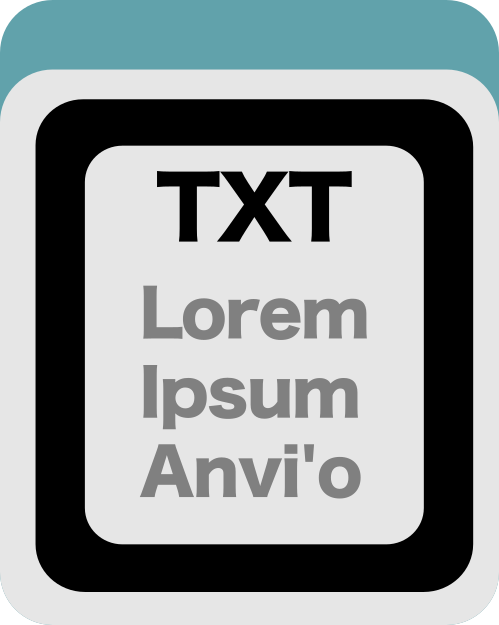

Export additional data or order tables in pan or profile databases for items or layers.

🔙 **[To the main page](../../)** of anvi'o programs and artifacts.



{{ "network.json" }}
{{ 300 }}


## Authors

<a href="/people/meren" target="_blank">A. Murat Eren (Meren)</a>
<a href="http://merenlab.org" class="person-social" target="_blank"><i class="fa fa-fw fa-home"></i>Web</a><a href="mailto:a.murat.eren@gmail.com" class="person-social" target="_blank"><i class="fa fa-fw fa-envelope-square"></i>Email</a><a href="http://twitter.com/merenbey" class="person-social" target="_blank"><i class="fa fa-fw fa-twitter-square"></i>Twitter</a><a href="http://github.com/meren" class="person-social" target="_blank"><i class="fa fa-fw fa-github"></i>Github</a>

<a href="/people/ekiefl" target="_blank">Evan Kiefl</a>
<a href="http://ekiefl.github.io" class="person-social" target="_blank"><i class="fa fa-fw fa-home"></i>Web</a><a href="mailto:kiefl.evan@gmail.com" class="person-social" target="_blank"><i class="fa fa-fw fa-envelope-square"></i>Email</a><a href="http://twitter.com/evankiefl" class="person-social" target="_blank"><i class="fa fa-fw fa-twitter-square"></i>Twitter</a><a href="http://github.com/ekiefl" class="person-social" target="_blank"><i class="fa fa-fw fa-github"></i>Github</a>

## Can consume

[pan-db](../../artifacts/pan-db)  [profile-db](../../artifacts/profile-db)  [contigs-db](../../artifacts/contigs-db)  [misc-data-items](../../artifacts/misc-data-items)  [misc-data-layers](../../artifacts/misc-data-layers)  [misc-data-layer-orders](../../artifacts/misc-data-layer-orders)  [misc-data-nucleotides](../../artifacts/misc-data-nucleotides)  [misc-data-amino-acids](../../artifacts/misc-data-amino-acids) 

## Can provide

[misc-data-items-txt](../../artifacts/misc-data-items-txt)  [misc-data-layers-txt](../../artifacts/misc-data-layers-txt)  [misc-data-layer-orders-txt](../../artifacts/misc-data-layer-orders-txt)  [misc-data-nucleotides-txt](../../artifacts/misc-data-nucleotides-txt)  [misc-data-amino-acids-txt](../../artifacts/misc-data-amino-acids-txt) 

## Usage

This program lets you export miscellaneous data of your choosing into a text file, which can be imported into another anvi'o project using [anvi-import-misc-data](/help/8/programs/anvi-import-misc-data). You can export the same types of data that you can import with that function. These are also listed below.

To see what misc-data is available in your database, use [anvi-show-misc-data](/help/8/programs/anvi-show-misc-data). 

If your misc-data is associated with a specific data group, you can provide that data group to this program with the `-D` flag. 

## Data types you can export 

### From a pan-db or profile-db: items, layers, layer orders

**From a [pan-db](/help/8/artifacts/pan-db) or [profile-db](/help/8/artifacts/profile-db), you can export**

- items data ([misc-data-items](/help/8/artifacts/misc-data-items)) into a [misc-data-items-txt](/help/8/artifacts/misc-data-items-txt). 

anvi&#45;export&#45;misc&#45;data &#45;p [profile&#45;db](/help/8/artifacts/profile&#45;db) \
                      &#45;&#45;target&#45;data&#45;table items 

- layers data ([misc-data-layers](/help/8/artifacts/misc-data-layers)) into a [misc-data-layers-txt](/help/8/artifacts/misc-data-layers-txt).  

anvi&#45;export&#45;misc&#45;data &#45;p [pan&#45;db](/help/8/artifacts/pan&#45;db) \
                      &#45;&#45;target&#45;data&#45;table layers 

- layer orders data ([misc-data-layer-orders](/help/8/artifacts/misc-data-layer-orders)) into a [misc-data-layer-orders-txt](/help/8/artifacts/misc-data-layer-orders-txt). 

anvi&#45;export&#45;misc&#45;data &#45;p [profile&#45;db](/help/8/artifacts/profile&#45;db) \
                      &#45;&#45;target&#45;data&#45;table layer_orders 

### From a contigs-db: nucleotide and amino acid information

**From a [contigs-db](/help/8/artifacts/contigs-db), you can export**

- nucleotide data ([misc-data-nucleotides](/help/8/artifacts/misc-data-nucleotides)) into a [misc-data-nucleotides-txt](/help/8/artifacts/misc-data-nucleotides-txt).

anvi&#45;export&#45;misc&#45;data &#45;c [contigs&#45;db](/help/8/artifacts/contigs&#45;db) 
                      &#45;&#45;target&#45;data&#45;table nucleotides

- amino acid data ([misc-data-amino-acids](/help/8/artifacts/misc-data-amino-acids)) into a [misc-data-amino-acids-txt](/help/8/artifacts/misc-data-amino-acids-txt).

anvi&#45;export&#45;misc&#45;data &#45;c [contigs&#45;db](/help/8/artifacts/contigs&#45;db) 
                      &#45;&#45;target&#45;data&#45;table amino_acids

{:.notice}
Edit [this file](https://github.com/merenlab/anvio/tree/master/anvio/docs/programs/anvi-export-misc-data.md) to update this information.

## Additional Resources

* [Working with anvi&#x27;o additional data tables](http://merenlab.org/2017/12/11/additional-data-tables/#views-items-layers-orders-some-anvio-terminology)

{:.notice}
Are you aware of resources that may help users better understand the utility of this program? Please feel free to edit [this file](https://github.com/merenlab/anvio/tree/master/bin/anvi-export-misc-data) on GitHub. If you are not sure how to do that, find the `__resources__` tag in [this file](https://github.com/merenlab/anvio/blob/master/bin/anvi-interactive) to see an example.
