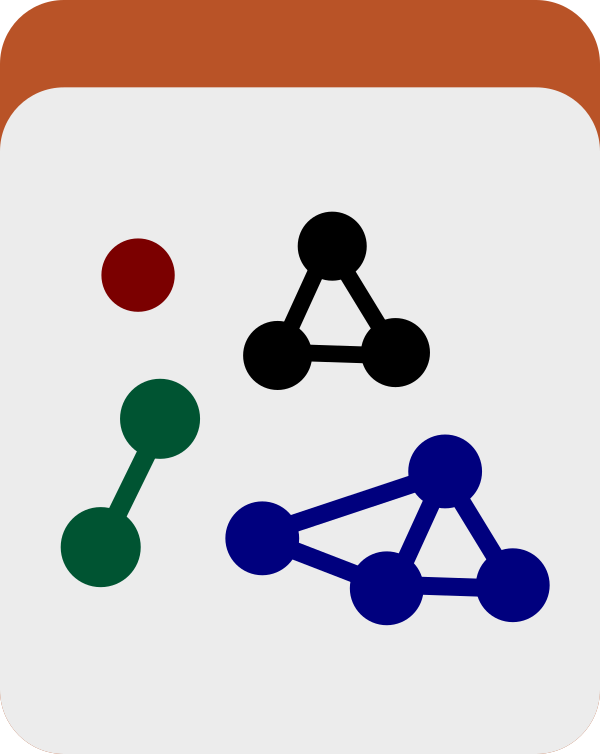

Split an anvi&#x27;o pan or profile database into smaller, self-contained projects. Black magic..

🔙 **[To the main page](../../)** of anvi'o programs and artifacts.



{{ "network.json" }}
{{ 300 }}


## Authors

<a href="/people/meren" target="_blank">A. Murat Eren (Meren)</a>
<a href="http://merenlab.org" class="person-social" target="_blank"><i class="fa fa-fw fa-home"></i>Web</a><a href="mailto:a.murat.eren@gmail.com" class="person-social" target="_blank"><i class="fa fa-fw fa-envelope-square"></i>Email</a><a href="http://twitter.com/merenbey" class="person-social" target="_blank"><i class="fa fa-fw fa-twitter-square"></i>Twitter</a><a href="http://github.com/meren" class="person-social" target="_blank"><i class="fa fa-fw fa-github"></i>Github</a>

## Can consume

[profile-db](../../artifacts/profile-db)  [contigs-db](../../artifacts/contigs-db)  [genomes-storage-db](../../artifacts/genomes-storage-db)  [pan-db](../../artifacts/pan-db)  [collection](../../artifacts/collection) 

## Can provide

[split-bins](../../artifacts/split-bins) 

## Usage

Creates individual, self-contained anvi'o projects for one or more [bin](/help/8/artifacts/bin)s stored in an anvi'o [collection](/help/8/artifacts/collection). This program may be useful if you would like to share a subset of an anvi'o project with the community or a collaborator, or focus on a particular aspect of your data without having to initialize very large files. Altogether, [anvi-split](/help/8/programs/anvi-split) promotoes reproducibility, openness, and collaboration.

The program can generate [split-bins](/help/8/artifacts/split-bins) from metagenomes or pangenomes. To split bins, you can provide the program [anvi-split](/help/8/programs/anvi-split) with a [contigs-db](/help/8/artifacts/contigs-db) and [profile-db](/help/8/artifacts/profile-db) pair. To split gene clusters, you can provide it with a [genomes-storage-db](/help/8/artifacts/genomes-storage-db) and [pan-db](/help/8/artifacts/pan-db) pair. In both cases you will also need a [collection](/help/8/artifacts/collection). If you don't provide any [bin](/help/8/artifacts/bin) names, the program will create individual directories for each bin that is found in your collection. You can also limit the output to a single bin. Each of the resulting directories in your output folder will contain a stand-alone anvi'o project that can be shared without sharing any of the larger dataset.

### An example run

Assume you have a [profile-db](/help/8/artifacts/profile-db) has a [collection](/help/8/artifacts/collection) with three bins, which are (very creatively) called `BIN_1`, `BIN_2`, and `BIN_3`.

If you ran the following code:

anvi&#45;split &#45;p [profile&#45;db](/help/8/artifacts/profile&#45;db) \
           &#45;c [contigs&#45;db](/help/8/artifacts/contigs&#45;db) \
           &#45;C [collection](/help/8/artifacts/collection) \
           &#45;o OUTPUT

Alternatively you can specify a bin name to limit the reported bins:

anvi&#45;split &#45;p [profile&#45;db](/help/8/artifacts/profile&#45;db) \
           &#45;c [contigs&#45;db](/help/8/artifacts/contigs&#45;db) \
           &#45;C [collection](/help/8/artifacts/collection) \
           &#45;&#45;bin&#45;id BIN_1
           &#45;o OUTPUT

Similarly, if you provide a [genomes-storage-db](/help/8/artifacts/genomes-storage-db) and [pan-db](/help/8/artifacts/pan-db) pair, the directories will contain their own smaller [genomes-storage-db](/help/8/artifacts/genomes-storage-db) and [pan-db](/help/8/artifacts/pan-db) pairs.

You can always use the program [anvi-show-collections-and-bins](/help/8/programs/anvi-show-collections-and-bins) to learn available [collection](/help/8/artifacts/collection) and [bin](/help/8/artifacts/bin) names in a given [profile-db](/help/8/artifacts/profile-db) or [pan-db](/help/8/artifacts/pan-db).

### Performance

For extremely large datasets, splitting bins may be difficult. For metagenomics projets you can,

* Use the flag `--skip-variability-tables` to NOT report single-nucleotide variants or single-amino acid variants in your split bins (which can reach hundreds of millions of lines of information for large and complex metagenomes), and/or,
* Use the flag `--compress-auxiliary-data` to save space. While this is a great option for data that is meant to be stored long-term and shared with the community, the compressed file would need to be manually decompressed by the end-user prior to using the split bin.

{:.notice}
Edit [this file](https://github.com/merenlab/anvio/tree/master/anvio/docs/programs/anvi-split.md) to update this information.

## Additional Resources

* [Anvi-split in action in the pangenomics tutorial](http://merenlab.org/2016/11/08/pangenomics-v2/#splitting-the-pangenome)

{:.notice}
Are you aware of resources that may help users better understand the utility of this program? Please feel free to edit [this file](https://github.com/merenlab/anvio/tree/master/bin/anvi-split) on GitHub. If you are not sure how to do that, find the `__resources__` tag in [this file](https://github.com/merenlab/anvio/blob/master/bin/anvi-interactive) to see an example.
