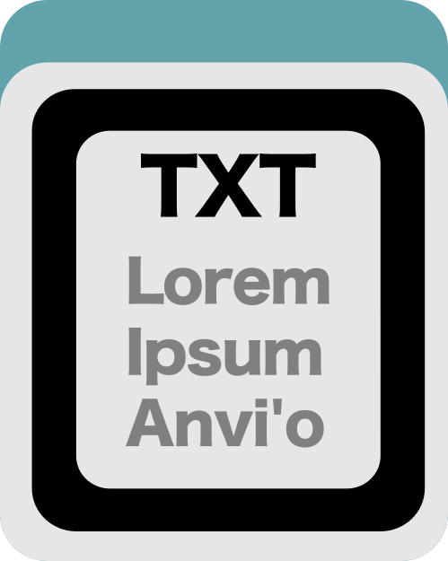



A TXT-type anvi'o artifact. This artifact is typically provided **by the user** for anvi'o to import into its databases, process, and/or use.

🔙 **[To the main page](../../)** of anvi'o programs and artifacts.

## Provided by

There are no anvi'o tools that generate this artifact, which means it is most likely provided to the anvi'o ecosystem by the user.

## Required by

There are no anvi'o tools that require this artifact directly, which means it is most likely an end-product for the user.

## Can be used by

[anvi-draw-kegg-pathways](../../programs/anvi-draw-kegg-pathways)

## Description

This artifact is a TAB-delimited text file that gives a color of your choosing to each **category** compared on [kegg-pathway-map](/help/main/artifacts/kegg-pathway-map) files drawn by [anvi-draw-kegg-pathways](/help/main/programs/anvi-draw-kegg-pathways).

A "category" is whatever the run compares: each sample of a [kegg-reaction-txt](/help/main/artifacts/kegg-reaction-txt) or [kegg-compound-txt](/help/main/artifacts/kegg-compound-txt) file, each [contigs-db](/help/main/artifacts/contigs-db), each genome of a [pan-db](/help/main/artifacts/pan-db), or — when a [groups-txt](/help/main/artifacts/groups-txt) groups any of these — each group. Normally anvi'o picks those colors for you by sampling a colormap (`--reaction-colormap`). This file says exactly which color each category gets instead, so that a color means the same thing across every figure in a paper.

Pass it with `--reaction-category-colors` for the reaction layer, and `--compound-category-colors` for the compound layer of a [kegg-compound-txt](/help/main/artifacts/kegg-compound-txt) file. The two layers are colored independently, so each can take its own file; pointing both options at a single file gives them one set of colors and so one legend.

## File format

|Column|Required|Description|
|:--|:--|:--|
|*a category column*|YES|The **first** column, which can be headed anything you like — `category`, `sample`, `genome`, `group` — so one file can describe samples in one run and groups in another without being renamed. Each row names one category, or a combination of them (see below).|
|`color`|YES|A six-digit color hex code, such as `#1f77b4`. Color *names* are not accepted, since the colors that pathway maps reserve for their own unhighlighted elements are compared as hex codes.|

Here is an example file:

|category|color|
|:--|:--|
|SAMPLE_1|#1f77b4|
|SAMPLE_2|#ff7f0e|
|SAMPLE_3|#2ca02c|

Every category of the run needs a color: anvi'o will not fill in the gaps from a colormap, since that would put colors you chose and colors chosen for you on one scale. Names in the file that are *not* categories of the run are reported and ignored, so one file can serve several runs that each draw a different subset.

## Coloring combinations of categories

Coloring by membership colors a map element by exactly **which** categories contain it, so it needs a color for every *combination* of them — with three samples, that is seven colors rather than three.

A category on its own takes its own color. A combination takes the **blend** of its members' colors, mixed perceptually, so that an element in the green sample and the blue sample is drawn in the color between them. To set a combination's color yourself, add a row naming its categories separated by commas, exactly as the colorbar labels it:

|category|color|
|:--|:--|
|SAMPLE_1|#1f77b4|
|SAMPLE_2|#ff7f0e|
|SAMPLE_3|#2ca02c|
|SAMPLE_1, SAMPLE_2|#7d5ba6|

Because a combination is written this way, no category name may itself contain a comma.

Two combinations can of course blend to the same color, and a discrete colorbar labels one band per combination — so anvi'o refuses to draw a scale whose bands cannot be told apart, and reports how many distinct colors it got. Adding rows for the offending combinations fixes it. Note that no color scale distinguishes combinations of more than a handful of categories in any case; past a few of them, color by count from a colormap instead — with `--presence-colormap-scheme by_count` for databases and pangenomes, or a `count` sample or group summary (such as `--reaction-sample-summary count`) for a text file, which rejects the former.

## Where the colors are used

**The 'unified' map and its colorbar.** Each combination of categories takes its color as described above.

**Each category's own map.** With `--draw-individual-files` or `--draw-grid`, a category's map is drawn in that category's own color rather than in one shared color, so a panel of a grid says which category it is and matches the band it takes on the 'unified' map.

**Each group's own map, on request.** When a [groups-txt](/help/main/artifacts/groups-txt) groups the categories, a group's own map is colored by how many of the group's samples, databases, or genomes contain an element — a magnitude rather than an identity — and takes its colors from `--group-colormap`, which is unaffected by this file by default. Giving `--group-colormap category` instead builds each group's scale as a ramp running from a pale tint to that group's own color, binding the two: every group's ramp is built the same way, so the panels of a grid stay comparable while each says which group it is.

anvi&#45;draw&#45;kegg&#45;pathways &#45;&#45;reaction&#45;txt [kegg&#45;reaction&#45;txt](/help/main/artifacts/kegg&#45;reaction&#45;txt) \
                        &#45;&#45;groups&#45;txt [groups&#45;txt](/help/main/artifacts/groups&#45;txt) \
                        &#45;&#45;group&#45;threshold 0.5 \
                        &#45;&#45;reaction&#45;category&#45;colors [kegg&#45;category&#45;colors&#45;txt](/help/main/artifacts/kegg&#45;category&#45;colors&#45;txt) \
                        &#45;&#45;group&#45;colormap category \
                        &#45;&#45;draw&#45;grid \
                        &#45;o OUTPUT_DIR

The two decimal values that `--group-colormap` also accepts then say how far from white each ramp starts and stops, defaulting to 0.25 and 1.0. The pale end stops short of white on purpose: standard and overview maps keep white for their own unhighlighted elements, so a ramp reaching it could not be drawn there — anvi'o checks for this before writing any file and tells you to start the ramp further from white.

## When this file does not apply

This file gives colors to categories, so it needs a run that has them, and needs a layer colored by *which* categories contain an element.

- It cannot be combined with that layer's `--reaction-colormap`/`--compound-colormap`, which is the other answer to where the colors come from, nor with `--reaction-color`/`--compound-color` or `--original-color`, which color a layer without comparing categories at all.
- It needs a `sample` column in a [kegg-reaction-txt](/help/main/artifacts/kegg-reaction-txt) or [kegg-compound-txt](/help/main/artifacts/kegg-compound-txt) file, or more than one [contigs-db](/help/main/artifacts/contigs-db), or a [pan-db](/help/main/artifacts/pan-db).
- It does not apply to coloring by *count* (`--presence-colormap-scheme by_count`, or a `count`/`count_continuous` sample or group summary), since a count says how many categories contain an element rather than which, and so has no category whose color it could take.

{:.notice}
Edit [this file](https://github.com/merenlab/anvio/tree/master/anvio/docs/artifacts/kegg-category-colors-txt.md) to update this information.

