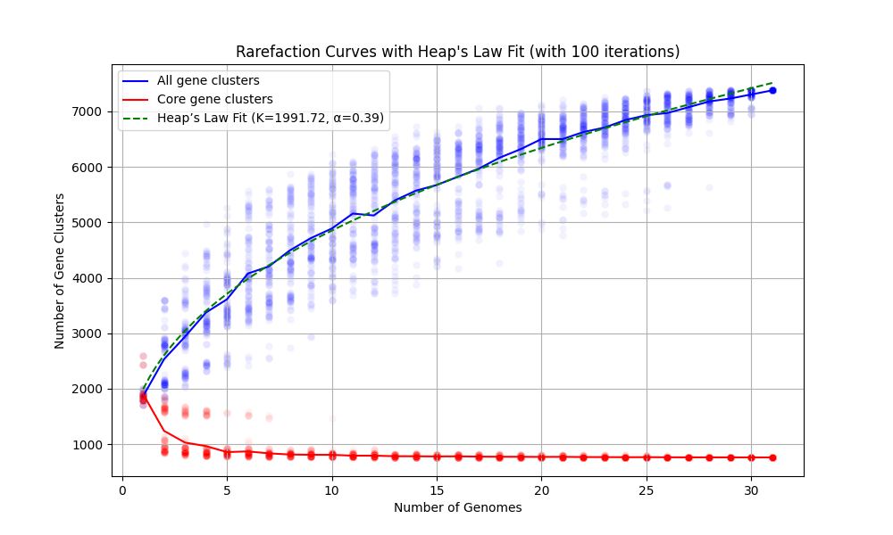



A SVG-type anvi'o artifact. This artifact is typically generated, used, and/or exported **by anvi'o** (and not provided by the user)..

🔙 **[To the main page](../../)** of anvi'o programs and artifacts.

## Provided by

[anvi-compute-rarefaction-curves](../../programs/anvi-compute-rarefaction-curves)

## Required or used by

There are no anvi'o tools that use or require this artifact directly, which means it is most likely an end-product for the user.

## Description

In general, this artifact will have visualization similar to this one for a given [pan-db](/help/main/artifacts/pan-db):

{:.notice}
Edit [this file](https://github.com/merenlab/anvio/tree/master/anvio/docs/artifacts/rarefaction-curves.md) to update this information.

