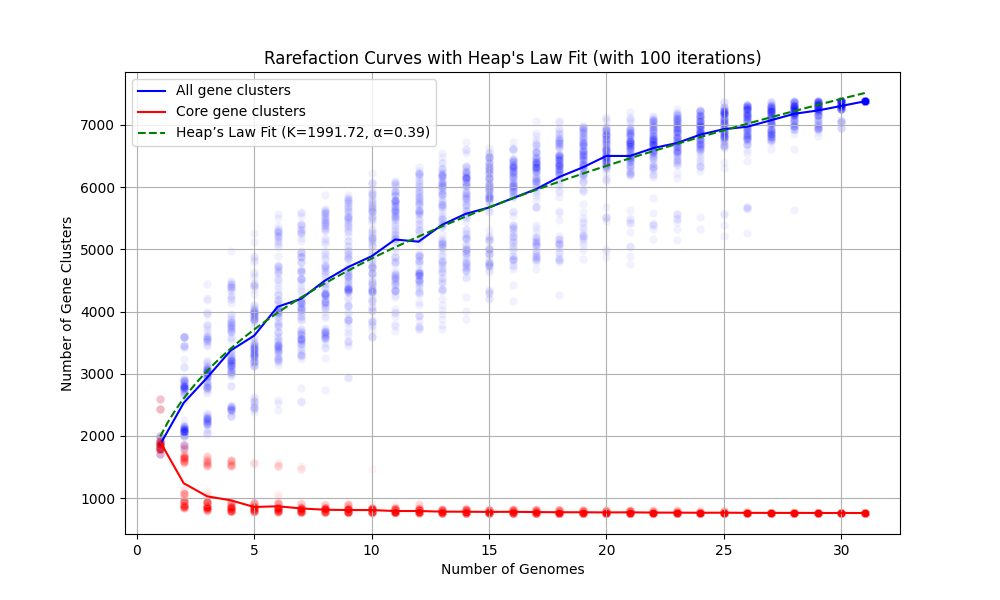



A SVG-type anvi'o artifact. This artifact is typically generated, used, and/or exported **by anvi'o** (and not provided by the user)..

🔙 **[To the main page](../../)** of anvi'o programs and artifacts.

## Provided by

[anvi-compute-rarefaction-curves](../../programs/anvi-compute-rarefaction-curves)

## Required by

There are no anvi'o tools that require this artifact directly, which means it is most likely an end-product for the user.

## Description

In general, this artifact will have visualization similar to this one for a given [pan-db](/help/main/artifacts/pan-db):

The same artifact can also be computed for a [pan-graph-db](/help/main/artifacts/pan-graph-db), in which case the curves count synteny-aware gene clusters (SynGCs) rather than gene clusters, and the figure is labeled accordingly.

Alongside the figure, this artifact includes four TAB-delimited text files: per-genome-count averages and every individual subsampling observation, for the whole pangenome and for its core. Their columns are named `num_genomes`, `avg_num_gene_clusters` and `standard_deviation` (averages), and `num_genomes` and `GeneClusters` (iterations), regardless of which kind of pangenome they were computed from.

{:.notice}
Edit [this file](https://github.com/merenlab/anvio/tree/master/anvio/docs/artifacts/rarefaction-curves.md) to update this information.

