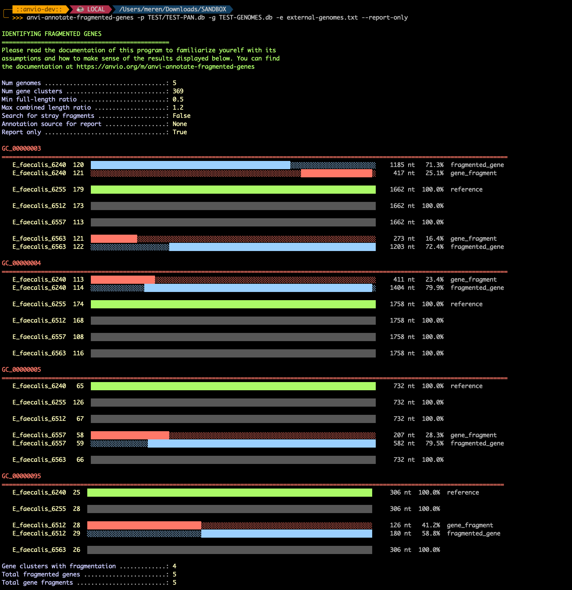

Identify fragmented genes (pseudogenes) in a pangenome by finding adjacent genes from the same genome within the same gene cluster, and annotate them under a &#x27;PSEUDO_GENES&#x27; function source in the relevant contigs databases.

🔙 **[To the main page](../../)** of anvi'o programs and artifacts.



<div id="svg" class="subnetwork"></div>
{{ "network.json" }}
{{ 300 }}



## Authors

<div class="anvio-person"><div class="anvio-person-info"><div class="anvio-person-photo"></div><div class="anvio-person-info-box"><a href="/people/meren" target="_blank"><span class="anvio-person-name">A. Murat Eren (Meren)</span></a><div class="anvio-person-social-box"><a href="http://merenlab.org" class="person-social" target="_blank"><i class="fa fa-fw fa-home"></i>Web</a><a href="mailto:a.murat.eren@gmail.com" class="person-social" target="_blank"><i class="fa fa-fw fa-envelope-square"></i>Email</a><a href="http://twitter.com/merenbey" class="person-social" target="_blank"><i class="fa fa-fw fa-twitter-square"></i>Twitter</a><a href="http://github.com/meren" class="person-social" target="_blank"><i class="fa fa-fw fa-github"></i>Github</a></div></div></div></div>


## Can consume


<p style="text-align: left" markdown="1"><span class="artifact-r">[pan-db](../../artifacts/pan-db) </span> <span class="artifact-r">[genomes-storage-db](../../artifacts/genomes-storage-db) </span> <span class="artifact-r">[external-genomes](../../artifacts/external-genomes) </span></p>


## Can provide


<p style="text-align: left" markdown="1"><span class="artifact-p">[functions](../../artifacts/functions) </span></p>


## Usage


This program **identifies and annotates fragmented genes (pseudogenes) across a pangenome** by scanning gene clusters stored in a <span class="artifact-n">[pan-db](/help/main/artifacts/pan-db)</span> for evidence of gene fragmentation. The results are stored as <span class="artifact-n">[functions](/help/main/artifacts/functions)</span> in individual <span class="artifact-n">[contigs-db](/help/main/artifacts/contigs-db)</span> files under the function annotation source `PSEUDO_GENES`.

Essentially, this program back propagates insights into gene fragmentation events in individual genomes by considering a pangenome. This allows investigation of the function and context of fragmented genes, their inclusion in formal reporting in interactive interfaces and summary outputs, and enables functional enrichment analyses.

### The problem

In comparative genomics, a gene that is intact in some genomes may be split into two or more adjacent open reading frames in others. Assuming that genomes are high-quality and do not suffer from extensive sequencing errors, fragmented genes occur when a point mutation or a transposon insertion introduces a premature stop codon into a gene, after which the gene caller identifies a new start codon downstream and reports two (or more) shorter genes where there used to be one.

If such fragmentation events are not common across all genomes, such fragmented genes appear as the following alignment in pangenomes:

```
Genome A gene x: xxxxxxxxxxxxxxxxxxxxxxxxxxxxxxxxxxxxxxxxxxxxxxxxxx

Genome B gene n: xxxxxxxxxxxxxxxxxxxxxxxxxxxxxxxxxxxx--------------
Genome B gene m: --------------------------------------xxxxxxxxxxxx

Genome C gene z: xxxxxxxxxxxxxxxxxxxxxxxxxxxxxxxxxxxxxxxxxxxxxxxxxx
```

In this example, gene `n` and gene `m` in Genome B are adjacent on the same contig and together correspond to the full-length gene represented by `x` in Genome A and `z` in Genome C. Due to the adjacency of `n` and `m`, and their overlap with other genes in the cluster, one can assume that the gene in Genome B was likely split by a mutation that disrupted the original reading frame.

Gene fragmentation can occur in any group, but it is more common in some clades than others. For instance, *Brucella* are known for having many pseudogenes (and in fact this program is coming to life because [Sean Crosson](https://directory.natsci.msu.edu/directory/Profiles/Person/101773), who studies *Brucella* asked for it -- so thank you, Sean!). The anvi'o pangenomics workflow correctly groups the fragments with the full-length gene into a single gene cluster thanks to the all-vs-all BLAST search. But excessive gene fragments create a problem for downstream analyses when the issue is not accounted for: they clutter the analysis results with spurious singletons and obscure truly unique genes.

### The solution

<span class="artifact-p">[anvi-annotate-fragmented-genes](/help/main/programs/anvi-annotate-fragmented-genes)</span> offers a solution for this issue by scanning every gene cluster in a <span class="artifact-n">[pan-db](/help/main/artifacts/pan-db)</span> and looking for cases where a single genome contributes two or more genes to the same gene cluster that are **adjacent on the same contig** (i.e., no other gene sits between them). When such a case is found, it compares the lengths of these adjacent fragments against a **full-length reference**, i.e., the longest gene in that cluster from a genome where the gene is not split.

Each fragment is then classified as one of the following:

- **`fragmented_gene`**: The longest fragment in a genome, which likely retains gene function. Or not. It is impossible to say, of course, but the assumption here is that if a gene has undergone fragmentation, the longest fragment of it is the most likely to continue retaining its function. This label is only assigned if the fragment is at least a certain fraction of the full-length reference, controlled by the `--min-full-length-ratio` flag (default: 0.7, which means the fragment must be longer than 70% of the reference gene).

- **`gene_fragment`**: Shorter fragments that are unlikely to be functional. If even the longest fragment in a genome falls below the length threshold, **all** fragments in that genome are labeled `gene_fragment`.

The results are written as functional annotations under the source name `PSEUDO_GENES` into each relevant <span class="artifact-n">[contigs-db](/help/main/artifacts/contigs-db)</span>. The annotation text for each gene includes the percent coverage relative to the full-length reference and identifies the genome and gene caller ID of that reference, so it remains meaningful even outside the pangenome context and becomes a part of the information in the genome.

### Basic usage

<div class="codeblock" markdown="1">
anvi&#45;annotate&#45;fragmented&#45;genes &#45;p <span class="artifact&#45;n">[pan&#45;db](/help/main/artifacts/pan&#45;db)</span> \
                               &#45;g <span class="artifact&#45;n">[genomes&#45;storage&#45;db](/help/main/artifacts/genomes&#45;storage&#45;db)</span> \
                               &#45;e <span class="artifact&#45;n">[external&#45;genomes](/help/main/artifacts/external&#45;genomes)</span>
</div>

This will scan all gene clusters, report fragmentation events to the terminal, and write `PSEUDO_GENES` annotations into the contigs databases listed in the <span class="artifact-n">[external-genomes](/help/main/artifacts/external-genomes)</span> file.

### Terminal output

When the program runs, it prints a color-coded visualization for each gene cluster where fragmentation was detected. Here is an example output:



In this particular example, four of the gene clusters in the pangenome had fragmented genes. The bars in the report show the relative length of each gene compared to the full-length reference, and their position reflects the actual layout of fragments on the contig. **Green** bars represent the full-length reference gene determined by anvi'o, **blue** bars represent the longest fragment in a genome (labeled `fragmented_gene`), **red** bars represent shorter fragments, and **gray** bars represent genes from genomes where the gene is not fragmented. Genome names and anvi'o gene caller ids are also shown to double check things.

The purpose of this report is for you to go back to the pangenome with <span class="artifact-p">[anvi-display-pan](/help/main/programs/anvi-display-pan)</span>, search for some of the gene clusters, and inspect them to confirm that you are happy with the result.

If you are satisfied and would like your pangenome to include this information, you will need to restart the pangenomics workflow with these newly annotated <span class="artifact-n">[contigs-db](/help/main/artifacts/contigs-db)</span> files so <span class="artifact-p">[anvi-summarize](/help/main/programs/anvi-summarize)</span> output can include the necessary data for you to be able to do functional enrichment analyses of genes that have `fragmented_gene` annotations.

### Adjusting the length threshold

By default, the longest fragment in a genome must be at least 70% of the full-length reference to receive the `fragmented_gene` label. You can adjust this threshold:

<div class="codeblock" markdown="1">
anvi&#45;annotate&#45;fragmented&#45;genes &#45;p <span class="artifact&#45;n">[pan&#45;db](/help/main/artifacts/pan&#45;db)</span> \
                               &#45;g <span class="artifact&#45;n">[genomes&#45;storage&#45;db](/help/main/artifacts/genomes&#45;storage&#45;db)</span> \
                               &#45;e <span class="artifact&#45;n">[external&#45;genomes](/help/main/artifacts/external&#45;genomes)</span> \
                               &#45;&#45;min&#45;full&#45;length&#45;ratio 0.50
</div>

Setting a lower value is more permissive (more fragments will be labeled `fragmented_gene` rather than `gene_fragment`). Setting a higher value is more conservative.

### Report-only and skip-reporting modes

If you want to see what the program would annotate **without actually writing to any database**, use the `--report-only` flag:

<div class="codeblock" markdown="1">
anvi&#45;annotate&#45;fragmented&#45;genes &#45;p <span class="artifact&#45;n">[pan&#45;db](/help/main/artifacts/pan&#45;db)</span> \
                               &#45;g <span class="artifact&#45;n">[genomes&#45;storage&#45;db](/help/main/artifacts/genomes&#45;storage&#45;db)</span> \
                               &#45;e <span class="artifact&#45;n">[external&#45;genomes](/help/main/artifacts/external&#45;genomes)</span> \
                               &#45;&#45;report&#45;only
</div>

Conversely, if you want to annotate silently without the per-gene-cluster terminal visualizations, use `--skip-reporting`:

<div class="codeblock" markdown="1">
anvi&#45;annotate&#45;fragmented&#45;genes &#45;p <span class="artifact&#45;n">[pan&#45;db](/help/main/artifacts/pan&#45;db)</span> \
                               &#45;g <span class="artifact&#45;n">[genomes&#45;storage&#45;db](/help/main/artifacts/genomes&#45;storage&#45;db)</span> \
                               &#45;e <span class="artifact&#45;n">[external&#45;genomes](/help/main/artifacts/external&#45;genomes)</span> \
                               &#45;&#45;skip&#45;reporting
</div>

### Finding stray out-of-frame fragments

By default, this program only detects fragmentation events where both fragments end up in the **same gene cluster**, which happens when the downstream fragment remains in the same reading frame as the original gene. However, if the premature stop codon shifts the reading frame (e.g., a single-nucleotide insertion or deletion rather than a substitution), the downstream fragment will be called in a different frame, and MCL will place it in a **different gene cluster**, since it no longer shares sequence similarity with the original gene. This is what that situation would look like compared to the example before; one gene cluster would look like this

```
Genome A gene x: xxxxxxxxxxxxxxxxxxxxxxxxxxxxxxxxxxxxxxxxxxxxxxxxxx

Genome B gene n: xxxxxxxxxxxxxxxxxxxxxxxxxxxxxxxxxxxx--------------

Genome C gene z: xxxxxxxxxxxxxxxxxxxxxxxxxxxxxxxxxxxxxxxxxxxxxxxxxx
```

And another one would look like this:

```
Genome B gene m: xxxxxxxxxxxx
```

The program includes an optional flag, `--find-stray-fragments`, to search for these out-of-frame fragments:

<div class="codeblock" markdown="1">
anvi&#45;annotate&#45;fragmented&#45;genes &#45;p <span class="artifact&#45;n">[pan&#45;db](/help/main/artifacts/pan&#45;db)</span> \
                               &#45;g <span class="artifact&#45;n">[genomes&#45;storage&#45;db](/help/main/artifacts/genomes&#45;storage&#45;db)</span> \
                               &#45;e <span class="artifact&#45;n">[external&#45;genomes](/help/main/artifacts/external&#45;genomes)</span> \
                               &#45;&#45;find&#45;stray&#45;fragments
</div>

When this flag is set, <span class="artifact-p">[anvi-annotate-fragmented-genes](/help/main/programs/anvi-annotate-fragmented-genes)</span> performs a second scan after the standard in-cluster analysis. For each gene cluster, it looks for genomes where the cluster contains a single gene that is significantly shorter than the full-length reference. It then checks whether an adjacent gene on the same contig (one that belongs to a **different** gene cluster) together with the truncated gene approximates the expected full-length gene. If so, both are annotated as fragments.

This is a more aggressive search, and it may occasionally flag genes that are genuinely short rather than fragmented, so it is off by default. But while the algorithm worked well in our mock datasets, Meren's test with a large *B. fragilis* pangenome in which the program found over 100 gene clusters with fragmented genes, it found 0 stray fragments, so it is safe to assume that its false positive rate will be rather small if any.

{:.notice}
**A note from** : *The zero strays in a pangenome that contained over 100 regular fragmentation events likely indicates that the process is likely a result of biology rather than bioinformatics. As in, most premature stops likely come from substitutions, not frameshifts (i.e., C-to-T turning CAG (Gln) into TAG (stop) preserves the reading frame, and both fragments stay in-frame, and then BLAST clusters them together, and then the in-cluster scan catches them. It is also possible that most frameshifted downstream sequences often aren't called as genes by Prodigal. Even if a frameshift creates a new reading frame downstream, Prodigal needs to find a valid start codon, a [Shine-Dalgarno-like signal](https://en.wikipedia.org/wiki/Shine–Dalgarno_sequence), and a reasonable ORF length before it calls it a gene. Difficult to know which one is playing a more significant role, but if you are reading these lines, and if you feel that you have an interesting observation from your own pangenome or ideas about why out-of-frame / stray fragments occur in much less frequency compared to in-frame fragments, please let us know and so we can update the code if we are making a mistake, or this section with a better explanation*. 

### Re-running the program

If the `PSEUDO_GENES` source already exists in a contigs database (from a previous run), the program will overwrite the existing annotations. This means you can safely re-run the program with different parameters without needing to manually remove old annotations first.


{:.notice}
Edit [this file](https://github.com/merenlab/anvio/tree/master/anvio/docs/programs/anvi-annotate-fragmented-genes.md) to update this information.


## Additional Resources


{:.notice}
Are you aware of resources that may help users better understand the utility of this program? Please feel free to edit [this file](https://github.com/merenlab/anvio/blob/master/anvio/cli/annotate_fragmented_genes.py) on GitHub. If you are not sure how to do that, find the `__resources__` tag in [this file](https://github.com/merenlab/anvio/blob/master/anvio/cli/interactive.py) to see an example.
