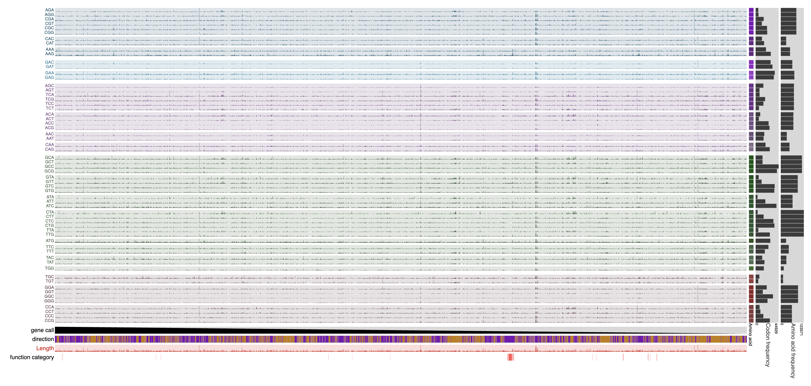
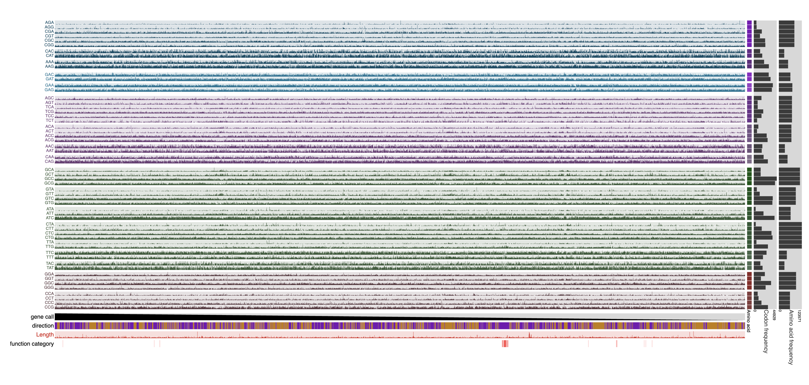
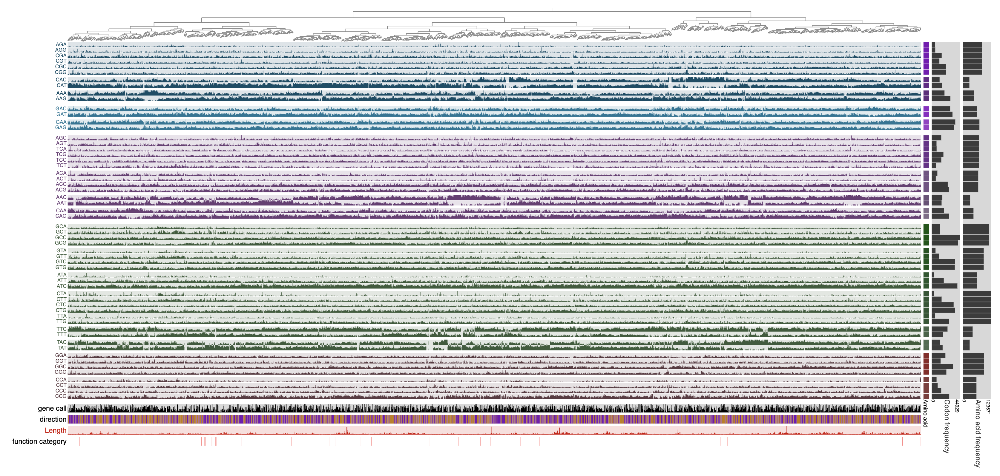
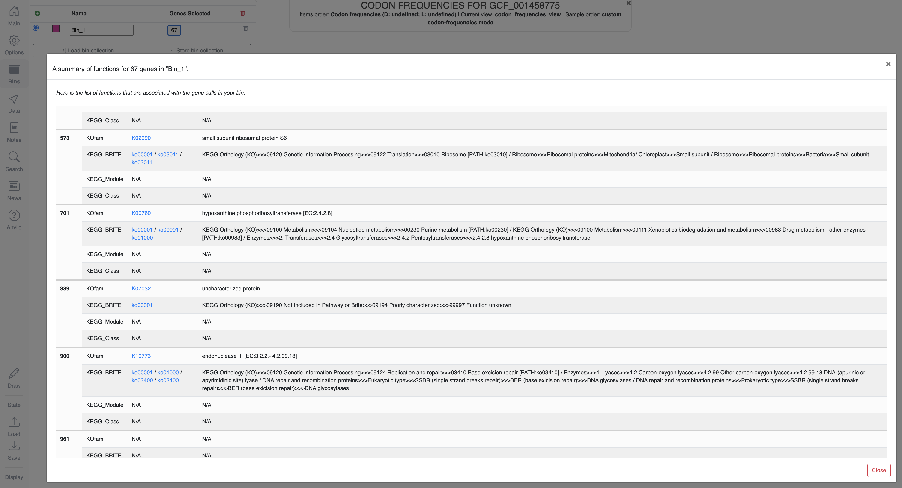

Display codon frequency statistics across genes in a given genome in the anvi&#x27;o interactive interface..

🔙 **[To the main page](../../)** of anvi'o programs and artifacts.



<div id="svg" class="subnetwork"></div>
{{ "network.json" }}
{{ 300 }}



## Authors

<div class="anvio-person"><div class="anvio-person-info"><div class="anvio-person-photo"></div><div class="anvio-person-info-box"><a href="/people/meren" target="_blank"><span class="anvio-person-name">A. Murat Eren (Meren)</span></a><div class="anvio-person-social-box"><a href="http://merenlab.org" class="person-social" target="_blank"><i class="fa fa-fw fa-home"></i>Web</a><a href="mailto:a.murat.eren@gmail.com" class="person-social" target="_blank"><i class="fa fa-fw fa-envelope-square"></i>Email</a><a href="http://twitter.com/merenbey" class="person-social" target="_blank"><i class="fa fa-fw fa-twitter-square"></i>Twitter</a><a href="http://github.com/meren" class="person-social" target="_blank"><i class="fa fa-fw fa-github"></i>Github</a></div></div></div></div>

<div class="anvio-person"><div class="anvio-person-info"><div class="anvio-person-photo"></div><div class="anvio-person-info-box"><a href="/people/semiller10" target="_blank"><span class="anvio-person-name">Samuel Miller</span></a><div class="anvio-person-social-box"><a href="https://semiller10.github.io" class="person-social" target="_blank"><i class="fa fa-fw fa-home"></i>Web</a><a href="mailto:samuelmiller10@gmail.com" class="person-social" target="_blank"><i class="fa fa-fw fa-envelope-square"></i>Email</a><a href="http://twitter.com/smiller_science" class="person-social" target="_blank"><i class="fa fa-fw fa-twitter-square"></i>Twitter</a><a href="http://github.com/semiller10" class="person-social" target="_blank"><i class="fa fa-fw fa-github"></i>Github</a></div></div></div></div>


## Can consume


<p style="text-align: left" markdown="1"><span class="artifact-r">[contigs-db](../../artifacts/contigs-db) </span> <span class="artifact-r">[profile-db](../../artifacts/profile-db) </span> <span class="artifact-r">[collection](../../artifacts/collection) </span> <span class="artifact-r">[bin](../../artifacts/bin) </span></p>


## Can provide


<p style="text-align: left" markdown="1"><span class="artifact-p">[interactive](../../artifacts/interactive) </span> <span class="artifact-p">[svg](../../artifacts/svg) </span></p>


## Usage


This program interactively **displays gene-level codon frequency patterns across a set of contigs**.

The program calculates gene-level frequencies of individual codons and displays them in a matrix format where each row represents a codon (ordered by the amino acids they encode), each column represents a single gene, and the data points represent the counts (or frequency, depending on user-provided parameters) of occurrence of a given codon in a given gene. By default, the program orders each gene based on their synteny (the conserved order of genes across genomes) to reveal patterns in codon usage throughout the genome.

This program is most effectively applied to a <span class="artifact-n">[contigs-db](/help/main/artifacts/contigs-db)</span> that represents a single genome. Its utility for revealing synteny-based patterns of codon usage increases with decreasing numbers of contigs (i.e., a complete genome with a single contig will provide much better visualization than a metagenome-assembled genome (MAG) with 200 contigs, even though the program will visualize the latter adequately).

The calculation of different frequency statistics depends on a range of options, and the tool relies upon the same library that <span class="artifact-p">[anvi-get-codon-frequencies](/help/main/programs/anvi-get-codon-frequencies)</span> uses.

## Default output

The simplest form of this command is the following:

<div class="codeblock" markdown="1">
anvi&#45;display&#45;codon&#45;frequencies &#45;c <span class="artifact&#45;n">[contigs&#45;db](/help/main/artifacts/contigs&#45;db)</span>
</div>

When run this way, the program will generate a blank <span class="artifact-n">[profile-db](/help/main/artifacts/profile-db)</span> as a temporary file and will display the counts of each codon across each gene in the genome.

Here is an example with [GCF_001458775.1](https://www.ncbi.nlm.nih.gov/datasets/genome/GCF_001458775.1/), a reference genome for *Nitrospira nitrificans*:

```
anvi-display-codon-frequencies -c GCF_001458775.db
```

Which will display the following:

[{:.center-img .width-90}](../../images/anvi-display-codon-frequencies-01.png)

Here, every data point represents the actual count of a given codon in a given gene. As a result, very long genes that produce very large counts for each codon lead to the suppression of all other counts. It is possible to use any of the interactive interface capabilities to improve the visualization of data (such as setting up min/max values for layer data points, etc). It is also possible to run the program with additional parameters.

## Additional parameters

Additional parameters available through the help menu of the program will help filter genes and functions, as well as determine how the data are normalized. For instance, the following command will exclude genes that are shorter than 100 nucleotides long, exclude the stop codon as well as those codons for amino acids methionine, tryptophan, and cysteine, normalize data *within* synonymous codons (codons that encode the same amino acid), and replace all empty values in output with 0.0:

```
anvi-display-codon-frequencies --gene-min-codons 100 \
                               --exclude-amino-acids STP Met Trp Cys \
                               --synonymous \
                               --infinity-to-zero \
                               -c GCF_001458775.db
```

Which will display the following:

[{:.center-img .width-90}](../../images/anvi-display-codon-frequencies-02.png)

Please see the help menu for a complete list of parameters.

## Visualization features

Once the display is shown, the genes can also be ordered based on hierarchical clustering of the codon frequencies using the Settings panel, and then selecting the 'Codon frequencies' option from the 'Order' menu and clicking Draw to bring together those genes that show similar codon usage patterns regardless of their location in the genome:

[{:.center-img .width-90}](../../images/anvi-display-codon-frequencies-03.png)

Bin selection is possible in all visualizations, and clicking on the button that shows the number of genes in a given bin in the Bins panel will open a window that displays their functions:

[{:.center-img .width-90}](../../images/anvi-display-codon-frequencies-04.png)


## Working with a profile-db

By default, the program will initiate a blank <span class="artifact-n">[profile-db](/help/main/artifacts/profile-db)</span>, a temporary file stored under a directory that will be cleaned up by the operating system regularly. This means that storing states and bins, and re-running <span class="artifact-p">[anvi-display-codon-frequencies](/help/main/programs/anvi-display-codon-frequencies)</span> will not bring the stored data back.

Alternatively, the user can define a specific location for a <span class="artifact-n">[profile-db](/help/main/artifacts/profile-db)</span>, upon which the program would generate a blank profile at this precise location:

```
anvi-display-codon-frequencies -c GCF_001458775.db \
                               -p GCF_001458775-PROFILE.db
```

This <span class="artifact-n">[profile-db](/help/main/artifacts/profile-db)</span> can be used to visualize the same data repeatedly; however, future visualizations will require <span class="artifact-p">[anvi-interactive](/help/main/programs/anvi-interactive)</span> rather than <span class="artifact-p">[anvi-display-codon-frequencies](/help/main/programs/anvi-display-codon-frequencies)</span>:


```
anvi-interactive -p GCF_001458775-PROFILE.db \
                 --manual
```

{:.notice}
Edit [this file](https://github.com/merenlab/anvio/tree/master/anvio/docs/programs/anvi-display-codon-frequencies.md) to update this information.


## Additional Resources


{:.notice}
Are you aware of resources that may help users better understand the utility of this program? Please feel free to edit [this file](https://github.com/merenlab/anvio/tree/master/bin/anvi-display-codon-frequencies) on GitHub. If you are not sure how to do that, find the `__resources__` tag in [this file](https://github.com/merenlab/anvio/blob/master/bin/anvi-interactive) to see an example.
