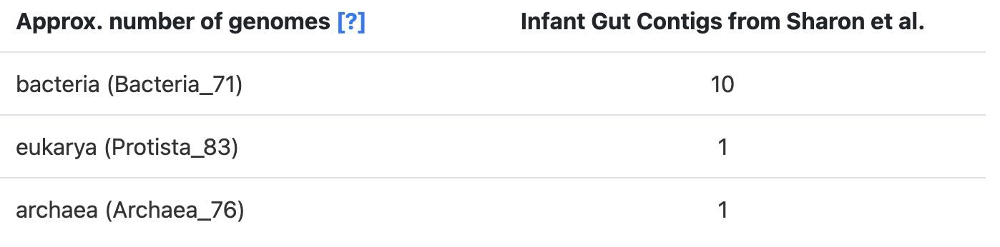

Start the anvi&#x27;o interactive interface for viewing or comparing contigs statistics..

🔙 **[To the main page](../../)** of anvi'o programs and artifacts.



<div id="svg" class="subnetwork"></div>
{{ "network.json" }}
{{ 300 }}



## Authors

<div class="anvio-person"><div class="anvio-person-info"><div class="anvio-person-photo"></div><div class="anvio-person-info-box"><a href="/people/ozcan" target="_blank"><span class="anvio-person-name">Özcan C. Esen</span></a><div class="anvio-person-social-box"><a href="http://blog.ozcanesen.com/" class="person-social" target="_blank"><i class="fa fa-fw fa-home"></i>Web</a><a href="mailto:ozcanesen@gmail.com" class="person-social" target="_blank"><i class="fa fa-fw fa-envelope-square"></i>Email</a><a href="http://twitter.com/ozcanesen" class="person-social" target="_blank"><i class="fa fa-fw fa-twitter-square"></i>Twitter</a><a href="http://github.com/ozcan" class="person-social" target="_blank"><i class="fa fa-fw fa-github"></i>Github</a></div></div></div></div>

<div class="anvio-person"><div class="anvio-person-info"><div class="anvio-person-photo"></div><div class="anvio-person-info-box"><a href="/people/FlorianTrigodet" target="_blank"><span class="anvio-person-name">Florian Trigodet</span></a><div class="anvio-person-social-box"><a href="mailto:trigodet.florian@gmail.com" class="person-social" target="_blank"><i class="fa fa-fw fa-envelope-square"></i>Email</a><a href="http://twitter.com/FlorianTrigodet" class="person-social" target="_blank"><i class="fa fa-fw fa-twitter-square"></i>Twitter</a><a href="http://github.com/FlorianTrigodet" class="person-social" target="_blank"><i class="fa fa-fw fa-github"></i>Github</a></div></div></div></div>

<div class="anvio-person"><div class="anvio-person-info"><div class="anvio-person-photo"></div><div class="anvio-person-info-box"><a href="/people/watsonar" target="_blank"><span class="anvio-person-name">Andrea Watson</span></a><div class="anvio-person-social-box"><a href="mailto:andreawatson@uchicago.edu" class="person-social" target="_blank"><i class="fa fa-fw fa-envelope-square"></i>Email</a><a href="http://twitter.com/awatsontxt" class="person-social" target="_blank"><i class="fa fa-fw fa-twitter-square"></i>Twitter</a><a href="http://github.com/watsonar" class="person-social" target="_blank"><i class="fa fa-fw fa-github"></i>Github</a></div></div></div></div>


## Can consume


<p style="text-align: left" markdown="1"><span class="artifact-r">[contigs-db](../../artifacts/contigs-db) </span></p>


## Can provide


<p style="text-align: left" markdown="1"><span class="artifact-p">[contigs-stats](../../artifacts/contigs-stats) </span> <span class="artifact-p">[interactive](../../artifacts/interactive) </span> <span class="artifact-p">[svg](../../artifacts/svg) </span></p>


## Usage


This program **helps you make sense of contigs in one or more <span class="artifact-n">[contigs-db](/help/main/artifacts/contigs-db)</span>s**.

### Working with single or multiple contigs databases

You can use this program on a single contigs database the following way:

<div class="codeblock" markdown="1">
anvi&#45;display&#45;contigs&#45;stats CONTIGS&#45;01.db
</div>

Alternatively, you may use it to compare multiple contigs databases:

<div class="codeblock" markdown="1">
anvi&#45;display&#45;contigs&#45;stats CONTIGS&#45;01.db \
                           CONTIGS&#45;02.db \
                           (...)
                           CONTIGS&#45;XX.db
</div>

If you are comparing multiple, each contigs databse will become an individual column in all outputs.

### Interactive output

If you run this program on an anvi'o contigs database with default parameters,

<div class="codeblock" markdown="1">
anvi&#45;display&#45;contigs&#45;stats <span class="artifact&#45;n">[contigs&#45;db](/help/main/artifacts/contigs&#45;db)</span>
</div>

it will open an interactive interface that looks like this:


At the top of the page are two graphs:

* The bars in the top graph represent every integer N and L statistic from 1 to 100. The y-axis is the respective N length and the x-axis is the percentage of the total dataset looked at (the exact L and N values can be seen by hovering over each bar). In other words, if you had sorted your contigs by length (from longest to shortest), and walked through each one, every time you had seen another 1 percent of your total dataset, you would add a bar to the graph showing the number of contigs that you had seen (the L statistic) and the length of the one you were looking at at the moment (the N statistic).

* The lower part of the graph tells you about which HMM hits your contigs database has. Each column is a gene in a specific <span class="artifact-n">[hmm-source](/help/main/artifacts/hmm-source)</span>, and the graph tells you how many hits each gene has in your data. (Hover your mouse over the graph to see the specifics of each gene.) The sidebar shows you how many of the genes in this graph were seen exactly that many times. For example, in the graph above, for the Bacteria_71 <span class="artifact-n">[hmm-source](/help/main/artifacts/hmm-source)</span>, a lot of genes were detected 9-11 times, so those bars are longer. This helps you estimate about how many of these genomes there are in your contigs database (so here, there is likely around 9-11 bacteria genomes in this contigs database). See the section about [predicting number of genomes](#how-do-we-predict-the-number-of-genomes) for more details.

Below the graphs are the **contigs stats** which are displayed in the following order:

- The total length of your contigs in nucleotides
- The number of contigs in your database
- The number of contigs that are of varying lengths. (for example "Num Contigs > 2.5 kb" gives you the number of contigs that are longer than 2500 base pairs)
- The length of the longest and shortest contig in your database in nucleotides
- The number of genes in your contigs (as predicted by [Prodigal](https://github.com/hyattpd/Prodigal))
- L50, L75, L90: If you ordered the contigs in your database from longest to shortest, these stats describe the *number of contigs* you would need to go through before you had looked at a certain percent of a genome. For example, L50 describes the number of contigs you would have to go through before you reached 50 percent of the entire dataset.
- N50, N75, N90:  If you ordered the contigs in your database from longest to shortest, these stats describe the *length of the contig* you would be looking when you had looked at a certain percent of a genome. For example, N50 describes the length of contig you would be on when you reached 50 percent of the entire genome length.
- The number of HMM hits in your contigs. This goes through every <span class="artifact-n">[hmm-source](/help/main/artifacts/hmm-source)</span> and gives the number of hits its genes had in all of your contigs. Basically, this is the number of hits that is given in the lower graph at the top of the page.
- The number of genomes that anvi'o predicts are in your sample, based on how many hits the single-copy core genes got from the various <span class="artifact-n">[hmm-source](/help/main/artifacts/hmm-source)</span>s. See the section about [predicting number of genomes](#how-do-we-predict-the-number-of-genomes) below.

#### How do we predict the number of genomes?

Our estimates rely on the following assumption: _most_ microbial genomes contain exactly one copy of each single-copy core gene (SCG) in the set of known SCGs for their taxonomic domain.

Under this assumption, the number of HMM hits to a known SCG in a metagenome can serve as an estimate of the number of genomes (of a given taxonomic domain) in that sample. For instance, if you see 5 hits to a bacterial 'Ribosomal L1' gene, you can guess that there are at least 5 bacteria in your sample. Of course, it doesn't make sense to use the number of hits to _just one_ SCG when there are many different ones. So what we do instead is to **compute the statistical mode of the number of hits to each SCG** in a given <span class="artifact-n">[hmm-source](/help/main/artifacts/hmm-source)</span>. This is what the lower graph of HMM hits is showing at the top of the interactive page -- the sideways histogram on the left side indicates the frequency of each total, so the longest bar there is the mode.

Why the mode? Consider that there are various potential issues with annotating SCGs that could throw off your estimates: you could be randomly missing some SCG hits due to incomplete sequencing of some populations in your sample, or systematically missing some SCG hits due to annotation models that don't capture all the diversity within your sample, or finding extra SCG hits due to a technical artifact that splits the annotation of a single gene into two different hits covering separate portions of the gene (we see this sometimes with multi-domain SCGs). In addition, there can be real biological duplications or losses of SCGs that violate the principle of the 'single-copy core' label. We compute the mode across all SCGs to make our estimates more robust to these fluctuations (we chose to use the mode rather than the average because averages are influenced by outliers).

The SCGs for each domain can be annotated in a <span class="artifact-n">[contigs-db](/help/main/artifacts/contigs-db)</span> with <span class="artifact-p">[anvi-run-hmms](/help/main/programs/anvi-run-hmms)</span>, which utilizes three domain-specific SCG sets: the <span class="artifact-n">[hmm-source](/help/main/artifacts/hmm-source)</span>s `Bacteria_71`, `Archaea_76`, and `Protista_83`. So what we do is get an estimate for each of these domains, which are the predicted number of genomes that you see in the stats table:



These domain-specific predictions can be added to get an estimate of the 'Total' number of genomes in the sample.

There is one additional caveat to mention. Sometimes, there is sufficient sequence similarity between single-copy core genes of different domains for a gene to be annotated with HMMs from more than one domain (e.g., a bacterial model and an archaeal model). When this happens, we don't include the affected SCG model in our calculation of the mode. This sometimes leads to differences between the mode shown on the SCG hit graphs and the estimates in the stats table. If this happens in your data, you will see a warning like this on your terminal:

```
WARNING
===============================================
Hello there from the SequencesForHMMHits.get_gene_hit_counts_per_hmm_source()
function. Just so you know, someone asked for SCG HMMs that belong to multiple
sources *not* to be counted, and this will result in 70 models to be removed
from our counts, more specifically: 29 from Bacteria_71, 31 from Archaea_76, 10
from Protista_83. You can run this program with the `--debug` flag if you want
to see a list of the models that we will ignore from each HMM source.
```

We implemented the above strategy to avoid double-counting certain genomes. You can see a discussion of this particular issue [here](https://github.com/merenlab/anvio/issues/2231).

If you want some additional context, this method was originally described in [this blog post](http://merenlab.org/2015/12/07/predicting-number-of-genomes/) before being implemented as part of this program. Also, please note that you can obtain these estimates from any <span class="artifact-n">[contigs-db](/help/main/artifacts/contigs-db)</span> programmatically with the anvi'o Python library as described [here](https://anvio.org/help/main/artifacts/contigs-db/#get-number-of-approximate-number-of-genomes).

### Text output

If you wish to report <span class="artifact-n">[contigs-db](/help/main/artifacts/contigs-db)</span> stats as a supplementary table, a text output will be much more appropriate. If you add the flag `--report-as-text` anvi'o will not attempt to initiate an interactive interface, and instead will report the stats as a TAB-delmited file:

<div class="codeblock" markdown="1">
anvi&#45;display&#45;contigs&#45;stats <span class="artifact&#45;n">[contigs&#45;db](/help/main/artifacts/contigs&#45;db)</span> \
                          &#45;&#45;report&#45;as&#45;text \
                          &#45;o OUTPUT_FILE_NAME.txt
</div>

There is also another flag you can add to get the output formatted as markdown, which makes it easier to copy-paste to GitHub or other markdown-friendly services. This is how you get a markdown output instead:

<div class="codeblock" markdown="1">
anvi&#45;display&#45;contigs&#45;stats <span class="artifact&#45;n">[contigs&#45;db](/help/main/artifacts/contigs&#45;db)</span> \
                          &#45;&#45;report&#45;as&#45;text \
                          &#45;&#45;as&#45;markdown \
                          &#45;o OUTPUT_FILE_NAME.md
</div>

Here is an example output:

contigs_db|oral_HMW_4_1|oral_HMW_4_2|oral_HMW_4_1_SS|oral_HMW_4_2_SS
--|--|--|--|--
Total Length|531641122|759470437|306115616|288581831
Num Contigs|468071|1007070|104273|148873
Num Contigs > 5 kb|19626|24042|25014|20711
Num Contigs > 10 kb|6403|8936|3531|2831
Num Contigs > 20 kb|1269|2294|300|407
Num Contigs > 50 kb|34|95|3|10
Num Contigs > 100 kb|0|0|0|0
Longest Contig|73029|92515|57337|63976
Shortest Contig|56|51|80|85
Num Genes (prodigal)|676577|994050|350657|327423
L50|38513|62126|17459|17161
L75|143030|328008|33063|35530
L90|301803|670992|53293|70806
N50|2810|1929|6106|5594
N75|686|410|3536|2422
N90|394|275|1360|640
Archaea_76|1594|1697|930|805
Protista_83|6|1|1|0
Ribosomal_RNAs|901|1107|723|647
Bacteria_71|2893|3131|1696|1441
archaea (Archaea_76)|0|0|0|0
eukarya (Protista_83)|0|0|0|0
bacteria (Bacteria_71)|33|26|20|18

You can easily convert the markdown output into PDF or HTML pages using [pandoc](https://pandoc.org/). For instance running the following command in the previous output,

```
pandoc -V geometry:landscape \
       OUTPUT_FILE_NAME.md
       -o OUTPUT_FILE_NAME.pdf
```

will results in a PDF file that looks like this:

{:.center-img}


{:.notice}
Edit [this file](https://github.com/merenlab/anvio/tree/master/anvio/docs/programs/anvi-display-contigs-stats.md) to update this information.


## Additional Resources


{:.notice}
Are you aware of resources that may help users better understand the utility of this program? Please feel free to edit [this file](https://github.com/merenlab/anvio/tree/master/bin/anvi-display-contigs-stats) on GitHub. If you are not sure how to do that, find the `__resources__` tag in [this file](https://github.com/merenlab/anvio/blob/master/bin/anvi-interactive) to see an example.
