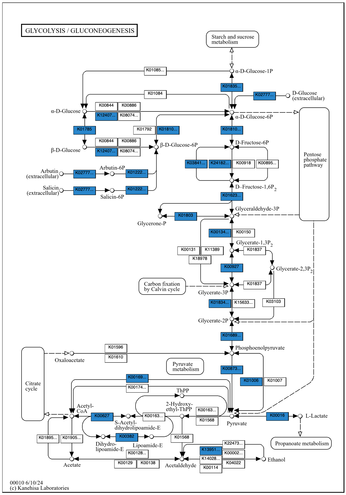
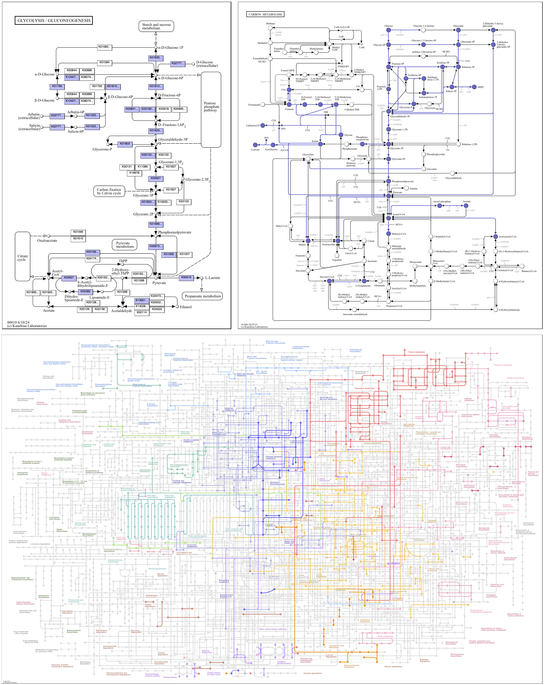
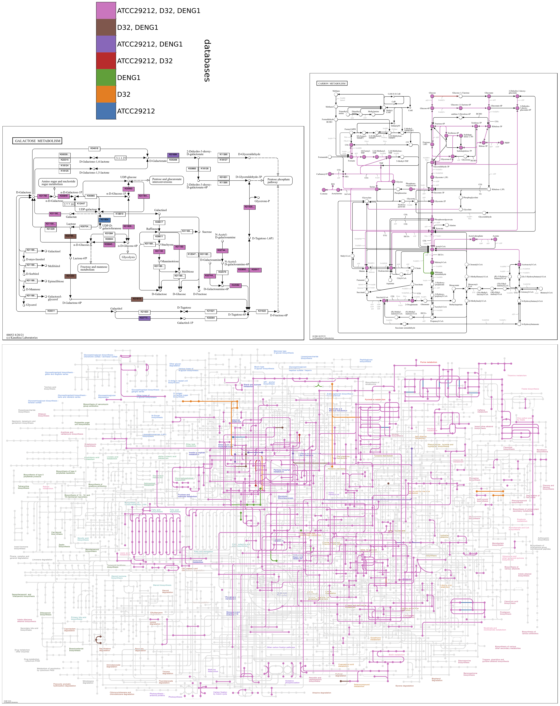
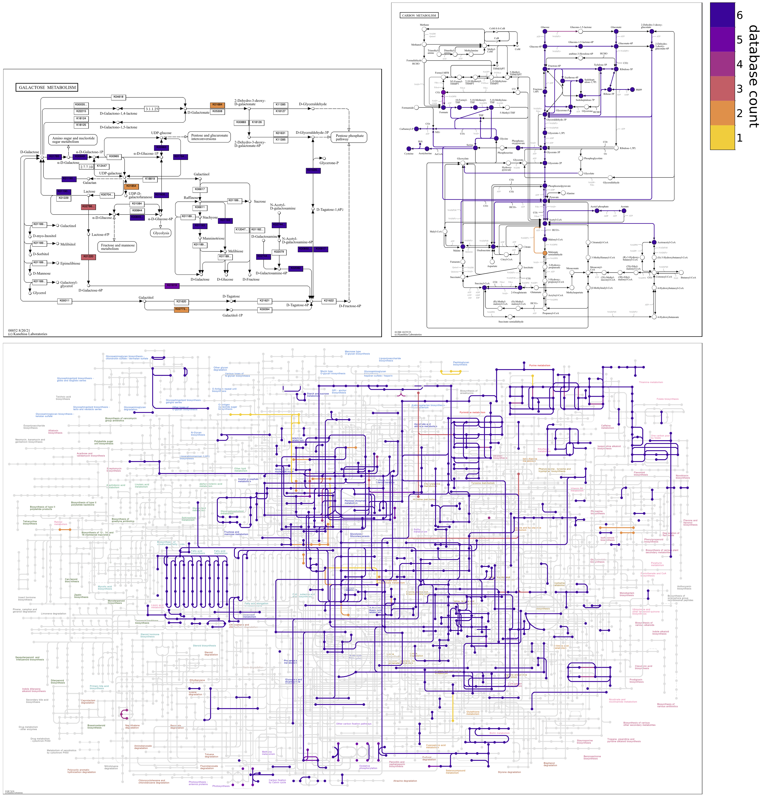
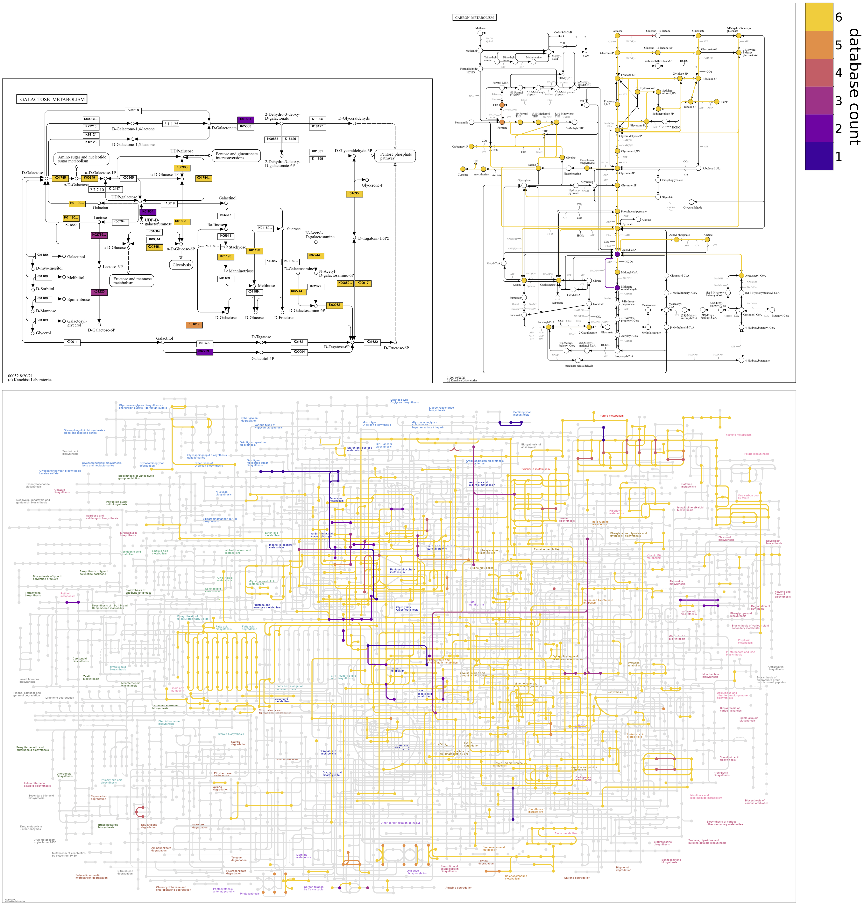
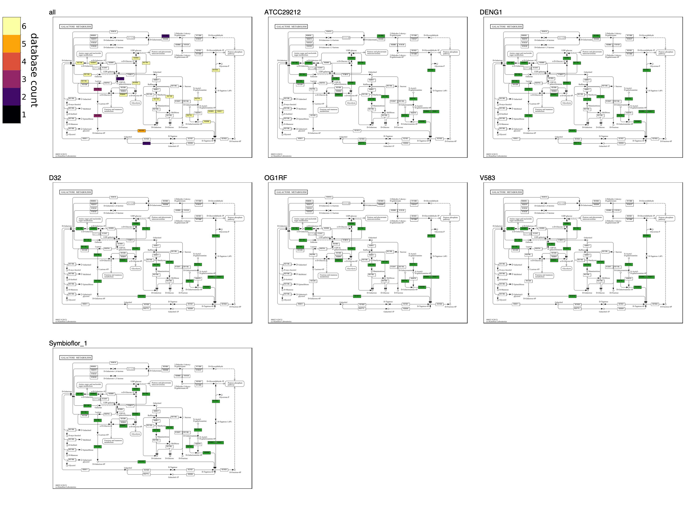
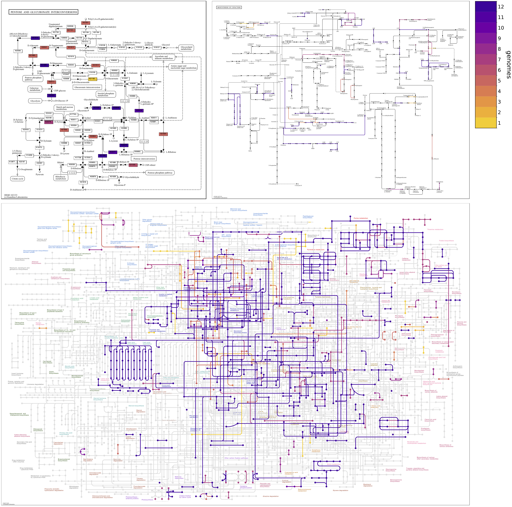

Write KEGG pathway map files incorporating data sourced from anvi&#x27;o databases..

🔙 **[To the main page](../../)** of anvi'o programs and artifacts.



{{ "network.json" }}
{{ 300 }}


## Authors

<a href="/people/semiller10" target="_blank">Samuel Miller</a>
<a href="https://semiller10.github.io" class="person-social" target="_blank"><i class="fa fa-fw fa-home"></i>Web</a><a href="mailto:samuelmiller10@gmail.com" class="person-social" target="_blank"><i class="fa fa-fw fa-envelope-square"></i>Email</a><a href="http://twitter.com/smiller_science" class="person-social" target="_blank"><i class="fa fa-fw fa-twitter-square"></i>Twitter</a><a href="http://github.com/semiller10" class="person-social" target="_blank"><i class="fa fa-fw fa-github"></i>Github</a>

## Can consume

[contigs-db](../../artifacts/contigs-db)  [external-genomes](../../artifacts/external-genomes)  [pan-db](../../artifacts/pan-db)  [genomes-storage-db](../../artifacts/genomes-storage-db)  [kegg-data](../../artifacts/kegg-data) 

## Can provide

[kegg-pathway-map](../../artifacts/kegg-pathway-map) 

## Usage

[anvi-draw-kegg-pathways](/help/main/programs/anvi-draw-kegg-pathways) draws [kegg-pathway-map](/help/main/artifacts/kegg-pathway-map) files incorporating data from anvi'o databases. The visualization of user data in the context of KEGG's curated biochemical pathways can reveal patterns in metabolism.

## Setup

There are hundreds of pathway maps, listed and categorized [here](https://www.genome.jp/kegg/pathway.html). [anvi-setup-kegg-data](/help/main/programs/anvi-setup-kegg-data) downloads the maps that have corresponding [files](https://www.kegg.jp/kegg/xml/) that allow elements of the map to be modified. Make sure to run that program with the `--kegg-snapshot` option to use the newest snapshot of [kegg-data](/help/main/artifacts/kegg-data), [`v2024-08-30`](https://figshare.com/articles/dataset/KEGG_build_2024-08-30/26880559?file=48903154), which includes pathway map files.

anvi&#45;setup&#45;kegg&#45;data &#45;&#45;kegg&#45;snapshot v2024&#45;08&#45;30

Additional Python packages may be needed if you installed anvi'o `v8.0-dev` before this program's package requirements were included. These can be installed with the following command.

pip install biopython ReportLab pymupdf frontend

### Download newest available files

Alternatively, KEGG data including maps can be set up not from a snapshot but by downloading the newest files available from KEGG using the `-D` flag. In the following command, a higher number of download threads than the default of 1 is provided by `-T`, which significantly speeds up downloading.

anvi&#45;setup&#45;kegg&#45;data &#45;D &#45;T 5

### Install in non-default location

At the moment, KEGG data that includes maps does _not_ include "stray" KOs (see [anvi-setup-kegg-data](/help/main/programs/anvi-setup-kegg-data)) due to changes in the available model files. To preserve KEGG data that you already have set up, for this reason or another, the new snapshot or download can be placed in a non-default location using the option, `--kegg-data-dir`.

anvi&#45;setup&#45;kegg&#45;data &#45;&#45;kegg&#45;snapshot v2024&#45;08&#45;30 &#45;&#45;kegg&#45;data&#45;dir path/to/other/directory

`anvi-draw-kegg-pathways` requires a `--kegg-dir` argument to seek KEGG data in a non-default location.

## Pathway selection

By default, this program draws the maps that contain data of interest, e.g., KO gene annotations in a [contigs-db](/help/main/artifacts/contigs-db).

To draw _all_ maps available in [kegg-data](/help/main/artifacts/kegg-data), including those that don't contain data of interest, use the flag, `--draw-bare-maps`.

The option, `--pathway-numbers`, limits the output to maps of interest. A single ID number can be provided, e.g., `00010` for `Glycolysis / Gluconeogenesis`, or multiple numbers can be listed, e.g., `00010 00020`. Regular expressions can also be provided, e.g., `011.. 012..`, where `.` represents any character: here the set of numbers given by `011..` corresponds to "global" maps and `012..` to "overview" maps.

The following command would draw all global maps and the glycolysis map, regardless of whether they contain any anvi'o data of interest (here, KO annotations from a contigs database).

anvi&#45;draw&#45;kegg&#45;pathways &#45;&#45;contigs&#45;dbs [contigs&#45;db](/help/main/artifacts/contigs&#45;db) \
                        &#45;o output_dir \
                        &#45;&#45;draw&#45;bare&#45;maps \
                        &#45;&#45;ko \
                        &#45;&#45;pathway&#45;numbers 011.. 00010

## KO occurrence

Gene sequences in anvi'o databases can be annotated with KEGG Orthologs (KOs): see [anvi-run-kegg-kofams](/help/main/programs/anvi-run-kegg-kofams). A KO indicates functional capabilities of the gene product. KO data from one or more contigs databases or a pan database can be mapped using the `--ko` flag, enabling investigation of the metabolic capabilities of individual organisms or multiple organisms, including community samples. Reactions associated with KOs are colored on the pathway maps.

### Single contigs database

Here is the basic command to draw KO data from a single [contigs-db](/help/main/artifacts/contigs-db).

anvi&#45;draw&#45;kegg&#45;pathways &#45;&#45;contigs&#45;dbs [contigs&#45;db](/help/main/artifacts/contigs&#45;db) \
                        &#45;o output_dir \
                        &#45;&#45;ko

Here are three maps drawn with this command from a bacterial genomic contigs database. The map in the upper left, `00010 Glycolysis / Gluconeogenesis`, is a "standard" map, in which boxes are associated with a reaction arrow and one or more KOs. The map in the upper right, `01200 Carbon metabolism`, is a metabolic "overview" map. Overview maps have numerical IDs in the range `012XX`. Reaction arrows in overview maps are associated with one or more KOs and are colored and widened if represented by anvi'o KO data. The bottom map, `01100 Metabolic pathways`, is a "global" metabolic map. Global maps have numerical IDs in the range `011XX`. Reaction lines in global maps are associated with one or more KOs and colored if represented by anvi'o KO data. In all maps, circles are colored if the compound they represent is involved in reactions that are also colored. (Occasionally complete data linking reaction and compound graphics is missing from the KEGG reference files, preventing the reaction color from being imparted to the compound. One such error can be seen at the very top of the overview map of `Carbon metabolism`, where `Glucono-1,5-lactone` is white when it should be green.)

#### Set color

The default color can be changed with the `--set-color` option.

The argument value can be a color hex code, e.g., `"#FF0000"` for red. It is necessary to enclose a color hex code argument value in quotation marks, as `#` otherwise causes the rest of the command to be ignored as a comment.

anvi&#45;draw&#45;kegg&#45;pathways &#45;&#45;contigs&#45;dbs [contigs&#45;db](/help/main/artifacts/contigs&#45;db) \
                        &#45;o output_dir \
                        &#45;&#45;pathway&#45;numbers 00010 \
                        &#45;&#45;ko \
                        &#45;&#45;set&#45;color "#2986cc"

The argument value can also be the string, `original`, for the original color scheme of the reference map. Global maps are especially colorful, with reactions varying in color across the map as a broad indication of function.

anvi&#45;draw&#45;kegg&#45;pathways &#45;&#45;contigs&#45;dbs [contigs&#45;db](/help/main/artifacts/contigs&#45;db) \
                        &#45;o output_dir \
                        &#45;&#45;pathway&#45;numbers 00010 01100 01200 \
                        &#45;&#45;ko \
                        &#45;&#45;set&#45;color original

### Multiple contigs databases

The KO content of multiple contigs databases can be compared. Database file paths can be provided directly on the command line or in an [external-genomes](/help/main/artifacts/external-genomes) text file.

anvi&#45;draw&#45;kegg&#45;pathways &#45;&#45;contigs&#45;dbs [contigs&#45;db](/help/main/artifacts/contigs&#45;db)_1 [contigs&#45;db](/help/main/artifacts/contigs&#45;db)_2 ... [contigs&#45;db](/help/main/artifacts/contigs&#45;db)_N \
                        &#45;o output_dir \
                        &#45;&#45;ko

anvi&#45;draw&#45;kegg&#45;pathways &#45;&#45;external&#45;genomes [external&#45;genomes](/help/main/artifacts/external&#45;genomes) \
                        &#45;o output_dir \
                        &#45;&#45;ko

The images in this section show data from contigs databases of genomes from different strains of the same bacterial species.

#### Color by database

When comparing a small number of contigs databases (realistically, two or three), reactions can be colored by their occurrence across databases, with each color representing a different database or combination of databases. A colorbar key is drawn in a separate file in the output directory, `colorbar.pdf`. Compound circles are imparted the color of the associated reaction found in the greatest number of databases.

#### Color by count

When comparing a larger number of contigs databases, it makes more sense to color reactions by the number of databases in which they occur using a sequential colormap rather than by database or combination of databases using a qualitative colormap. By default, coloring explicitly by database automatically applies to three or fewer databases, whereas coloring by database count applies to four or more databases. The user can override this default with the argument, `--colormap-scheme`, which accepts the values `by_database` and `by_count`. For example, the user may have three databases but wish to color reactions by database count, and so would specify `--colormap-scheme by_count`.

#### Reverse colormap

Changing the colormap can draw attention to different information on maps. When coloring by count, the default sequential colormap, `plasma_r`, goes from dark to light colors; reactions shared among all of the contigs databases are assigned the darkest color, and reactions unique to a single database are assigned the lightest color. The colormap can be reversed to accentuate unshared reactions in the darkest colors and shared reactions in the lightest colors. Reversing the default colormap is accomplished with the option, `--colormap plasma 0.1 0.9`. Note that Matplotlib colormap names differing by `_r` (here, `plasma` and `plasma_r`) have the same colors in reverse.

The second and third numerical `--colormap` values are not mandatory, but can be provided to trim a fraction of the colormap from each end to eliminate the lightest and darkest colors. The default coloring by database count with `plasma_r` uses limits of `0.1 0.9`. Just changing the colormap (e.g., `--colormap plasma`) removes the limits (i.e., changes them to `0.0 1.0`), so exactly reversing the default colormap requires that the same limits be specified.

The `--reverse-overlay` flag should also be used to reverse the default drawing order. This causes unshared reactions to be rendered above rather than below shared reactions, which is especially important in cluttered global maps.

anvi&#45;draw&#45;kegg&#45;pathways &#45;&#45;external&#45;genomes [external&#45;genomes](/help/main/artifacts/external&#45;genomes) \
                        &#45;o output_dir \
                        &#45;&#45;ko \
                        &#45;&#45;colormap plasma 0.1 0.9 \
                        &#45;&#45;reverse&#45;overlay

#### Showing individual database maps

Coloring by count obviously masks the individual contigs databases that contain the different reactions. However, options are provided to enable investigation of the distribution of reactions across databases.

Standalone map files showing the presence/absence of reactions in individual contigs databases can be drawn by using the flag, `--draw-individual-files`.

To facilitate comparisons, maps for individual databases can also be drawn alongside the "unified" map containing information from all databases by using the flag, `--draw-grid`.

The following command would draw individual map files plus grid files; a reverse colormap is used in unified maps to emphasize unshared reactions.

anvi&#45;draw&#45;kegg&#45;pathways &#45;&#45;external&#45;genomes [external&#45;genomes](/help/main/artifacts/external&#45;genomes) \
                        &#45;o output_dir \
                        &#45;&#45;draw&#45;grid \
                        &#45;&#45;draw&#45;individual&#45;files \
                        &#45;&#45;ko \
                        &#45;&#45;colormap plasma 0.1 0.9 \
                        &#45;&#45;reverse&#45;overlay

The following map grid reveals unique aspects of galactose metabolism among six related genomes.

### Pangenomic database

Pangenomes are treated similarly to multiple contigs databases. Rather than comparing the occurrence of KOs across contigs databases, consensus KO annotations of gene clusters are compared across genomes in a pangenomic database. Here is the basic structure of the command.

anvi&#45;draw&#45;kegg&#45;pathways &#45;p [pan&#45;db](/help/main/artifacts/pan&#45;db) \
                        &#45;g [genomes&#45;storage&#45;db](/help/main/artifacts/genomes&#45;storage&#45;db) \
                        &#45;o output_dir \
                        &#45;&#45;ko

The following maps were produced with a basic command using a pangenome constructed from 12 strains of two related bacterial species.

As with the comparison of contigs databases, it can be useful to reverse the colormap and create map grids to compare the KO content of genomes in the pangenome.

anvi&#45;draw&#45;kegg&#45;pathways &#45;p [pan&#45;db](/help/main/artifacts/pan&#45;db) \
                        &#45;g [genomes&#45;storage&#45;db](/help/main/artifacts/genomes&#45;storage&#45;db) \
                        &#45;o output_dir \
                        &#45;&#45;draw&#45;grid \
                        &#45;&#45;ko \
                        &#45;&#45;colormap plasma 0.1 0.9 \
                        &#45;&#45;reverse&#45;overlay

The following map grid reveals certain differences between the strains, and particularly the two species, in carbohydrate metabolism, with *faecalis* enriched in enzymes for xylose metabolism (towards the bottom of the map), and *faecium* enriched in enzymes for uronate metabolism (towards the top of the map).

{:.notice}
Edit [this file](https://github.com/merenlab/anvio/tree/master/anvio/docs/programs/anvi-draw-kegg-pathways.md) to update this information.

## Additional Resources

{:.notice}
Are you aware of resources that may help users better understand the utility of this program? Please feel free to edit [this file](https://github.com/merenlab/anvio/tree/master/bin/anvi-draw-kegg-pathways) on GitHub. If you are not sure how to do that, find the `__resources__` tag in [this file](https://github.com/merenlab/anvio/blob/master/bin/anvi-interactive) to see an example.
