Write KEGG pathway map files incorporating data sourced from external inputs.

🔙 **[To the main page](../../)** of anvi'o programs and artifacts.



{{ "network.json" }}
{{ 300 }}


## Authors

<a href="/people/semiller10" target="_blank">Samuel Miller</a>
<a href="https://semiller10.github.io" class="person-social" target="_blank"><i class="fa fa-fw fa-home"></i>Web</a><a href="mailto:samuelmiller10@gmail.com" class="person-social" target="_blank"><i class="fa fa-fw fa-envelope-square"></i>Email</a><a href="http://twitter.com/smiller_science" class="person-social" target="_blank"><i class="fa fa-fw fa-twitter-square"></i>Twitter</a><a href="http://github.com/semiller10" class="person-social" target="_blank"><i class="fa fa-fw fa-github"></i>Github</a>

## Requires

[kegg-data](../../artifacts/kegg-data) 

## Can use

[contigs-db](../../artifacts/contigs-db)  [external-genomes](../../artifacts/external-genomes)  [pan-db](../../artifacts/pan-db)  [genomes-storage-db](../../artifacts/genomes-storage-db)  [reaction-network-json](../../artifacts/reaction-network-json)  [kegg-reaction-txt](../../artifacts/kegg-reaction-txt)  [kegg-compound-txt](../../artifacts/kegg-compound-txt)  [kegg-category-colors-txt](../../artifacts/kegg-category-colors-txt) 

## Provides

[kegg-pathway-map](../../artifacts/kegg-pathway-map) 

## Usage

[anvi-draw-kegg-pathways](/help/main/programs/anvi-draw-kegg-pathways) draws [kegg-pathway-map](/help/main/artifacts/kegg-pathway-map) files from input [kegg-reaction-txt](/help/main/artifacts/kegg-reaction-txt) and/or [kegg-compound-txt](/help/main/artifacts/kegg-compound-txt) files, one or more [contigs-db](/help/main/artifacts/contigs-db)s, a [pan-db](/help/main/artifacts/pan-db), or a metabolic model file (see [reaction-network-json](/help/main/artifacts/reaction-network-json)). The visualization of user data in the context of KEGG's curated biochemical pathways can reveal patterns in metabolism.

## Setup

There are hundreds of pathway maps, listed and categorized [here](https://www.genome.jp/kegg/pathway.html). [anvi-setup-kegg-data](/help/main/programs/anvi-setup-kegg-data) downloads, among other files, the maps with corresponding [XML files](https://www.kegg.jp/kegg/xml/) that allow elements of the map to be modified. The following command sets up the database in a default anvi'o directory.

anvi&#45;setup&#45;kegg&#45;data

Additional Python packages may be needed if you installed anvi'o `v8.0-dev` before this program's package requirements were included. These can be installed with the following command.

pip install biopython reportlab pymupdf

The program can be tested with the following command.

anvi&#45;self&#45;test &#45;&#45;suite kegg&#45;mapping

### Download newest available files

Alternatively, KEGG data can be set up not from a snapshot but by downloading the newest files available from KEGG using the `-D` flag. In the following command, a higher number of download threads than the default of 1 is provided by `-T`, which significantly speeds up downloading.

anvi&#45;setup&#45;kegg&#45;data &#45;D &#45;T 5

### Install in non-default location

To preserve KEGG data that you've already set up for whatever reason, the new snapshot or download can be placed in a non-default location using the option, `--kegg-data-dir`.

anvi&#45;setup&#45;kegg&#45;data &#45;&#45;kegg&#45;data&#45;dir path/to/other/directory

`anvi-draw-kegg-pathways` requires a `--kegg-dir` argument to seek KEGG data in a non-default location.

## Pathway selection

By default, this program draws the maps that contain data of interest, e.g., KO gene sequence annotations in a [contigs-db](/help/main/artifacts/contigs-db).

To draw _all_ maps available in [kegg-data](/help/main/artifacts/kegg-data), including those that don't contain data of interest, use the flag, `--draw-bare-maps`.

The option, `--pathway-numbers`, limits the output to maps of interest. A single ID number can be provided, e.g., `00010` for `Glycolysis / Gluconeogenesis`, or multiple numbers can be listed, e.g., `00010 00020`. Regular expressions can also be provided, e.g., `011.. 01[23]..`, where `.` represents any character: here the set of numbers given by `011..` corresponds to "global" maps and `01[23]..` to "overview" maps.

The following command would draw all global maps and the glycolysis map, regardless of whether they contain any anvi'o data of interest (here, KO annotations from a contigs database).

anvi&#45;draw&#45;kegg&#45;pathways &#45;&#45;contigs&#45;dbs [contigs&#45;db](/help/main/artifacts/contigs&#45;db) \
                        &#45;&#45;pathway&#45;numbers 011.. 00010 \
                        &#45;&#45;draw&#45;bare&#45;maps \
                        &#45;o output_dir

## Output

This program requires the path to a directory as an argument to `-o` or `--output-dir`. This must be a non-existent directory unless the flag, `-W` or `--overwrite-output-destinations`, is also used. Options are available to make it easier to browse through output files and anticipate their contents.

### Directory layout

Map files are sorted into up to four subdirectories, one for each kind of map:

|Subdirectory|Contents|
|:--|:--|
|`unified`|The type of map drawn from all of the data at once. With a single source — a [kegg-reaction-txt](/help/main/artifacts/kegg-reaction-txt) and/or [kegg-compound-txt](/help/main/artifacts/kegg-compound-txt) with no `sample` column, one [contigs-db](/help/main/artifacts/contigs-db), or one [reaction-network-json](/help/main/artifacts/reaction-network-json) — these maps per pathway are the only ones drawn.|
|`individual`|One subdirectory per data source, named after it: each sample of a text file, each contigs database, each genome of a pangenome, or, when they are grouped with a [groups-txt](/help/main/artifacts/groups-txt) file, each group instead. Drawn on request with `--draw-individual-files`.|
|`grid`|The map grids, each showing the `unified` map alongside the individual ones. Drawn on request with `--draw-grid`.|
|`by_map`|The same individual maps arranged the other way round: one subdirectory per map, each holding one file per data source, named after it. Written on request with `--collate-files-by-map`.|

Colorbars, which are keys to the colors of every map in the run, are written at the top of the output directory beside these subdirectories.

Because the names in `individual` come from your own data, they are kept in that subdirectory of their own: a sample, genome, or group may be named anything at all — including `unified`, `grid`, `by_map`, `all_maps`, or `Metabolism` — without ever colliding with a directory this program creates for itself.

The one requirement is that a name becoming a subdirectory has to work as a directory name, so a name containing a path separator, such as `Rhizobium meliloti RU11/001`, is refused. This only applies to the sources that are actually drawn individually: a source summarized on the `unified` map contributes color rather than a path, so its name is never used as one, and a source left out of a subset requested with `--draw-individual-files` or `--draw-grid` is not checked either.

### File names

By default, an output file is named after the map's KEGG accession, e.g., `ko00010.pdf` for `Glycolysis / Gluconeogenesis`. The `--name-files` flag attaches a simplified version of the pathway name to the file name, e.g., `ko00010_Glycolysis_Gluconeogenesis.pdf`.

### File categorization

The `--categorize-files` flag categorizes output map files into a subdirectory structure based on the KEGG [BRITE hierarchy of pathways](https://www.genome.jp/brite/br08901). For example, a `Glycolysis / Gluconeogenesis` map would be placed in a directory named `Metabolism/Carbohydrate_metabolism`, as would a `Citrate cycle (TCA cycle)` map, whereas an `RNA polymerase` map would be placed in a directory named `Genetic_Information_Processing/Transcription`. These category directories are built inside each of the subdirectories described above, so a categorized map of one sample would be found at, say, `individual/SAMPLE_1/Metabolism/Carbohydrate_metabolism/ko00010.pdf`. Within `unified`, `individual`, and `grid`, a subdirectory named `all_maps` is created alongside them, holding a hard link to every one of that directory's maps so that they can also be reached from a single place.

Here is a simple example of the output file structure produced with `--name-files` and `--categorize-files` in the course of `anvi-self-test --suite kegg-mapping` (with the `-o` option to save the temporary directories in the test from removal).

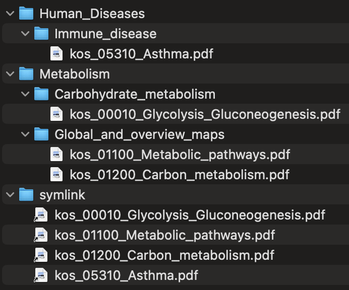{:.center-img .width-50}

### Gathering files by map

`--draw-individual-files` writes one subdirectory per data source, each holding that source's whole set of maps. That is the right arrangement for reading everything about one sample, and the wrong one for comparing a single map across samples, which means opening one file in each of those subdirectories. The `--collate-files-by-map` flag adds the transposed view: a subdirectory named after each map, holding one file per source, named after the source.

With samples `A` through `E`, `by_map/ko00010` holds `A.pdf` through `E.pdf`, `by_map/ko00020` holds another five files, and so on. Selecting everything in one of those subdirectories and stepping through it with a file browser's preview shows the colors of a single map changing from sample to sample, like an animation. Files are sorted by the name of their source, so name your samples in the order in which you would like to step through them.

This is a second arrangement of the same files rather than a replacement: the subdirectory per source stays where it is, and the gathered files are links to the maps already drawn there, so they take up no disk space of their own. `--name-files` and `--categorize-files` apply here as they do elsewhere in the output, so with both of them a gathered map would be found at, say, `by_map/Metabolism/Carbohydrate_metabolism/ko00010_Glycolysis_Gluconeogenesis/SAMPLE_1.pdf`.

## Mapping reaction and compound occurrence

Gene sequences in anvi'o databases can be annotated with KEGG Orthologs (KOs) indicating the functional capabilities of the gene product: see [anvi-run-kegg-kofams](/help/main/programs/anvi-run-kegg-kofams). KO data can be provided directly by a [kegg-reaction-txt](/help/main/artifacts/kegg-reaction-txt) file or a reaction network JSON file, instead of through anvi'o databases. KO data from one or more organisms can be mapped, enabling the comparison of metabolic capabilities.

Rather than KOs, KEGG reactions supplied by a [kegg-reaction-txt](/help/main/artifacts/kegg-reaction-txt) file can be used to draw the reaction layer; both map to reaction elements — reaction lines in global and overview maps and boxes in standard maps.

KEGG compounds provided by a [kegg-compound-txt](/help/main/artifacts/kegg-compound-txt) file can be used to draw the compound layer of circle elements on maps.

### Reaction and compound text files

Maps can be drawn directly from per-layer text files — the quickest way to visualize custom data, needing no anvi'o database. There is one file per layer, and either or both can be given:

- a [kegg-reaction-txt](/help/main/artifacts/kegg-reaction-txt) file (`--reaction-txt`) colors the **reaction layer**. Its `accession` column holds either KO IDs (`K#####`), as with the database inputs, **or** KEGG reaction IDs (`R#####`) when data are per-reaction, such as a metabolic model's fluxes — ALL accessions in the file must be of one type or the other.
- a [kegg-compound-txt](/help/main/artifacts/kegg-compound-txt) file (`--compound-txt`) colors the **compound layer**, from data such as metabolomics. Its `accession` column holds compound IDs (`C#####`).

When both files are given, the two layers are drawn together on each map, each on its own color scale, so that (for example) metabolite levels can be compared against enzyme expression. Each layer is colored independently by its own auto-detected mode (see below). Here is a basic command drawing just the reaction layer.

anvi&#45;draw&#45;kegg&#45;pathways &#45;&#45;reaction&#45;txt [kegg&#45;reaction&#45;txt](/help/main/artifacts/kegg&#45;reaction&#45;txt) \
                        &#45;o output_maps/

See [kegg-reaction-txt](/help/main/artifacts/kegg-reaction-txt) and [kegg-compound-txt](/help/main/artifacts/kegg-compound-txt) for the full format of each file.

Data from more than one origin, such as multiple genomes or samples, can be compared on the same maps by adding a `sample` column. Because this works just like comparing multiple contigs databases, it is described further below, under [Compare samples in an input text file](#compare-samples-in-an-input-text-file).

Instead of showing presence/absence, elements can be colored by a continuous quantitative value from a numeric column of the file, such as KO coverage, reaction flux, or compound concentration. This is described below, under [Color elements by a quantitative value](#color-elements-by-a-quantitative-value).

### Reaction network JSON file

Pathway maps can be drawn from a reaction network JSON file produced by [anvi-reaction-network](/help/main/programs/anvi-reaction-network) or [anvi-get-metabolic-model-file](/help/main/programs/anvi-get-metabolic-model-file). This is especially useful with custom enzyme lists — for example, annotations from transcriptomic or proteomic data, or predicted gene content of a last common ancestor.

anvi&#45;draw&#45;kegg&#45;pathways &#45;&#45;reaction&#45;network&#45;json /path/to/network.json \
                        &#45;o output_maps/

### Single contigs database

Pathway maps can be drawn from KO data in a single [contigs-db](/help/main/artifacts/contigs-db).

anvi&#45;draw&#45;kegg&#45;pathways &#45;&#45;contigs&#45;dbs [contigs&#45;db](/help/main/artifacts/contigs&#45;db) \
                        &#45;o output_dir

Here are three maps drawn with this command from a bacterial genomic contigs database. The map in the upper left, `00010 Glycolysis / Gluconeogenesis`, is a "standard" map, in which boxes are associated with a reaction arrow and one or more KOs. The map in the upper right, `01200 Carbon metabolism`, is a metabolic "overview" map. Overview maps have numerical IDs in the range `012XX` and `013XX`. Reaction arrows in overview maps are associated with one or more KOs and are colored and widened if represented by anvi'o KO data. The bottom map, `01100 Metabolic pathways`, is a "global" metabolic map. Global maps have numerical IDs in the range `011XX`. Reaction lines in global maps are associated with one or more KOs and colored if represented by anvi'o KO data. In all maps, circles are colored if the compound they represent is involved in reactions that are also colored. (Occasionally complete data linking reaction and compound graphics is missing from the KEGG reference files, preventing the reaction color from being imparted to the compound. One such error can be seen at the very top of the overview map of `Carbon metabolism`, where `Glucono-1,5-lactone` is white when it should be green.)

#### Set color

The default reaction color can be changed with the `--reaction-color` option. For text-file input, the compound layer has its own `--compound-color`.

The argument can be a color hex code, e.g., `"#FF0000"` for red. It is necessary to enclose a color hex code argument in quotation marks, as `#` otherwise causes the rest of the command to be ignored as a comment.

anvi&#45;draw&#45;kegg&#45;pathways &#45;&#45;contigs&#45;dbs [contigs&#45;db](/help/main/artifacts/contigs&#45;db) \
                        &#45;&#45;pathway&#45;numbers 00010 \
                        &#45;&#45;reaction&#45;color "#2986cc" \
                        &#45;o output_dir

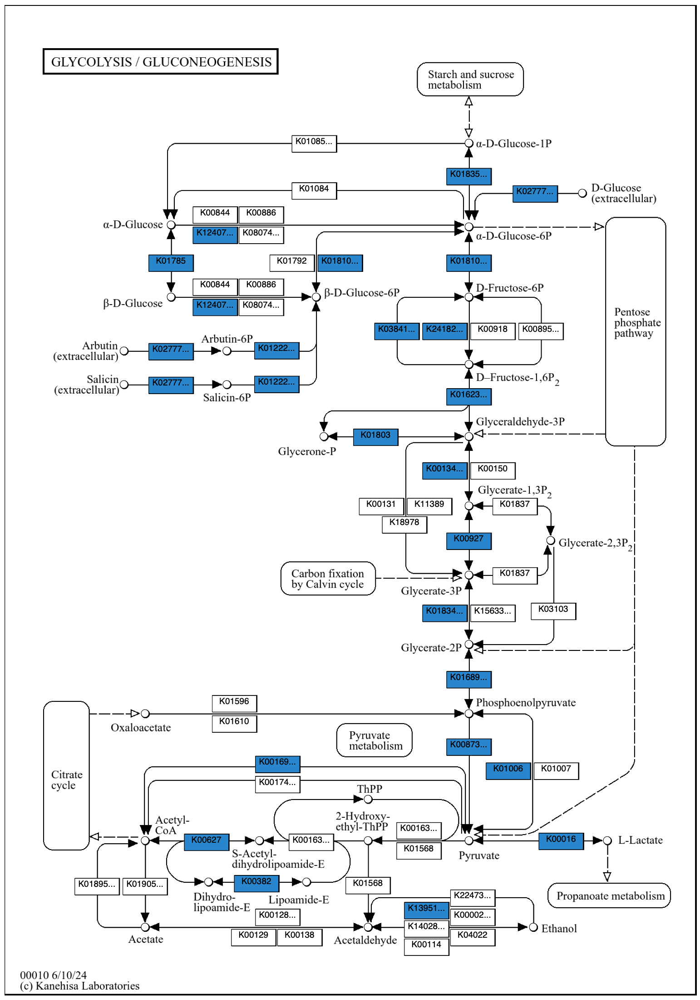{:.center-img .width-60}

The `--original-color` flag instead uses the original color scheme of the reference map. Global maps are especially colorful, with reactions varying in color across the map as a broad indication of function.

anvi&#45;draw&#45;kegg&#45;pathways &#45;&#45;contigs&#45;dbs [contigs&#45;db](/help/main/artifacts/contigs&#45;db) \
                        &#45;&#45;pathway&#45;numbers 00010 01100 01200 \
                        &#45;&#45;original&#45;color \
                        &#45;o output_dir

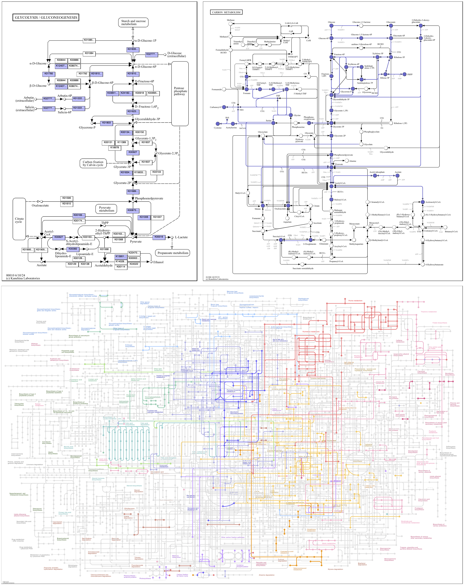

### Compare multiple contigs databases

The KO content of multiple contigs databases can be compared. Database file paths can be provided directly on the command line or in an [external-genomes](/help/main/artifacts/external-genomes) text file.

anvi&#45;draw&#45;kegg&#45;pathways &#45;&#45;contigs&#45;dbs [contigs&#45;db](/help/main/artifacts/contigs&#45;db)_1 [contigs&#45;db](/help/main/artifacts/contigs&#45;db)_2 ... [contigs&#45;db](/help/main/artifacts/contigs&#45;db)_N \
                        &#45;o output_dir

anvi&#45;draw&#45;kegg&#45;pathways &#45;&#45;external&#45;genomes [external&#45;genomes](/help/main/artifacts/external&#45;genomes) \
                        &#45;o output_dir

The images in this section show data from contigs databases of genomes from different strains of the same bacterial species.

#### Color by database

When comparing a small number of contigs databases (realistically, two or three), reactions can be colored by their occurrence across databases, with each color representing a different database or combination of databases. A colorbar key is drawn in a separate file in the output directory, `colorbar_reactions.pdf`. Compound circles are imparted the color of the associated reaction found in the greatest number of databases.

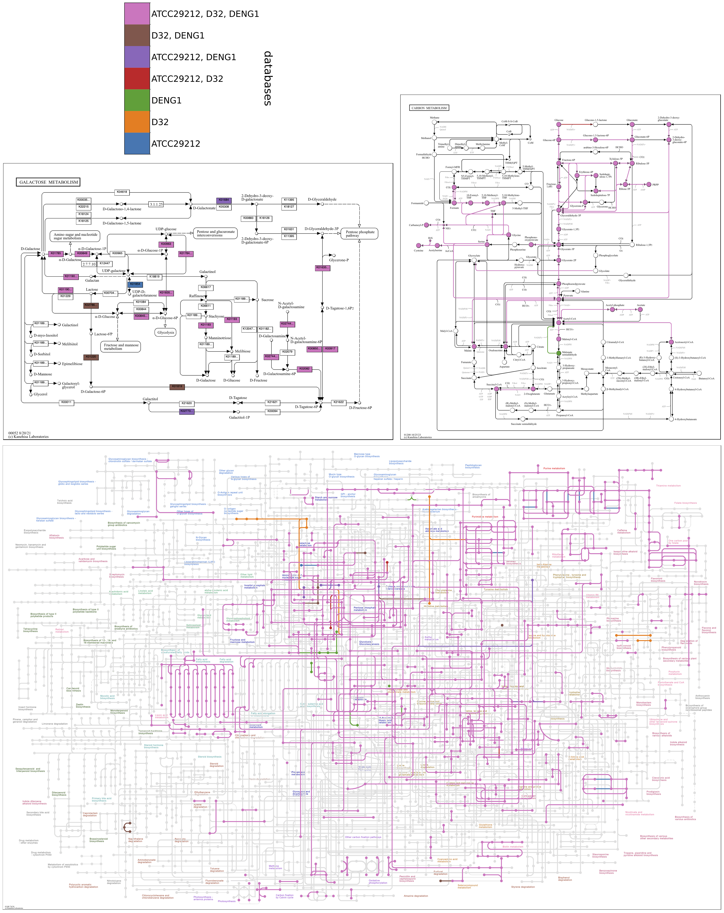

#### Color by count

When comparing a larger number of contigs databases, it makes more sense to color reactions by the number of databases in which they occur using a sequential colormap rather than by database or combination of databases using a qualitative colormap. By default, coloring explicitly by database automatically applies to three or fewer databases, whereas coloring by database count applies to four or more databases. The user can override this default with the option, `--presence-colormap-scheme`, which accepts the values `by_membership`, `by_count`, and `by_count_continuous`. For example, the user may have three databases but wish to color reactions by database count, and so would specify `--presence-colormap-scheme by_count`.

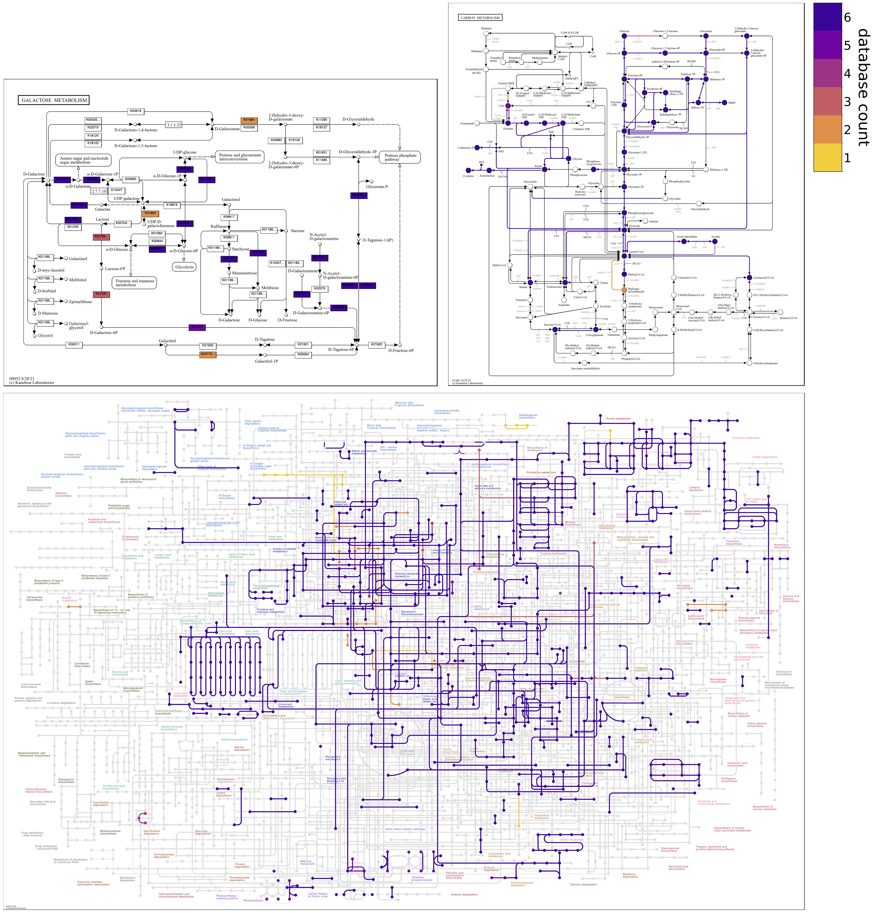

##### Counts on a continuous scale

`by_count` labels one band per count, which asks two things of the colorbar. It needs a distinguishable color for each count, and is refused when there are more categories than the colormap can supply — a few hundred at most. It also needs room to set every one of those labels: a label is sized to fit its band, so past about 40 bands they are too small to read. Asking for `by_count` above that draws the bands anyway, with a warning that the labels will be tiny.

`by_count_continuous` colors counts from the same colormap but draws the colorbar as a gradient and not a discrete band per count, so it needs neither a color nor a label per count and works with any number of categories. It is chosen automatically, with a warning, wherever `by_count` would be refused or its labels would be unreadable.

For a [kegg-reaction-txt](/help/main/artifacts/kegg-reaction-txt) or [kegg-compound-txt](/help/main/artifacts/kegg-compound-txt) file this is the summaries' `count_continuous` rather than `--presence-colormap-scheme`; see [Compare samples in an input text file](#compare-samples-in-an-input-text-file). The count scale of a group's own maps has the same two choices under its own option, `--group-colormap-scheme`; see [counts in bands or on a gradient](#counts-in-bands-or-on-a-gradient).

##### Where a count scale stops

A count scale runs from 1 to a maximum set by `--count-scale-max`: `observed` (the default) stops at the highest count on the drawn maps, `total` runs to every category there is, and a number pins it, with higher counts assigned the top color.

This matters for sparse data. With 100 samples and no compound in more than 10 of them, a scale to 100 draws every compound in nearly indistinguishable shades at the bottom of the colormap, while a scale to 10 spreads them across it. The cost of `observed` is that the scale depends on which maps were drawn, so use `total` or a number where figures have to be comparable between runs.

#### Choose the color of each category yourself

Instead of having anvi'o sample a colormap, a color can be given to each category — each contigs database, genome, sample, or group — in a [kegg-category-colors-txt](/help/main/artifacts/kegg-category-colors-txt) file, passed with `--reaction-category-colors` (and `--compound-category-colors` for the compound layer of a [kegg-compound-txt](/help/main/artifacts/kegg-compound-txt) file). This is what to reach for when a category's color has to mean the same thing across every figure in a paper.

|category|color|
|:--|:--|
|E_faecalis_6240|#1f77b4|
|E_faecalis_6255|#ff7f0e|
|E_faecalis_6512|#2ca02c|

Coloring by membership colors a reaction by exactly *which* categories contain it, so it needs a color per *combination* of them: a category on its own takes its own color, and a combination takes the perceptual blend of its members' colors, which a row naming the combination (its names separated by commas) overrides. Where the categories are samples, databases or genomes, the same colors also color each category's own map, so a panel of a grid says which category it is and matches the band it takes on the `unified` map. Where they are groups, each group's own maps count that group's sources rather than showing which of them an element is in, so it is `--group-colormap category` that carries a group's color onto them.

Because the colors answer the same question a colormap does, this replaces `--reaction-colormap` and cannot be combined with it. It also does not apply to coloring by *count*, which says how many categories contain a reaction rather than which, and so has no category whose color it could take.

anvi&#45;draw&#45;kegg&#45;pathways &#45;&#45;external&#45;genomes [external&#45;genomes](/help/main/artifacts/external&#45;genomes) \
                        &#45;&#45;reaction&#45;category&#45;colors [kegg&#45;category&#45;colors&#45;txt](/help/main/artifacts/kegg&#45;category&#45;colors&#45;txt) \
                        &#45;&#45;draw&#45;grid \
                        &#45;o output_dir

#### Reverse colormap

Changing the colormap can draw attention to different information on maps. When coloring by count, the default sequential colormap, `plasma_r`, goes from dark to light colors; reactions shared among all of the contigs databases are assigned the darkest color, and reactions unique to a single database are assigned the lightest color. The colormap can be reversed to accentuate unshared reactions in the darkest colors and shared reactions in the lightest colors. Reversing the default colormap is accomplished with the option, `--reaction-colormap plasma 0.1 0.9`. Note that Matplotlib colormap names differing by `_r` (here, `plasma` and `plasma_r`) have the same colors in reverse.

The second and third numerical `--reaction-colormap` values are not mandatory, but can be provided to trim a fraction of the colormap from each end to eliminate the lightest and darkest colors. The default coloring by database count with `plasma_r` uses limits of `0.1 0.9`. Just changing the colormap (e.g., `--reaction-colormap plasma`) removes the limits (i.e., changes them to `0.0 1.0`), so exactly reversing the default colormap requires that the same limits be specified.

The `--reaction-reverse-overlay` flag should also be used to reverse the default drawing order. This causes unshared reactions to be rendered above rather than below shared reactions, which is especially important in cluttered global maps.

anvi&#45;draw&#45;kegg&#45;pathways &#45;&#45;external&#45;genomes [external&#45;genomes](/help/main/artifacts/external&#45;genomes) \
                        &#45;&#45;reaction&#45;colormap plasma 0.1 0.9 \
                        &#45;&#45;reaction&#45;reverse&#45;overlay \
                        &#45;o output_dir

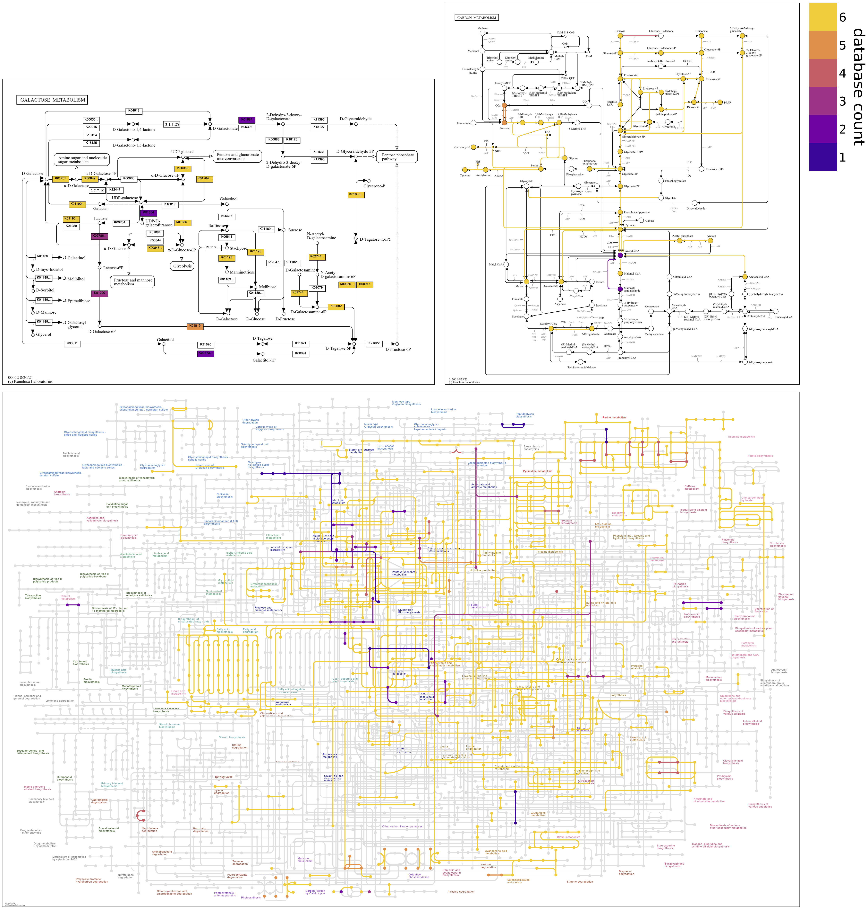

#### Show individual database maps

Coloring by count obviously masks the individual contigs databases that contain the different reactions. However, options are provided to enable investigation of the distribution of reactions across databases.

Standalone map files showing the presence/absence of reactions in all of the individual contigs databases can be drawn by using the option, `--draw-individual-files`, as a flag. Files can be drawn just for a subset of input databases by passing file arguments to the option, e.g., `--draw-individual-files contigs_db_1 contigs_db_3`. Individual map files for each database are stored in subdirectories of the output directory, with subdirectory names being the project names of databases.

To facilitate comparisons, maps for individual databases can also be drawn alongside the "unified" map containing information from all databases by using the option, `--draw-grid`, as a flag. Maps for just a subset of individual databases can be shown alongside the unified map in the grid file by passing file arguments to the option, e.g., `--draw-grid contigs_db_2 contigs_db_3`. Grid files are stored in a subdirectory of the output directory named `grid`.

The following command would draw individual map files plus grid files for all input contigs databases; a reverse colormap is used in unified maps to emphasize unshared reactions.

anvi&#45;draw&#45;kegg&#45;pathways &#45;&#45;external&#45;genomes [external&#45;genomes](/help/main/artifacts/external&#45;genomes) \
                        &#45;&#45;draw&#45;grid \
                        &#45;&#45;draw&#45;individual&#45;files \
                        &#45;&#45;reaction&#45;colormap plasma 0.1 0.9 \
                        &#45;&#45;reaction&#45;reverse&#45;overlay \
                        &#45;o output_dir

The following map grid uncovers aspects of `Galactose metabolism` among the genomes of six *Enterococcus faecalis* strains. The unified map shows that some genomes may be missing steps from `Lactose` to `D-Tagatose-6P` in the tagatose-6-phosphate pathway, an alternative to the Leloir pathway for lactose catabolism found in some lactic acid bacteria. The individual maps show that strain **ATCC29212** is missing three consecutive steps; **OG1RF** and **V583** are missing two consecutive steps. When sequential reactions catalyzed by different enzymes are missing from a pathway in a closed genomic assembly while present in related genomes, it compellingly suggests that the genes and biological capacity are not in the genome rather than absent due to technical issues of orthology annotation.

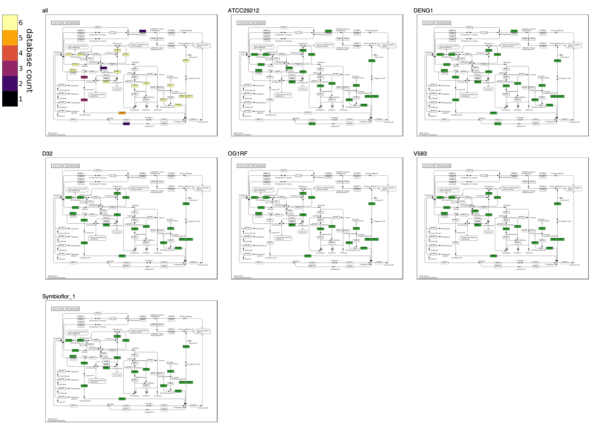

### Compare groups of contigs databases

A [groups-txt](/help/main/artifacts/groups-txt) file can be supplied to define groups of contigs databases. For example, databases representing genomes could be grouped by taxonomy, databases representing enrichment cultures under different conditions could be grouped by treatment, or databases representing marine metagenomic samples could be grouped by depth. The first column of [groups-txt](/help/main/artifacts/groups-txt) must contain the paths to the input contigs databases provided with `--contigs-dbs`. The second column headed `group` must contain group names, such as `Pacific`, `Atlantic`, and `Arctic`. Each database can only be assigned to one group.

A `--group-threshold` argument between 0 and 1 must also be provided to analyze groups. The group threshold is the proportion of databases in a group that must contain KOs defining a reaction on a map for the reaction to be associated with the group. A threshold of 0 means that ANY database in the group can contain the reaction for the reaction to be considered present in the group. A threshold of 0.75 means that at least 75% of databases in the group must contain the reaction for it to be present. A threshold of 1 means that ALL of the databases in the group must contain the reaction for it be present.

For example, set the threshold to 0.5. Reaction J on a map is defined by KO X and Reaction K is defined by KOs Y and Z. 90% of Pacific, 50% of Atlantic, and 10% of Arctic metagenomes contain KO X, so Reaction J would be colored to indicate that it is found in the Pacific and Atlantic. 0% of Pacific, 15% of Atlantic, and 40% of Arctic metagenomes contain KO Y or KO Z, so Reaction K would not be colored, being considered absent from the groups.

anvi&#45;draw&#45;kegg&#45;pathways &#45;&#45;external&#45;genomes [external&#45;genomes](/help/main/artifacts/external&#45;genomes) \
                        &#45;&#45;groups&#45;txt [groups&#45;txt](/help/main/artifacts/groups&#45;txt) \
                        &#45;&#45;group&#45;threshold 0.5 \
                        &#45;o output_dir

As with comparisons of databases rather than groups, the default setting with two or three groups is to color reactions explicitly by the group or combination of groups in which they occur. With more databases, it makes more sense to color reactions by the number of databases in which they occur using a sequential colormap. The option `--presence-colormap-scheme` can be used to override this behavior, e.g., to color reactions by group count rather than explicitly by membership using `--presence-colormap-scheme by_count`.

The following example continues with `Galactose metabolism`, now including two groups of genomic contigs databases from *Enterococcus faecalis* and *Enterococcus faecium*. The program was run three times with different values of `--group-threshold`. The top map has a threshold of 0, so a reaction is included in the *faecalis* group if it has corresponding KOs in any of the six *faecalis* genomes, and included in the *faecium* group if it has KOs in any of the five *faecium* genomes. The middle map has a threshold of 0.5, so reactions in the *faecalis* group must be in at least four of six *faecalis* genomes, and reactions in the *faecium* group must be in at least three of five genomes. The bottom map has a threshold of 1. As in the map grid of *faecalis* genomes from above, the group maps show that some *faecalis* strains may be missing steps from `Lactose` to `D-Tagatose-6P` in the tagatose-6-phosphate pathway, though at least four of the strains have each step. In comparison, a greater proportion of the *faecium* strains have these steps, with all of them having the first two, as seen in the bottom map with a threshold of 1.

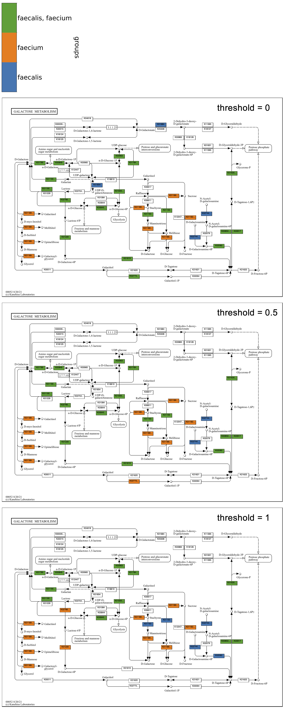

Below is the `Global metabolism` map using the same species groups with thresholds of 0 and 1. The map with a threshold of 0 shows how some metabolic pathways are present only in *faecalis* or *faecium* genomes, and the threshold of 1 shows how some of these unique pathways are conserved amongst all of the genomes of the species, such as the *faecalis* (blue) reactions in the upper right corner of the map involved in cofactor biosynthesis, and the *faecium* (orange) reactions in the upper center involved in sugar metabolism, including galactose, pentoses, and uronates.

Exploring the `Folate biosynthesis` map given the observation regarding cofactors in the global map, all *faecalis* genomes have a full set of enzymes required for folate biosynthesis, whereas all *faecium* genomes appear to be missing a big chunk of the pathway in the center of the map, from `7,8-Dihydroneopterin 3'-3P` to `7,8-Dihydropteroate`. The implication of folate auxotropy in *faecium* is confirmed by Ramsey, Hartke, and Huycke in [The Physiology and Metabolism of Enterococci](https://www.ncbi.nlm.nih.gov/books/NBK190432/): "Characteristically, *E. faecium* requires folate while *E. faecalis* does not."

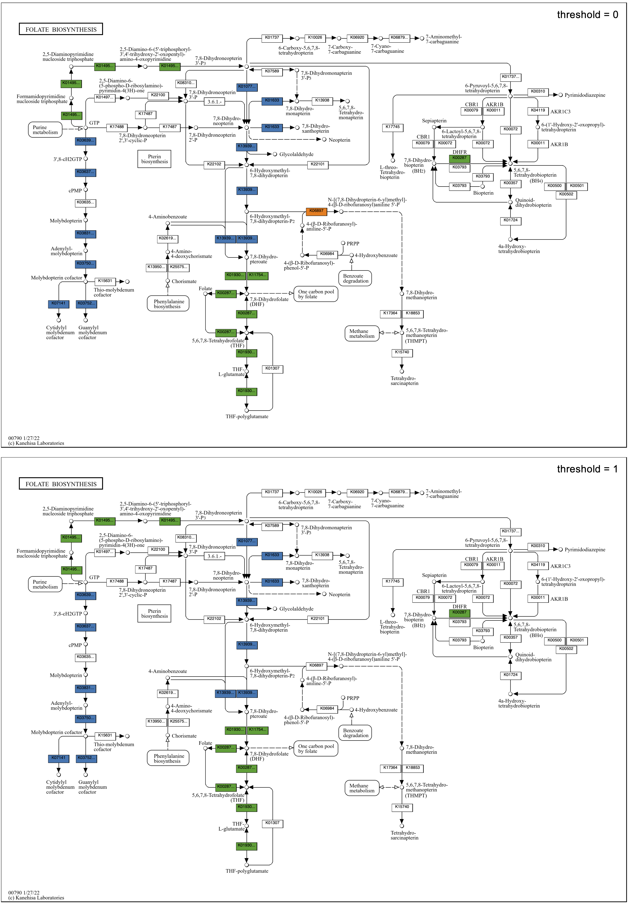

#### Show individual group maps

Maps can be drawn for individual groups as grids or separate files. These depict the occurrence of reactions across contigs databases in each group, identical to the maps that can be drawn to compare ungrouped databases.

Coloring options are available for individual group maps, `--group-colormap`, `--group-colormap-scheme` and `--group-reverse-overlay`. Unlike drawing maps for ungrouped databases, drawing maps for individual groups always colors reactions by database count regardless of the number of databases in the group in order to facilitate the comparison of individual group maps using the same colormap scheme.

With the option, `--draw-individual-files`, individual group map files and a colorbar file are written to subdirectories of the output directory named after groups. With the option, `--draw-grid`, map grid files and colorbar files are written to the `grid` subdirectory of the output directory. There are colorbar files for each individual group in the grids: using our example *Enterococcus* dataset, there are files like *colorbar_faecalis.pdf* and *colorbar_faecium.pdf*.

A subset of groups can be considered, limiting the individual files drawn or the individual maps shown in grids to the specified groups, e.g., `--draw-individual-files faecalis`, `--draw-grid faecium`.

The following command would draw individual map files plus grid files for all groups. A reverse colormap is used in individual group maps to emphasize reactions that are not shared across databases of the group. The group threshold is set to 0, meaning a reaction is classified in a group if it occurs in any database, since the individual group maps reveal the number of databases in which the reaction occurs.

anvi&#45;draw&#45;kegg&#45;pathways &#45;&#45;external&#45;genomes [external&#45;genomes](/help/main/artifacts/external&#45;genomes) \
                        &#45;&#45;groups&#45;txt [groups&#45;txt](/help/main/artifacts/groups&#45;txt) \
                        &#45;&#45;group&#45;threshold 0 \
                        &#45;&#45;draw&#45;individual&#45;files \
                        &#45;&#45;draw&#45;grid \
                        &#45;&#45;group&#45;colormap plasma 0.1 0.9 \
                        &#45;&#45;group&#45;reverse&#45;overlay \
                        &#45;o output_dir

##### Give each group's maps its own color

A group's own maps show a *magnitude* — the number of the group's databases, genomes, or samples containing a reaction — while a group's color on the `unified` map is an *identity*. The two are separate by default: `--group-colormap` names a colormap engineered for showing magnitude, and a [kegg-category-colors-txt](/help/main/artifacts/kegg-category-colors-txt) file does not change it.

To bind them, give `--group-colormap category`. Each group's scale is then a ramp running from a pale tint to that group's own color, so `faecalis` panels are drawn in shades of one hue and `faecium` panels in shades of another. Every group's ramp is built the same way, so the panels of a grid stay comparable while each says which group it is.

anvi&#45;draw&#45;kegg&#45;pathways &#45;&#45;external&#45;genomes [external&#45;genomes](/help/main/artifacts/external&#45;genomes) \
                        &#45;&#45;groups&#45;txt [groups&#45;txt](/help/main/artifacts/groups&#45;txt) \
                        &#45;&#45;group&#45;threshold 0 \
                        &#45;&#45;reaction&#45;category&#45;colors [kegg&#45;category&#45;colors&#45;txt](/help/main/artifacts/kegg&#45;category&#45;colors&#45;txt) \
                        &#45;&#45;group&#45;colormap category \
                        &#45;&#45;draw&#45;individual&#45;files \
                        &#45;&#45;draw&#45;grid \
                        &#45;o output_dir

The two decimal values `--group-colormap` also accepts then say how far from white each ramp starts and stops rather than which fraction of a colormap to use, defaulting to `0.25 1.0`. The pale end stops short of white on purpose: standard and overview maps keep white for their own unhighlighted elements, so a ramp reaching it could not be drawn there. Anvi'o checks every group's ramp against those reserved colors before writing any file, and if one collides it says to start the ramp further from white — that is, to raise the first of the two values.

Since one scale styles every layer's group maps at once, a run whose reaction and compound layers give the same group different colors is refused; pointing both `--reaction-category-colors` and `--compound-category-colors` at a single file is the simplest way to keep them in step.

##### Counts in bands or on a gradient

A group's count scale is drawn in discrete bands, one per count the scale runs over — which is where `--count-scale-max` stops it, not how many sources the group has — or as a gradient over that same range. These are the two choices `--presence-colormap-scheme` gives the `unified` map, under `--group-colormap-scheme`:

anvi&#45;draw&#45;kegg&#45;pathways &#45;&#45;external&#45;genomes [external&#45;genomes](/help/main/artifacts/external&#45;genomes) \
                        &#45;&#45;groups&#45;txt [groups&#45;txt](/help/main/artifacts/groups&#45;txt) \
                        &#45;&#45;group&#45;threshold 0 \
                        &#45;&#45;group&#45;colormap&#45;scheme by_count_continuous \
                        &#45;&#45;draw&#45;individual&#45;files \
                        &#45;&#45;draw&#45;grid \
                        &#45;o output_dir

Which color a count takes is the same either way: it is always sampled at an even fraction of the group's colormap or ramp, so this option changes the colorbar and nothing on the maps themselves. `by_count` needs a distinguishable color for every count *and* room to label every band, both of which a group of many sources can exhaust; `by_count_continuous` needs neither, since a color on a gradient reads as a position along the range of counts rather than as an exact count, and so works for a group of any size. By default the bands are drawn while they can be told apart and read, and the gradient takes over with a warning where they cannot — see [counts on a continuous scale](#counts-on-a-continuous-scale).

Unlike `--presence-colormap-scheme`, which each layer sets for itself, one scheme covers every layer's group maps, because the reaction and compound layers of a group's map share one set of colors and one colorbar. For the same reason the choice is made once for the whole run rather than per group, so that the panels of a grid all carry the same kind of colorbar. There is no `by_membership` here: a group's own map counts that group's sources and never shows which of them contain an element.

Continuing with the comparison of *Enterococcus* species, the `Folate biosynthesis` map from above shows, on the left side, that all *faecalis* genomes have the pathway for molybdenum cofactor (MoCo) biosynthesis, unlike any *faecium* genomes. A molybdenum requirement in *faecalis* but not *faecium* is supported by the annotation of a molybdate transporter in all *faecalis* genomes and no *faecium* genomes, as seen in an `ABC transporters` map grid -- in the map of "all" groups, it is the top transporter colored blue in the first column.

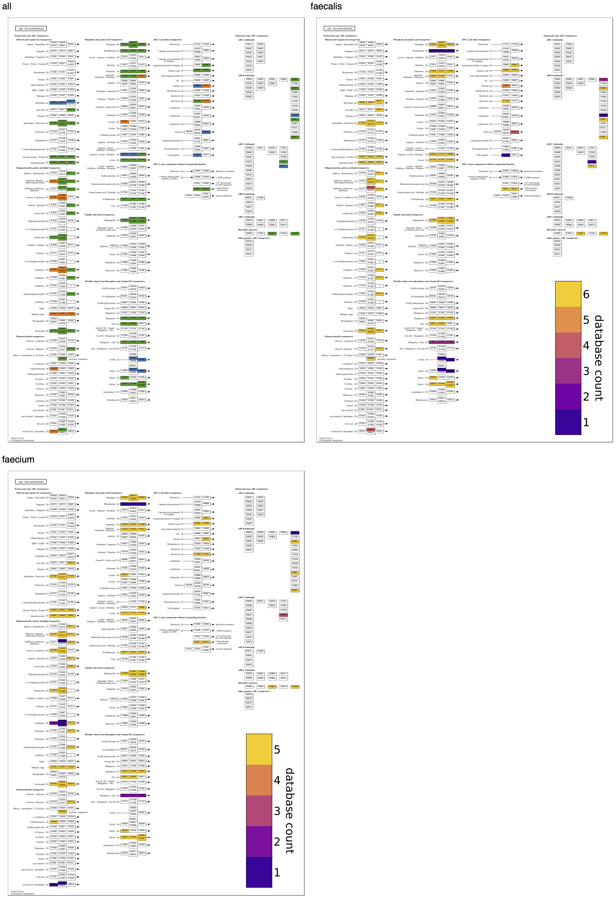

### Compare samples in an input text file

The [kegg-reaction-txt](/help/main/artifacts/kegg-reaction-txt) and [kegg-compound-txt](/help/main/artifacts/kegg-compound-txt) files introduced above can compare data across origins in the same way as multiple contigs databases, without any anvi'o database. Add a `sample` column that assigns each row to its sample of origin, where a sample can be, for example, a genome (e.g., *E. coli* versus *K. pneumoniae*), a metagenome, or a transcriptomic, proteomic, or metabolomic sample. Every row must have a sample.

When a layer's file has a `sample` column but no value column, its elements are compared across samples just as reactions are across contigs databases: they are colored by the sample or by the number of samples in which they occur, a `colorbar_reactions.pdf` (and, for the compound layer, `colorbar_compounds.pdf`) key is written, and all of the same coloring and output options apply, including `--reaction-colormap`, `--compound-colormap`, `--reaction-reverse-overlay`, `--draw-individual-files`, and `--draw-grid`. Whether elements are colored by *which* samples or by *how many* is set per layer with `--reaction-sample-summary`/`--compound-sample-summary` (`membership`, `count` or `count_continuous`; by default `membership` for 3 or fewer samples, `count` above that, and `count_continuous` where a discrete scale would run out of distinguishable colors or of room to label its bands). `count` writes a discrete colorbar with one band per count and `count_continuous` writes a gradient from the lowest count to the highest, as described under [counts on a continuous scale](#counts-on-a-continuous-scale). These per-layer options take the place of `--presence-colormap-scheme`, which applies to contigs database and pangenome inputs only and is rejected for a text run. (If a file has a value column, that value colors each sample's own map; see [Color elements by a quantitative value](#color-elements-by-a-quantitative-value).)

When elements are colored by *which* samples or groups contain them, the color of each of them can be given explicitly in a [kegg-category-colors-txt](/help/main/artifacts/kegg-category-colors-txt) file rather than sampled from a colormap — `--reaction-category-colors` for the reaction layer and `--compound-category-colors` for the compound layer, each taking the place of that layer's colormap. See [Choose the color of each category yourself](#choose-the-color-of-each-category-yourself), which works the same way here as it does for contigs databases and genomes.

anvi&#45;draw&#45;kegg&#45;pathways &#45;&#45;reaction&#45;txt [kegg&#45;reaction&#45;txt](/help/main/artifacts/kegg&#45;reaction&#45;txt) \
                        &#45;&#45;draw&#45;grid \
                        &#45;&#45;draw&#45;individual&#45;files \
                        &#45;o output_dir

Samples can be grouped with a [groups-txt](/help/main/artifacts/groups-txt) file, like contigs databases. The file has the same format, but the items in its first column must be the sample names from the `sample` column. The two files share one sample space and one [groups-txt](/help/main/artifacts/groups-txt). Whenever a layer summarizes its groups by presence — the default — `--group-threshold` must accompany `--groups-txt`, as with contigs databases: it sets the proportion of a group's samples in which an element must occur for the group to be considered to contain it.

anvi&#45;draw&#45;kegg&#45;pathways &#45;&#45;reaction&#45;txt [kegg&#45;reaction&#45;txt](/help/main/artifacts/kegg&#45;reaction&#45;txt) \
                        &#45;&#45;groups&#45;txt [groups&#45;txt](/help/main/artifacts/groups&#45;txt) \
                        &#45;&#45;group&#45;threshold 0.5 \
                        &#45;o output_dir

### Pangenomic database

Pangenomes are treated similarly to multiple contigs databases. Rather than comparing the distribution of KOs across contigs databases, KOs assigned to [pan-db](/help/main/artifacts/pan-db) gene clusters are compared across genomes. Here is the basic structure of the command.

anvi&#45;draw&#45;kegg&#45;pathways &#45;p [pan&#45;db](/help/main/artifacts/pan&#45;db) \
                        &#45;g [genomes&#45;storage&#45;db](/help/main/artifacts/genomes&#45;storage&#45;db) \
                        &#45;o output_dir

The following maps were produced with the basic command structure for a pangenome of seven *Enterococcus faecalis* and five *Enterococcus faecium* genomes. A metagenome-assembled genome (MAG) has been added to the set of *E. faecalis* genomes from above.

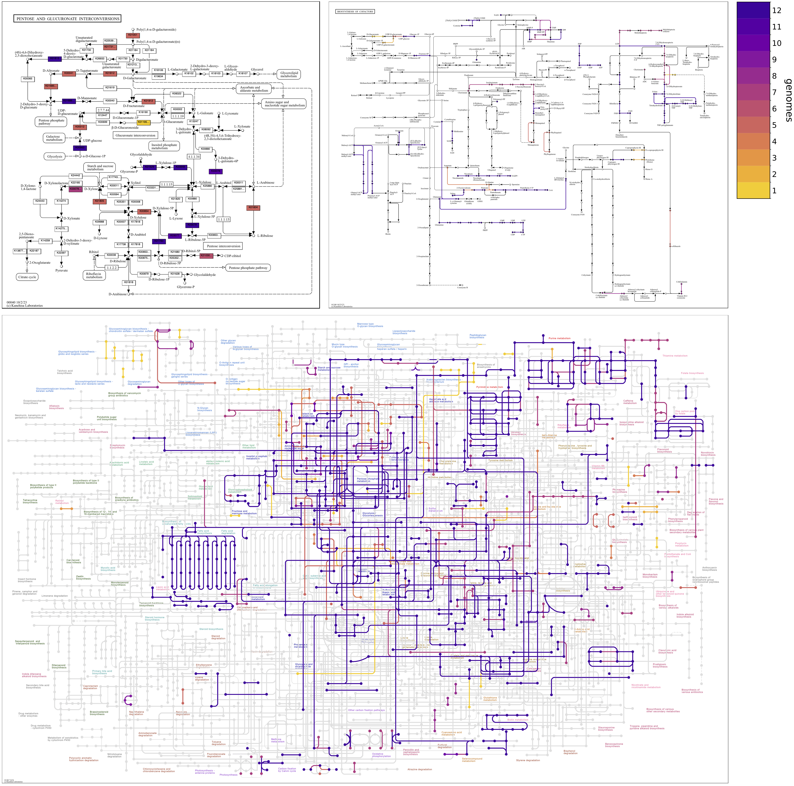

Genomes defined in the pangenomic database can be grouped like contigs databases. The [groups-txt](/help/main/artifacts/groups-txt) file has the same format, but the items in the first column must now be the names of the genomes in the pangenome rather than contigs database files. The following command colors reactions by group, assigning a reaction to a group if the reaction is in at least 50% of the group's genomes.

anvi&#45;draw&#45;kegg&#45;pathways &#45;p [pan&#45;db](/help/main/artifacts/pan&#45;db) \
                        &#45;g [genomes&#45;storage&#45;db](/help/main/artifacts/genomes&#45;storage&#45;db) \
                        &#45;&#45;groups&#45;txt [groups&#45;txt](/help/main/artifacts/groups&#45;txt) \
                        &#45;&#45;group&#45;threshold 0.5 \
                        &#45;o output_dir

All of the options demonstrated in comparing contigs databases apply to pangenomes as well, including drawing map grids and changing the colormap to emphasize reactions unshared between genomes.

anvi&#45;draw&#45;kegg&#45;pathways &#45;p [pan&#45;db](/help/main/artifacts/pan&#45;db) \
                        &#45;g [genomes&#45;storage&#45;db](/help/main/artifacts/genomes&#45;storage&#45;db) \
                        &#45;&#45;draw&#45;grid \
                        &#45;&#45;reaction&#45;colormap plasma 0.1 0.9 \
                        &#45;&#45;reaction&#45;reverse&#45;overlay \
                        &#45;o output_dir

Continuing with the *Enterococcus* pangenome, the following map grid shows differences in `Pentose and glucuronate interconversions` between *faecalis* and *faecium* and between strains of each species. *faecalis* genomes are enriched in genes for xylose metabolism (towards the bottom of the map), and *faecium* genomes are enriched in enzymes for uronate metabolism (toward the top of the map). The *faecalis* MAG, **SHARON**, has genes for the catabolism of `Xylose`, via `D-Xylulose` and `D-Xylulose-5P`. These are also annotated in three of the *faecalis* isolate genomes, **ATCC29212**, **DENG1**, and **V583**, but not the other three, **D32**, **OG1RF**, and **Symbioflor_1**. Xylose utilization is [known](https://doi.org/10.1186%2Fs12864-015-1367-x) to be variable among *faecalis* strains.

#### Consensus KOs

The functional annotations of gene clusters as a whole are imputed to the genes in the cluster. The method of assigning consensus annotations to a cluster is parameterized by the options, `--consensus-threshold` and `--discard-ties`. By default, the consensus threshold is 0 and ties are not discarded. The consensus threshold sets the proportion of genes in the cluster that must have the same functional annotation to be assigned to the cluster as a whole, so a value of 0 means that the most abundant annotation is used regardless of its abundance. To discard ties means to ignore candidate consensus annotations that are equally abundant among genes. The default behavior randomly breaks ties. The consensus KO of a gene cluster becomes the KO annotation of all the genes in the cluster for the purposes of analysis.

### Color elements by a quantitative value

The sections above color elements to show **presence/absence**. A layer can instead be colored by a continuous **quantitative value** simply by including a numeric value column in its [kegg-reaction-txt](/help/main/artifacts/kegg-reaction-txt) or [kegg-compound-txt](/help/main/artifacts/kegg-compound-txt) file. The single column that is not a key column — `accession`; `sample`; in the reaction file, `gene_id` — is auto-detected as the value column, and its header labels the colorbar. The column can have any name. Uses can include coloring reactions by gene, transcript, or protein levels in a [kegg-reaction-txt](/help/main/artifacts/kegg-reaction-txt) file, and compound levels in a [kegg-compound-txt](/help/main/artifacts/kegg-compound-txt) file. Every row must have a numeric value.

anvi&#45;draw&#45;kegg&#45;pathways &#45;&#45;reaction&#45;txt [kegg&#45;reaction&#45;txt](/help/main/artifacts/kegg&#45;reaction&#45;txt) \
                        &#45;o output_dir

For a reaction file of KO accessions, the value of a KO is the aggregate of its optional gene rows' values, and KO accessions are aggregated to map element values. Two options set these, both defaulting to `sum`: `--reaction-gene-aggregation` combines the genes carrying one KO into that KO's value, and `--reaction-accession-aggregation` combines the KOs of one map element into that element's value. They can differ — averaging across the genes of each KO while totaling across the KOs of a reaction, for instance. The compound layer has only the second of the two, `--compound-accession-aggregation`, since a compound file names no genes and no two of its rows may name the same compound in the same sample. Accession aggregations reduce values **within a sample**.

The **reaction layer** and the **compound layer** are colored on independent scales, each through its own sequential colormap and each getting its own continuous key: `colorbar_reactions.pdf` and `colorbar_compounds.pdf`. The reaction colormap is set with `--reaction-colormap` and the compound colormap with `--compound-colormap` (both default `plasma_r`). The drawing order of overlapping elements can be flipped per layer with `--reaction-reverse-overlay` and `--compound-reverse-overlay`.

If a layer's file has a `sample` column, the value column colors **each sample's own magnitude**: maps for individual samples are added with `--draw-individual-files` and/or `--draw-grid`, as when comparing samples by presence/absence, and they share a single `colorbar_reactions_samples.pdf` and `colorbar_compounds_samples.pdf` so their colors are directly comparable across samples. That makes two scales per layer, the `unified` map's and the one those individual maps share. They are colored by the layer's one colormap from `--reaction-colormap`/`--compound-colormap` unless `--reaction-category-colormap`/`--compound-category-colormap` gives the individual maps a distinct colormap; see [Give the two scales different colormaps](#give-the-two-scales-different-colormaps).

anvi&#45;draw&#45;kegg&#45;pathways &#45;&#45;reaction&#45;txt [kegg&#45;reaction&#45;txt](/help/main/artifacts/kegg&#45;reaction&#45;txt) \
                        &#45;&#45;draw&#45;individual&#45;files \
                        &#45;&#45;draw&#45;grid \
                        &#45;o output_dir

#### Summarize samples and groups

A layer with a `sample` column involves multiple separate reductions, and each has its own option:

|Level|Option|What it reduces|
|:--|:--|:--|
|genes of an accession|`--reaction-gene-aggregation` (an aggregation; `sum` by default)|the genes carrying one KO or KEGG reaction accession → that accession's value|
|accessions of an element|`--reaction-accession-aggregation`/`--compound-accession-aggregation` (an aggregation; `sum` by default)|the constituent accessions of a map element → that element's value|
|across samples|`--reaction-sample-summary`/`--compound-sample-summary` (`count`, `count_continuous`, `membership`, or an aggregation)|a set of samples → one continuous value or one presence value per accession|
|across groups|`--reaction-group-summary`/`--compound-group-summary` (`count`, `count_continuous`, `membership`, or an aggregation)|the groups of a [groups-txt](/help/main/artifacts/groups-txt) → one continuous value or one presence value per accession|

An **aggregation** is `sum` (default), `mean`, `max`, `min`, `median`, `std` — or any other unsuggested pandas aggregation that reduces a series of numbers to one number, such as `var` or `sem`. Names that transform rather than reduce (`cumsum`) or that only a grouping offers (`first`) are rejected. Where an aggregation is undefined for the values available, as `std` is for a single value, the affected elements are left uncolored and a warning says how many accessions are affected.

A summary reduces only the samples (or groups) that actually contain an accession: a sample with no row for an accession is treated as not having observed it, so `mean` over three samples where only one lists the accession is that one sample's value.

The sample summary drives the `unified` map when there are no groups, and each per-group map (produced when using `--draw-individual-files` or `--draw-grid`) when there are. The group summary colors the `unified` map when there are groups.

Note that with groups, the per-group map either shows the count of that group's sample — the default case — or, with a `--reaction-sample-summary`/`--compound-sample-summary` aggregation argument, the samples' pooled value; `--*-sample-summary` is therefore not permitted with a presence name (`count`, `count_continuous` or `membership`) when using groups. Whether that count is drawn in bands or on a gradient is set for every layer's group maps at once by `--group-colormap-scheme`, not per layer; see [counts in bands or on a gradient](#counts-in-bands-or-on-a-gradient).

Both summaries default to **presence**: in how many (`count` and `count_continuous`) or exactly which (`membership`) samples or groups an element occurs. `membership` is chosen automatically for 3 or fewer categories and `count` above that, matching the presence/absence behavior for contigs databases and genomes; where a discrete scale would run out of distinguishable colors or of room to label its bands, `count_continuous` is chosen instead and a warning says so. `count` draws a discrete colorbar with one band per count, while `count_continuous` draws a gradient from the lowest count to the highest — see [counts on a continuous scale](#counts-on-a-continuous-scale). Presence is the default because it is meaningful for any set of samples, whereas pooling values is only meaningful when the samples are commensurable: averaging the coverages or concentrations of replicates of one condition makes sense, while pooling them across unrelated conditions does not. Name an aggregation to pool values instead, which draws a continuous colorbar for that view; `std` across replicate samples turns the map into a picture of where they disagree. Note that `count`, `count_continuous` and `membership` always mean presence at these two levels, so pandas `count` (a row count) is not reachable through a summary option — use it with `--reaction-gene-aggregation` if you want it.

The sample and group summaries in the `unified` maps both default to **presence** (`membership` for 3 or fewer categories, `count` above that, and `count_continuous` beyond what the colormap can distinguish), even with a quantitative value column, because presence is meaningful across any set of samples while pooling values is only meaningful for commensurable ones. For example, it makes sense to average transcript abundances across samples from replicate conditions, but not from unrelated conditions. Pooling values across samples is triggered by providing an aggregation argument to `--reaction-sample-summary`/`--compound-sample-summary` or `--reaction-group-summary`/`--compound-group-summary`. `std` at sample and group levels map how much samples and groups disagree. Note that `count`, `count_continuous` and `membership` always mean presence at these two levels, so pandas `count` (a row count) is not reachable through a summary option, but may be used through gene and accession aggregation options, say for drawing counts of the number of genes per reaction.

A layer can be **categorical in the overview and continuous per sample or group**. With the default presence summary, the `unified` map gets a colorbar of sample or group counts or memberships, while per-sample maps keep a continuous colorbar. The sample and group levels can be treated independently — replicate samples can be averaged within each condition (group) while the `unified` map summarizing all conditions shows in how many conditions each element occurs, with a group containing an element when at least half of its samples do:

anvi&#45;draw&#45;kegg&#45;pathways &#45;&#45;reaction&#45;txt [kegg&#45;reaction&#45;txt](/help/main/artifacts/kegg&#45;reaction&#45;txt) \
                        &#45;&#45;groups&#45;txt [groups&#45;txt](/help/main/artifacts/groups&#45;txt) \
                        &#45;&#45;group&#45;threshold 0.5 \
                        &#45;&#45;reaction&#45;sample&#45;summary mean \
                        &#45;&#45;reaction&#45;group&#45;summary count \
                        &#45;&#45;draw&#45;individual&#45;files \
                        &#45;&#45;draw&#45;grid \
                        &#45;o output_dir

#### Limit the color scale

By default a continuous scale spans exactly the values it is given, from the lowest map element to the highest. A handful of extreme elements can therefore stretch the colors over a range in which everything else is crowded into one end and cannot be told apart. The `--reaction-value-limits` and `--compound-value-limits` options bound the scale so that this cannot happen. Each takes two values, a minimum and then a maximum, and either can be the word `none` to leave that end wherever the data puts it.

anvi&#45;draw&#45;kegg&#45;pathways &#45;&#45;reaction&#45;txt [kegg&#45;reaction&#45;txt](/help/main/artifacts/kegg&#45;reaction&#45;txt) \
                        &#45;&#45;reaction&#45;accession&#45;aggregation mean \
                        &#45;&#45;reaction&#45;value&#45;limits &#45;6 none \
                        &#45;o output_dir

A limit **only takes effect where the values actually cross it**. Given the limits above, a scale whose values run from -8.6 to -2.8 is truncated to -6 to -2.8, while a scale whose values happen to stay above -6 is left exactly where its own values put it. Where a limit does truncate, every element past it is drawn in the color of that end of the scale, and the colorbar marks that end `≥` or `≤`: its color stands for that value *or anything beyond it*, rather than for the value alone.

Limits are read in the units of the colorbar, which are the values of **map elements** after both reductions — gene to accession (optional) and accession to map element — have been applied. With the default `sum` at the accession level, an element standing for a dozen KOs may sit well past any single value in the file, so limits should be chosen against the scale that is actually drawn rather than against the input column.

A layer with a `sample` column has **two** continuous scales, and each is limited separately: `--reaction-value-limits` bounds the `unified` map's scale, while `--reaction-category-value-limits` bounds the single scale shared by the per-sample maps (or the per-group maps given a [groups-txt](/help/main/artifacts/groups-txt)). The two are kept apart because a summary can put them on quite different footings — for example, the mean across samples clusters more tightly than the per-sample values behind it — so limits that suit one can be inappropriate for the other. Setting only one of the two is perfectly legitimate, and anvi'o warns when you do, since the scale left alone goes on spanning whatever its own values reach.

anvi&#45;draw&#45;kegg&#45;pathways &#45;&#45;reaction&#45;txt [kegg&#45;reaction&#45;txt](/help/main/artifacts/kegg&#45;reaction&#45;txt) \
                        &#45;&#45;reaction&#45;sample&#45;summary mean \
                        &#45;&#45;reaction&#45;value&#45;limits &#45;6 none \
                        &#45;&#45;reaction&#45;category&#45;value&#45;limits &#45;7 none \
                        &#45;&#45;draw&#45;individual&#45;files \
                        &#45;&#45;draw&#45;grid \
                        &#45;o output_dir

The compound layer takes the same pair, `--compound-value-limits` and `--compound-category-value-limits`, on its own independent scale.

Note that these options are a different thing from the two decimals `--reaction-colormap`/`--compound-colormap` accept, which choose what fraction *of the colormap* to sample and say nothing at all about the values.

#### Center the color scale

A **diverging** colormap, such as 'RdYlGn' or 'RdYlBu_r', has a neutral color at its middle and two opposed ramps either side. That middle color only means something if the scale puts it where the value it stands for actually is, and by default a scale spans exactly the values it is given: a column of log ratios running from -2 to +6 puts the neutral color at +2, and paints the negatives in the same half of the colormap as some positives.

`--reaction-value-center` and `--compound-value-center` put a value at the middle of the scale instead. Used as a bare flag, each centers the scale on **0**; give it a number to center the scale on that number instead.

anvi&#45;draw&#45;kegg&#45;pathways &#45;&#45;reaction&#45;txt [kegg&#45;reaction&#45;txt](/help/main/artifacts/kegg&#45;reaction&#45;txt) \
                        &#45;&#45;reaction&#45;accession&#45;aggregation mean \
                        &#45;&#45;reaction&#45;colormap RdYlBu_r \
                        &#45;&#45;reaction&#45;value&#45;center \
                        &#45;o output_dir

**The scale is widened, never narrowed.** It comes to run the same distance either side of the center, reaching as far as the farther of its two ends already did: values from -2 to +6 centered on 0 give a scale from -6 to +6. Nothing is clipped that was not clipped before, and the scale stays linear, so the same distance in color goes on meaning the same distance in value on both sides of the center. The colorbar is ticked at the center, wherever it falls, so a reader can see where the middle of the scale is.

The price of that is the shorter side of the colormap going partly unused — the honest picture of values that lean one way. To fill the colormap again, trim the longer side: `--reaction-value-limits none 2` along with the centering gives a scale from -2 to +2 whose top is marked `≥ 2`.

Limits and a center act on a scale in that order — the limits truncate what the values reach, and the center then widens whichever side falls short — so the two can conflict. Where centering would push a scale past a limit that was actually truncating something, anvi'o refuses rather than quietly undoing the limit, and says which pair of limits would give a scale that is both centered and truncated. A center lying outside its own scale's limits is refused for the same reason.

A layer with a `sample` column has **two** scales here as well, centered separately: `--reaction-value-center` centers the `unified` map's, and `--reaction-category-value-center` the one shared by the per-sample (or per-group) maps. Centering only one of the two earns a warning, because unless `--reaction-category-colormap` (described in the next section) gives them each a colormap, one colormap colors both, and its middle color would then mean the centered value on the one map and whatever the values happen to leave in the middle on the other.

anvi&#45;draw&#45;kegg&#45;pathways &#45;&#45;reaction&#45;txt [kegg&#45;reaction&#45;txt](/help/main/artifacts/kegg&#45;reaction&#45;txt) \
                        &#45;&#45;reaction&#45;sample&#45;summary mean \
                        &#45;&#45;reaction&#45;colormap RdYlGn \
                        &#45;&#45;reaction&#45;value&#45;center \
                        &#45;&#45;reaction&#45;category&#45;value&#45;center \
                        &#45;&#45;draw&#45;individual&#45;files \
                        &#45;&#45;draw&#45;grid \
                        &#45;o output_dir

Centering says nothing to a reader looking at a sequential colormap, which has no middle to speak of, so anvi'o warns when a centered scale is drawn from one — the default `plasma_r` included. It also warns when a diverging colormap has been trimmed off-center by the two decimals accepted by a colormap option such as `--reaction-colormap`, since the neutral color is then no longer in the middle of what is drawn.

#### Give the two scales different colormaps

The `unified` and per-sample/per-group scales are on one colormap by default, which can work when they show the same quantity, such as the values of one sample beside the mean of them all. The different types of maps can also show quantities of different **kinds**, and then a single colormap invites mistaking one scale for the other. For example, with `--reaction-sample-summary std`, the `unified` map shows how much replicate samples *disagree*, a spread that is never negative and is not measured equivalently to the underlying values shown in the per-sample maps, which may include negative numbers.

`--reaction-category-colormap` gives the per-sample or per-group scale a colormap of its own, leaving `--reaction-colormap` to the `unified` map. The argument structure is the same as `--reaction-colormap`, a Matplotlib colormap name optionally followed by two decimals limiting the fraction of it to sample.

anvi&#45;draw&#45;kegg&#45;pathways &#45;&#45;reaction&#45;txt [kegg&#45;reaction&#45;txt](/help/main/artifacts/kegg&#45;reaction&#45;txt) \
                        &#45;&#45;reaction&#45;accession&#45;aggregation mean \
                        &#45;&#45;reaction&#45;sample&#45;summary std \
                        &#45;&#45;reaction&#45;colormap cool \
                        &#45;&#45;reaction&#45;category&#45;colormap RdYlBu \
                        &#45;&#45;draw&#45;individual&#45;files \
                        &#45;&#45;draw&#45;grid \
                        &#45;o output_dir

Here the `unified` map draws the standard deviation across samples on a sequential scale, whereas each sample's own map draws its signed values on a diverging scale. Each scale writes its own colorbar either way — `colorbar_reactions.pdf` for the `unified` map and `colorbar_reactions_samples.pdf` or `colorbar_reactions_groups.pdf` for the individual maps — so which colors mean what is never left implicit.

The compound layer takes `--compound-category-colormap` on its own independent scales, so a run drawing both layers across samples can have four colormaps and four colorbars. A category colormap applies only where those individual maps are actually colored by value: the file needs a value column and a `sample` column, and under a [groups-txt](/help/main/artifacts/groups-txt) the sample summary must pool each group's values rather than summarize their presence, which `--group-colormap` colors instead.

### Mixed coloring across reaction and compound layers

Because each file is colored independently by its own mode, one map can mix a value-colored layer with a presence- or membership-colored layer. For example, the presence/absence of KOs in a genome (a [kegg-reaction-txt](/help/main/artifacts/kegg-reaction-txt) file with no value column) can be displayed alongside quantitative metabolomics of compounds (a [kegg-compound-txt](/help/main/artifacts/kegg-compound-txt) file with a value column), each layer getting its own colorbar. When only one layer carries a `sample` column, that layer drives the per-sample (or per-group) maps and the other layer is drawn identically on every one of them, as would apply in the example with metabolomes measured from different treatments of an organism.

Text-file presence layers use their own default colors (reaction green, compound pink), which can be changed independently with `--reaction-color` and `--compound-color` (each takes a color hex code, or is used as a flag for the default). Either one is a *static* color, so with a `sample` column it overrides comparison across samples the same way it does for multiple contigs databases: the `unified` map shows presence in any sample in that one color, with no colorbar, while the individual maps still show one sample each (or, with a [groups-txt](/help/main/artifacts/groups-txt), their group's sample counts). Because it overrides the comparison, it cannot be combined with that layer's sample or group summary.

A reaction presence layer can instead be highlighted in the reference map's colors with `--original-color`, which also works with a `sample` column: the `unified` map shows the union of the samples and `--draw-individual-files`/`--draw-grid` add a reference-colored map per sample, just as they do for multiple contigs databases. Because the reference map dictates both the colors and their drawing order, that flag, like a fixed color, cannot be combined with a value column, with the sample or group summaries, with `--reaction-reverse-overlay`, or with `--group-threshold`. With a [groups-txt](/help/main/artifacts/groups-txt) the `unified` map is still the union, while each group's map falls back to counting the group's samples — one color cannot distinguish them — styled by `--group-colormap`/`--group-reverse-overlay`.

Avoid purely grayscale colormaps or colormaps whose ends are pure white or black, as these can collide with the reserved colors that anvi'o uses for un-highlighted reactions and compounds; if that happens, the error names which layer's colormap (`--reaction-colormap` or `--compound-colormap`) to change. The same check covers the colors given per category in a [kegg-category-colors-txt](/help/main/artifacts/kegg-category-colors-txt) file and the scale of each group's own maps, including a ramp built from a group's own color (`--group-colormap category`), which runs towards white by construction and so is the most likely of them to collide.

{:.notice}
Edit [this file](https://github.com/merenlab/anvio/tree/master/anvio/docs/programs/anvi-draw-kegg-pathways.md) to update this information.

## Additional Resources

{:.notice}
Are you aware of resources that may help users better understand the utility of this program? Please feel free to edit [this file](https://github.com/merenlab/anvio/blob/master/anvio/cli/draw_kegg_pathways.py) on GitHub. If you are not sure how to do that, find the `__resources__` tag in [this file](https://github.com/merenlab/anvio/blob/master/anvio/cli/interactive.py) to see an example.
