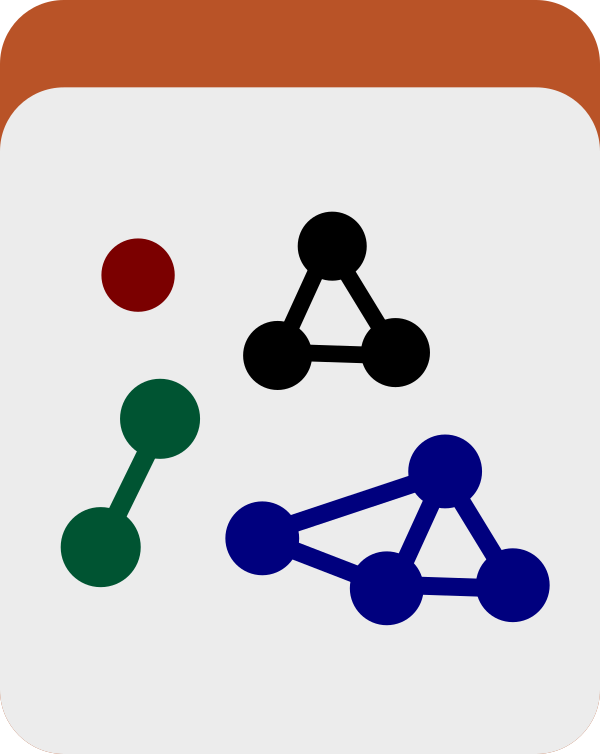

Estimates taxonomy at genome and metagenome level. This program is the entry point to estimate taxonomy for a given set of contigs (i.e., all contigs in a contigs database, or contigs described in collections as bins). For this, it uses single-copy core gene sequences and the GTDB database.

🔙 **[To the main page](../../)** of anvi'o programs and artifacts.



<div id="svg" class="subnetwork"></div>
{{ "network.json" }}
{{ 300 }}



## Authors

<div class="anvio-person"><div class="anvio-person-info"><div class="anvio-person-photo"></div><div class="anvio-person-info-box"><a href="/people/meren" target="_blank"><span class="anvio-person-name">A. Murat Eren (Meren)</span></a><div class="anvio-person-social-box"><a href="http://merenlab.org" class="person-social" target="_blank"><i class="fa fa-fw fa-home"></i>Web</a><a href="mailto:a.murat.eren@gmail.com" class="person-social" target="_blank"><i class="fa fa-fw fa-envelope-square"></i>Email</a><a href="http://twitter.com/merenbey" class="person-social" target="_blank"><i class="fa fa-fw fa-twitter-square"></i>Twitter</a><a href="http://github.com/meren" class="person-social" target="_blank"><i class="fa fa-fw fa-github"></i>Github</a></div></div></div></div>

<div class="anvio-person"><div class="anvio-person-info"><div class="anvio-person-photo"></div><div class="anvio-person-info-box"><a href="/people/qclayssen" target="_blank"><span class="anvio-person-name">Quentin Clayssen</span></a><div class="anvio-person-social-box"><a href="mailto:quentin.clayssen@gmail.com" class="person-social" target="_blank"><i class="fa fa-fw fa-envelope-square"></i>Email</a><a href="http://twitter.com/ClayssenQ" class="person-social" target="_blank"><i class="fa fa-fw fa-twitter-square"></i>Twitter</a><a href="http://github.com/qclayssen" class="person-social" target="_blank"><i class="fa fa-fw fa-github"></i>Github</a></div></div></div></div>


## Requires


<p style="text-align: left" markdown="1"><span class="artifact-r">[contigs-db](../../artifacts/contigs-db) </span> <span class="artifact-r">[scgs-taxonomy](../../artifacts/scgs-taxonomy) </span></p>


## Can use

<p style="text-align: left" markdown="1"><span class="artifact-r">[profile-db](../../artifacts/profile-db) </span> <span class="artifact-r">[collection](../../artifacts/collection) </span> <span class="artifact-r">[bin](../../artifacts/bin) </span> <span class="artifact-r">[metagenomes](../../artifacts/metagenomes) </span></p>


## Provides


<p style="text-align: left" markdown="1"><span class="artifact-p">[genome-taxonomy](../../artifacts/genome-taxonomy) </span></p>


## Can provide

<p style="text-align: left" markdown="1"><span class="artifact-p">[genome-taxonomy-txt](../../artifacts/genome-taxonomy-txt) </span></p>


## Usage


This program makes **quick taxonomy estimates for genomes, metagenomes, or bins stored in your <span class="artifact-n">[contigs-db](/help/main/artifacts/contigs-db)</span>** using single-copy core genes.

You can run this program on an anvi'o contigs database only if you already have setup the necessary databases to assign taxonomy on your computer by running <span class="artifact-p">[anvi-setup-scg-taxonomy](/help/main/programs/anvi-setup-scg-taxonomy)</span> and annotated the <span class="artifact-n">[contigs-db](/help/main/artifacts/contigs-db)</span> you are working with using <span class="artifact-p">[anvi-run-scg-taxonomy](/help/main/programs/anvi-run-scg-taxonomy)</span>, which are described in greater detail in [this document](http://merenlab.org/2019/10/08/anvio-scg-taxonomy/)), which also offers a [comprehensive overview](http://merenlab.org/2019/10/08/anvio-scg-taxonomy/#estimating-taxonomy-in-the-terminal) of what <span class="artifact-p">[anvi-estimate-scg-taxonomy](/help/main/programs/anvi-estimate-scg-taxonomy)</span> can do.

Keep in mind that the scg-taxonomy framework currently uses single-copy core genes found in [GTDB](https://gtdb.ecogenomic.org/) genomes, thus it will not work well for low-completion, viral, or eukaryotic genomes.

This same functionality <span class="artifact-p">[anvi-estimate-scg-taxonomy](/help/main/programs/anvi-estimate-scg-taxonomy)</span> is implicitly accessed thorugh the anvi'o <span class="artifact-n">[interactive](/help/main/artifacts/interactive)</span> interface, when you turn on real-time taxonomy estimation for bins. So, if you've ever wondered where those estimates were coming from, now you know.

So, what can this program do?

### 1. Estimate the taxonomy of a single genome

By default, this program wll assume your <span class="artifact-n">[contigs-db](/help/main/artifacts/contigs-db)</span> contains only one genome, and will try to use the single-copy core genes (that were associated with taxonomy when you ran <span class="artifact-p">[anvi-run-scg-taxonomy](/help/main/programs/anvi-run-scg-taxonomy)</span>) to try to identify the taxonomy of your genome.

When you run

<div class="codeblock" markdown="1">
anvi&#45;estimate&#45;scg&#45;taxonomy &#45;c <span class="artifact&#45;n">[contigs&#45;db](/help/main/artifacts/contigs&#45;db)</span>
</div>

It will give you the best taxonomy hit for your genome. If you would like to see how it got there (by looking at the hits for each of the single-copy core genes), just use the `--debug` flag to see more information, as so:

<div class="codeblock" markdown="1">
anvi&#45;estimate&#45;scg&#45;taxonomy &#45;c <span class="artifact&#45;n">[contigs&#45;db](/help/main/artifacts/contigs&#45;db)</span> \
                           &#45;&#45;debug
</div>

### 2. Estimate the taxa within a metagenome

By running this program in metagenome mode, it will assume that your <span class="artifact-n">[contigs-db](/help/main/artifacts/contigs-db)</span> contains multiple genomes and will try to give you an overview of the taxa within it. To do this, it will determine which single-copy core gene has the most hits in your contigs (for example `Ribosomal_S6`), and then will look at the taxnomy hits for that gene across your contigs. The output will be this list of taxonomy results.

<div class="codeblock" markdown="1">
anvi&#45;estimate&#45;scg&#45;taxonomy &#45;c <span class="artifact&#45;n">[contigs&#45;db](/help/main/artifacts/contigs&#45;db)</span> \
                           &#45;&#45;metagenome&#45;mode
</div>

If you want to look at a specific gene (instead of the one with the most hits), you can also tell it to do that. For example, to tell it to look at Ribosomal_S9, run

<div class="codeblock" markdown="1">
anvi&#45;estimate&#45;scg&#45;taxonomy &#45;c <span class="artifact&#45;n">[contigs&#45;db](/help/main/artifacts/contigs&#45;db)</span> \
                           &#45;&#45;metagenome&#45;mode \
                           &#45;&#45;scg&#45;name Ribosomal_S9
</div>

Without a <span class="artifact-n">[profile-db](/help/main/artifacts/profile-db)</span>, the output will report the **frequency** of each taxon — i.e., how many times that taxon was detected across the SCG hits in your contigs database. If you only care whether a taxon is present or absent rather than how many times it was detected, you can use the `--presence-absence-only` flag to get a binary report instead:

<div class="codeblock" markdown="1">
anvi&#45;estimate&#45;scg&#45;taxonomy &#45;c <span class="artifact&#45;n">[contigs&#45;db](/help/main/artifacts/contigs&#45;db)</span> \
                           &#45;&#45;metagenome&#45;mode \
                           &#45;&#45;presence&#45;absence&#45;only
</div>

### 3. Look at the taxonomic composition as a tree

The table above answers the question "what is the taxonomy of each of these hits?", which is not the same question as "what is in here?". Since each row spells out an entire lineage, a taxon that occurs 30 times occupies 30 nearly identical rows, and the shape of the community is nowhere to be seen. If that is what you are after, add the flag `--tree-output`:

<div class="codeblock" markdown="1">
anvi&#45;estimate&#45;scg&#45;taxonomy &#45;c <span class="artifact&#45;n">[contigs&#45;db](/help/main/artifacts/contigs&#45;db)</span> \
                           &#45;&#45;metagenome&#45;mode \
                           &#45;&#45;tree&#45;output
</div>

which will show you the very same results as a hierarchical tree instead (please remember that the tree here has no phylogenetic order or meaning in its current implementation):

```
All Ribosomal_S11 copies (96)
├── Bacteria (94)
│   ├── Campylobacterota (36)
│   │   └── Campylobacteria (36)
│   │       └── Campylobacterales (36)
│   ├── Desulfobacterota (16)
│   │   ├── Desulfobulbia (9)
│   │   │   └── Desulfobulbales (9)
│   │   ├── Desulfobacteria (3)
│   │   │   └── Desulfobacterales (3)
(...)
└── Archaea (2)
    └── Halobacteriota (2)
        └── Methanosarcinia (2)
            └── Methanosarcinales (2)
```

The number next to each taxon is the number of things that were assigned to it **or to anything under it**, which is why the numbers of a node's children always add up to the number of the node itself. What is being counted depends on how you ran the program: copies of the single-copy core gene anvi'o surveyed in metagenome mode (`Ribosomal_S11` in the example above), bins if you gave anvi'o a <span class="artifact-n">[collection](/help/main/artifacts/collection)</span>, and genomes otherwise. The root of the tree spells out which one it is, so you never have to guess.

Hits that could not be resolved all the way down show up in an explicit `Unknown_*` node at the level where they ran out of names (as in `Unknown_genera`) rather than being quietly dropped, so nothing goes missing from the tree.

By default the tree does not go deeper than genus names, since species-level assignments from single-copy core genes are often absent or not particularly trustworthy. If you want a different cutoff, use `--tree-output-level`:

<div class="codeblock" markdown="1">
anvi&#45;estimate&#45;scg&#45;taxonomy &#45;c <span class="artifact&#45;n">[contigs&#45;db](/help/main/artifacts/contigs&#45;db)</span> \
                           &#45;&#45;metagenome&#45;mode \
                           &#45;&#45;tree&#45;output \
                           &#45;&#45;tree&#45;output&#45;level t_family
</div>

{:.notice}
Please note that `--tree-output-level` has nothing to do with the `--taxonomic-level` parameter, and only influences the tree that is displayed in your terminal.

Two small things to know about this flag. First, it only changes what is displayed: if you also ask for an output file with `-o`, that file will contain the usual TAB-delimited table, exactly as it would have without `--tree-output`. Second, since a tree is the only thing this flag produces, anvi'o will refuse to run it together with `--quiet` (which would show you nothing) or `--as-markdown` (which would mangle the characters anvi'o uses to draw the tree).

If you are working with a <span class="artifact-n">[metagenomes](/help/main/artifacts/metagenomes)</span> or <span class="artifact-n">[external-genomes](/help/main/artifacts/external-genomes)</span> file, `--tree-output` will give you a single tree in which the results from every one of your inputs are merged together. This is not really the appropriate display for many (meta)genomes at once, since a tree gives you no way to tell which input a taxon came from, and anvi'o will warn you about that -- but if a bird's eye view of everything at once is what you want, there it is.

### 4. Look at relative abundance of taxa across samples

If you provide a merged <span class="artifact-n">[profile-db](/help/main/artifacts/profile-db)</span> or <span class="artifact-n">[single-profile-db](/help/main/artifacts/single-profile-db)</span>, then you'll be able to look at the relative abundance of your taxonomy hits (through a single-copy core gene) across your samples. Essentially, this adds additional columns to your output (one per sample) that descrbe the relative abundance of each hit in each sample.

Running this will look something like this,
<div class="codeblock" markdown="1">
anvi&#45;estimate&#45;scg&#45;taxonomy &#45;c <span class="artifact&#45;n">[contigs&#45;db](/help/main/artifacts/contigs&#45;db)</span> \
                           &#45;&#45;metagenome&#45;mode \
                           &#45;p <span class="artifact&#45;n">[profile&#45;db](/help/main/artifacts/profile&#45;db)</span> \
                           &#45;&#45;compute&#45;scg&#45;coverages
</div>

For an example output, take a look at [this page](http://merenlab.org/2019/10/08/anvio-scg-taxonomy/#contigs-db--profile-db).

If you add `--tree-output` to a command like the one above, each node of the tree will report a coverage value in addition to its count. That value is the total coverage of everything under that node, summed across all of your samples. A tree has no room for one column per sample, so if you need per-sample numbers, ask for an output file with `-o`.

### 5. Estimate the taxonomy of your bins

This program basically looks at each of the <span class="artifact-n">[bin](/help/main/artifacts/bin)</span>s in your <span class="artifact-n">[collection](/help/main/artifacts/collection)</span> as a single genome and tries to assign it taxonomy information. To do this, simply provide a collection, like this:

<div class="codeblock" markdown="1">
anvi&#45;estimate&#45;scg&#45;taxonomy &#45;c <span class="artifact&#45;n">[contigs&#45;db](/help/main/artifacts/contigs&#45;db)</span> \
                           &#45;C <span class="artifact&#45;n">[collection](/help/main/artifacts/collection)</span>
</div>

You can also look at the relative abundances across your samples at the same time, by running something like this:

<div class="codeblock" markdown="1">
anvi&#45;estimate&#45;scg&#45;taxonomy &#45;c <span class="artifact&#45;n">[contigs&#45;db](/help/main/artifacts/contigs&#45;db)</span> \
                           &#45;C <span class="artifact&#45;n">[collection](/help/main/artifacts/collection)</span> \
                           &#45;p <span class="artifact&#45;n">[profile&#45;db](/help/main/artifacts/profile&#45;db)</span> \
                           &#45;&#45;compute&#45;scg&#45;coverages
</div>

Pro tip: you can use the output that emerges from the following output,

<div class="codeblock" markdown="1">
anvi&#45;estimate&#45;scg&#45;taxonomy &#45;c <span class="artifact&#45;n">[contigs&#45;db](/help/main/artifacts/contigs&#45;db)</span> \
                           &#45;p <span class="artifact&#45;n">[profile&#45;db](/help/main/artifacts/profile&#45;db)</span> \
                           &#45;C <span class="artifact&#45;n">[collection](/help/main/artifacts/collection)</span> \
                           &#45;o TAXONOMY.txt
</div>

to display the taxonomy of your bins in the anvi'o interactive interface in **collection mode**:

<div class="codeblock" markdown="1">
<span class="artifact&#45;p">[anvi&#45;interactive](/help/main/programs/anvi&#45;interactive)</span> &#45;c <span class="artifact&#45;n">[contigs&#45;db](/help/main/artifacts/contigs&#45;db)</span> \
                     &#45;p <span class="artifact&#45;n">[profile&#45;db](/help/main/artifacts/profile&#45;db)</span> \
                     &#45;C <span class="artifact&#45;n">[collection](/help/main/artifacts/collection)</span> \
                     &#45;&#45;additional&#45;layers TAXONOMY.txt
</div>

That simple.

### 6. Look at multiple metagenomes at the same time

You can even use this program to look at multiple metagenomes by providing a <span class="artifact-n">[metagenomes](/help/main/artifacts/metagenomes)</span> artifact. This is useful to get an overview of what kinds of taxa might be in your metagenomes, and what kinds of taxa they share.

Running this

<div class="codeblock" markdown="1">
anvi&#45;estimate&#45;scg&#45;taxonomy &#45;&#45;metagenomes <span class="artifact&#45;n">[metagenomes](/help/main/artifacts/metagenomes)</span> \
                           &#45;&#45;output&#45;file&#45;prefix EXAMPLE
</div>

will give you an output file containing all taxonomic levels found and their coverages in each of your metagenomes.

For a concrete example, check out [this page](http://merenlab.org/2019/10/08/anvio-scg-taxonomy/#many-contigs-dbs-for-many-metagenomes).

### 7. Estimate taxonomy across multiple genomes using an external genomes file

You can also run this program on a set of genomes described in an <span class="artifact-n">[external-genomes](/help/main/artifacts/external-genomes)</span> file:

<div class="codeblock" markdown="1">
anvi&#45;estimate&#45;scg&#45;taxonomy &#45;&#45;external&#45;genomes <span class="artifact&#45;n">[external&#45;genomes](/help/main/artifacts/external&#45;genomes)</span> \
                           &#45;&#45;output&#45;file&#45;prefix EXAMPLE
</div>

If you want to treat each genome as a metagenome (i.e., report the taxonomic composition within each genome rather than a single consensus taxonomy for it), add the `--metagenome-mode` flag:

<div class="codeblock" markdown="1">
anvi&#45;estimate&#45;scg&#45;taxonomy &#45;&#45;external&#45;genomes <span class="artifact&#45;n">[external&#45;genomes](/help/main/artifacts/external&#45;genomes)</span> \
                           &#45;&#45;metagenome&#45;mode \
                           &#45;&#45;output&#45;file&#45;prefix EXAMPLE
</div>

### A note on SCG selection when working with multiple contigs databases

When you use `--external-genomes` or `--metagenomes` together with `--metagenome-mode`, anvi'o must pick a **single SCG to use consistently across all contigs databases**. This is critical for result comparability: using different SCGs for different databases would make the outputs impossible to compare.

If you do not explicitly name an SCG with `--scg-name-for-metagenome-mode`, anvi'o will automatically select the SCG that is most frequent across all your contigs databases combined, and will report which one it chose. You can inspect per-SCG frequencies beforehand with `--report-scg-frequencies` to make an informed choice.

If instead you want to use the most frequent SCG independently for each contigs database (which would make results incomparable across databases), you should run <span class="artifact-p">[anvi-estimate-scg-taxonomy](/help/main/programs/anvi-estimate-scg-taxonomy)</span> on each contigs database separately in `--metagenome-mode`.


{:.notice}
Edit [this file](https://github.com/merenlab/anvio/tree/master/anvio/docs/programs/anvi-estimate-scg-taxonomy.md) to update this information.


## Additional Resources


* [Usage examples and warnings](http://merenlab.org/scg-taxonomy)


{:.notice}
Are you aware of resources that may help users better understand the utility of this program? Please feel free to edit [this file](https://github.com/merenlab/anvio/blob/master/anvio/cli/estimate_scg_taxonomy.py) on GitHub. If you are not sure how to do that, find the `__resources__` tag in [this file](https://github.com/merenlab/anvio/blob/master/anvio/cli/interactive.py) to see an example.
