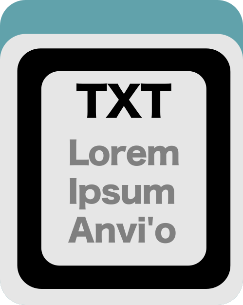
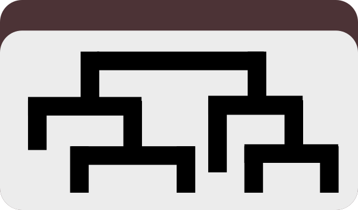

Create an experimental clustering dendrogram..

🔙 **[To the main page](../../)** of anvi'o programs and artifacts.



{{ "network.json" }}
{{ 300 }}


## Authors

<a href="/people/meren" target="_blank">A. Murat Eren (Meren)</a>
<a href="http://merenlab.org" class="person-social" target="_blank"><i class="fa fa-fw fa-home"></i>Web</a><a href="mailto:a.murat.eren@gmail.com" class="person-social" target="_blank"><i class="fa fa-fw fa-envelope-square"></i>Email</a><a href="http://twitter.com/merenbey" class="person-social" target="_blank"><i class="fa fa-fw fa-twitter-square"></i>Twitter</a><a href="http://github.com/meren" class="person-social" target="_blank"><i class="fa fa-fw fa-github"></i>Github</a>

## Can consume

[clustering-configuration](../../artifacts/clustering-configuration) 

## Can provide

[dendrogram](../../artifacts/dendrogram) 

## Usage

This program uses an anvi'o [clustering-configuration](/help/main/artifacts/clustering-configuration) file to access various data sources in anvi'o databases to produce a hierarchical clustering dendrogram for items.

It is especially powerful when the user wishes to create a hierarchical clustering of contigs or gene clusters using only a specific set of samples. If you would like to see an example usage of this program see the article on [combining metagenomics with metatranscriptomics](https://merenlab.org/2015/06/10/combining-omics-data/).

### How does it work?

A [clustering-configuration](/help/main/artifacts/clustering-configuration) file tells the program which data matrices to use and how to process them. The program reads all matrices described in the config, scales and normalizes them as instructed, and then merges them into a single combined matrix by concatenating the columns from each matrix. This final merged matrix is then used to perform hierarchical clustering, producing a [dendrogram](/help/main/artifacts/dendrogram).

A simple run of this program looks like this:

anvi&#45;experimental&#45;organization [clustering&#45;configuration](/help/main/artifacts/clustering&#45;configuration) \
                               &#45;c [contigs&#45;db](/help/main/artifacts/contigs&#45;db) \
                               &#45;p [profile&#45;db](/help/main/artifacts/profile&#45;db) \
                               &#45;N my_organization \
                               &#45;o [dendrogram](/help/main/artifacts/dendrogram)

If you don't want to store the result in your [profile-db](/help/main/artifacts/profile-db), use the `--skip-store-in-db` flag:

anvi&#45;experimental&#45;organization [clustering&#45;configuration](/help/main/artifacts/clustering&#45;configuration) \
                               &#45;c [contigs&#45;db](/help/main/artifacts/contigs&#45;db) \
                               &#45;&#45;skip&#45;store&#45;in&#45;db \
                               &#45;o [dendrogram](/help/main/artifacts/dendrogram)

You can use the `--dry-run` flag to check whether the program can parse the config file and find the relevant data sources without actually performing the clustering:

anvi&#45;experimental&#45;organization [clustering&#45;configuration](/help/main/artifacts/clustering&#45;configuration) \
                               &#45;c [contigs&#45;db](/help/main/artifacts/contigs&#45;db) \
                               &#45;&#45;skip&#45;store&#45;in&#45;db \
                               &#45;&#45;dry&#45;run

### Exporting the merged data matrix

In some cases, you may want to see the actual data that goes into the clustering. Since the program combines multiple data matrices into one before clustering, the final form of this merged matrix may not be immediately obvious to the user. But it can be recovered using the `--export-merged-matrix` flag with any of the clustering configurations.

For instance, running the program this way will export the combined and scaled matrix as a TAB-delimited file while still performing the clustering and storing the result in the database:

anvi&#45;experimental&#45;organization [clustering&#45;configuration](/help/main/artifacts/clustering&#45;configuration) \
                               &#45;c [contigs&#45;db](/help/main/artifacts/contigs&#45;db) \
                               &#45;o [dendrogram](/help/main/artifacts/dendrogram) \
                               &#45;&#45;export&#45;merged&#45;matrix merged_matrix.txt

The resulting file will contain one row per item and columns from all input matrices after they have been normalized, log-transformed, and scaled according to the config. This can be useful for debugging, or for generating dendrograms using other software.

You can also recover the matrix *without* running the clustering step, which may be costly for large datasets, and without storing anything in the database -- as in "just scale the data, merge it, give it back to me as a TAB-delimited file, and stop there":

anvi&#45;experimental&#45;organization [clustering&#45;configuration](/help/main/artifacts/clustering&#45;configuration) \
                               &#45;c [contigs&#45;db](/help/main/artifacts/contigs&#45;db) \
                               &#45;&#45;dry&#45;run \
                               &#45;&#45;export&#45;merged&#45;matrix merged_matrix.txt

This will scale and merge the matrices but skip the hierarchical clustering entirely.

{:.notice}
Edit [this file](https://github.com/merenlab/anvio/tree/master/anvio/docs/programs/anvi-experimental-organization.md) to update this information.

## Additional Resources

* [An example use of this program](https://merenlab.org/2015/06/10/combining-omics-data/)

{:.notice}
Are you aware of resources that may help users better understand the utility of this program? Please feel free to edit [this file](https://github.com/merenlab/anvio/blob/master/anvio/cli/experimental_organization.py) on GitHub. If you are not sure how to do that, find the `__resources__` tag in [this file](https://github.com/merenlab/anvio/blob/master/anvio/cli/interactive.py) to see an example.
