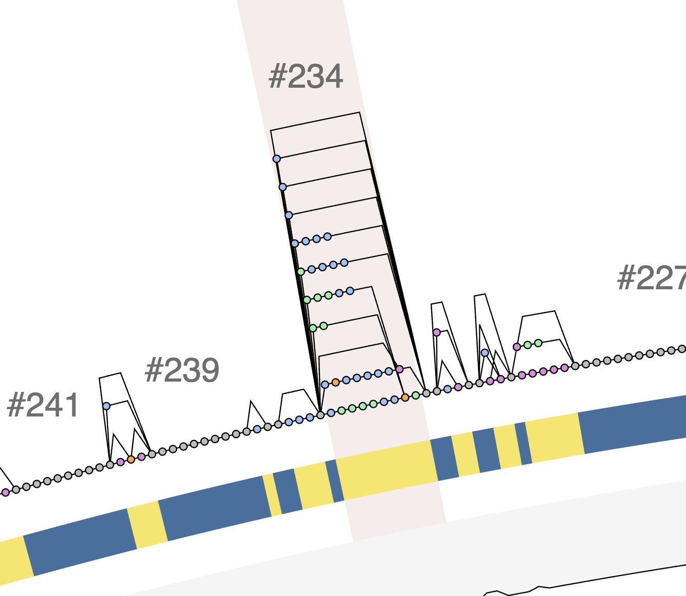

Export genomic loci that is in between two nodes in a given pangenome graph..

🔙 **[To the main page](../../)** of anvi'o programs and artifacts.



{{ "network.json" }}
{{ 300 }}


## Authors

<a href="/people/meren" target="_blank">A. Murat Eren (Meren)</a>
<a href="http://merenlab.org" class="person-social" target="_blank"><i class="fa fa-fw fa-home"></i>Web</a><a href="mailto:a.murat.eren@gmail.com" class="person-social" target="_blank"><i class="fa fa-fw fa-envelope-square"></i>Email</a><a href="http://twitter.com/merenbey" class="person-social" target="_blank"><i class="fa fa-fw fa-twitter-square"></i>Twitter</a><a href="http://github.com/meren" class="person-social" target="_blank"><i class="fa fa-fw fa-github"></i>Github</a>

<a href="/people/ahenoch" target="_blank">Alexander Henoch</a>
<a href="mailto:alexander.henoch@hifmb.de" class="person-social" target="_blank"><i class="fa fa-fw fa-envelope-square"></i>Email</a><a href="http://github.com/ahenoch" class="person-social" target="_blank"><i class="fa fa-fw fa-github"></i>Github</a>

## Requires

[pan-graph-db](../../artifacts/pan-graph-db) 

## Can use

[external-genomes](../../artifacts/external-genomes) 

## Provides

[contigs-db](../../artifacts/contigs-db) 

## Usage

This program exports the genomic loci that fall between two nodes of an anvi'o [pan-graph-db](/help/main/artifacts/pan-graph-db) as individual [contigs-db](/help/main/artifacts/contigs-db) files (one per genome).

You will typically identify the two nodes of interest by visualizing the pangenome graph with [anvi-display-pan-graph](/help/main/programs/anvi-display-pan-graph), and then ask this program to extract, for each genome in the graph, the stretch of DNA that lies between the genes that correspond to those two nodes.

### Required Parameters

You will need to provide a [pan-graph-db](/help/main/artifacts/pan-graph-db), an [external-genomes](/help/main/artifacts/external-genomes) file that describes the genomes that went into the graph (so anvi'o knows where to find each source [contigs-db](/help/main/artifacts/contigs-db)), an output directory, and a way to describe the loci to export. The loci can be described either by two graph nodes (`--graph-nodes`) or by a single region ID (`--region-id`). You must provide one of these two, but not both.

#### Describing loci with two graph nodes

Provide the two graph nodes that flank the loci you wish to export with `--graph-nodes`:

anvi&#45;export&#45;pan&#45;subgraph &#45;p PAN&#45;GRAPH.db \
                         &#45;e [external&#45;genomes](/help/main/artifacts/external&#45;genomes) \
                         &#45;&#45;graph&#45;nodes NODE_1,NODE_2 \
                         &#45;o OUTPUT_DIRECTORY

#### Describing loci with a region ID

Alternatively, you can provide a single region ID with `--region-id`, and anvi'o will resolve the two boundary nodes of that region automatically:

anvi&#45;export&#45;pan&#45;subgraph &#45;p PAN&#45;GRAPH.db \
                         &#45;e [external&#45;genomes](/help/main/artifacts/external&#45;genomes) \
                         &#45;&#45;region&#45;id 234 \
                         &#45;o OUTPUT_DIRECTORY

Please note that the way by which boundary nodes are resolved depends on the type of the region:

* For a **backbone region**, anvi'o uses the leftmost and rightmost nodes of the region (by position) as the boundaries.
* For a **variable region**, the first and the last nodes in the region will not necessarily present in all genomes, so anvi'o instead uses the closest eligible (non-RNA, coding) backbone nodes flanking the region on each side. As a result, the exported loci will include the variable region content plus at least two extra genes from the flanking backbone regions (one on each side), and anvi'o will print a warning describing exactly what was used. Keep this in mind if you intend to analyze the conservancy of genes in variable regions, to avoid misinterpretations.

You will typically learn which nodes or region IDs you are interested in by visualizing the pangenome graph in anvi'o using the program [anvi-display-pan-graph](/help/main/programs/anvi-display-pan-graph). Region IDs will appear as you zoom in to certain parts of the pangenome graph like shown below:

[{:.center-img .width-70}](../../images/anvi-export-pan-subgraph-region.png)

#### Output

Regardless of how you describe the loci, the output directory will contain a separate [contigs-db](/help/main/artifacts/contigs-db) (along with a FASTA file and a blank [profile-db](/help/main/artifacts/profile-db)) for the locus extracted from each genome.

### Gene caller IDs

By default, the gene caller IDs in each exported [contigs-db](/help/main/artifacts/contigs-db) **match those in the source [contigs-db](/help/main/artifacts/contigs-db)** that the locus was extracted from. This way you can trace every gene in an exported locus back to the gene it originated from in the original database.

If you would rather have the gene caller IDs reset so that they start from `0` in each output database (which was the historical behavior of this program), use the `--reset-gene-caller-ids` flag:

anvi&#45;export&#45;pan&#45;subgraph &#45;p PAN&#45;GRAPH.db \
                         &#45;e [external&#45;genomes](/help/main/artifacts/external&#45;genomes) \
                         &#45;&#45;graph&#45;nodes NODE_1,NODE_2 \
                         &#45;o OUTPUT_DIRECTORY \
                         &#45;&#45;reset&#45;gene&#45;caller&#45;ids

{:.notice}
Edit [this file](https://github.com/merenlab/anvio/tree/master/anvio/docs/programs/anvi-export-pan-subgraph.md) to update this information.

## Additional Resources

{:.notice}
Are you aware of resources that may help users better understand the utility of this program? Please feel free to edit [this file](https://github.com/merenlab/anvio/blob/master/anvio/cli/export_pan_subgraph.py) on GitHub. If you are not sure how to do that, find the `__resources__` tag in [this file](https://github.com/merenlab/anvio/blob/master/anvio/cli/interactive.py) to see an example.
