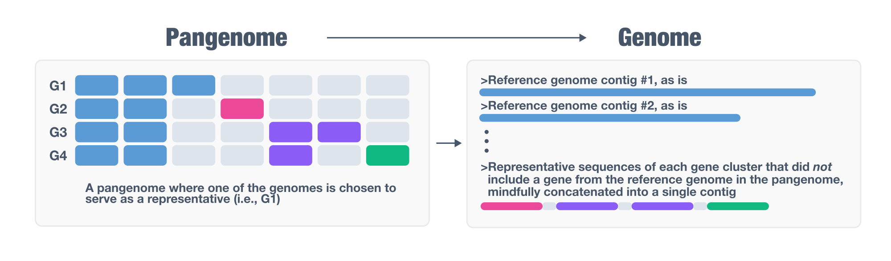
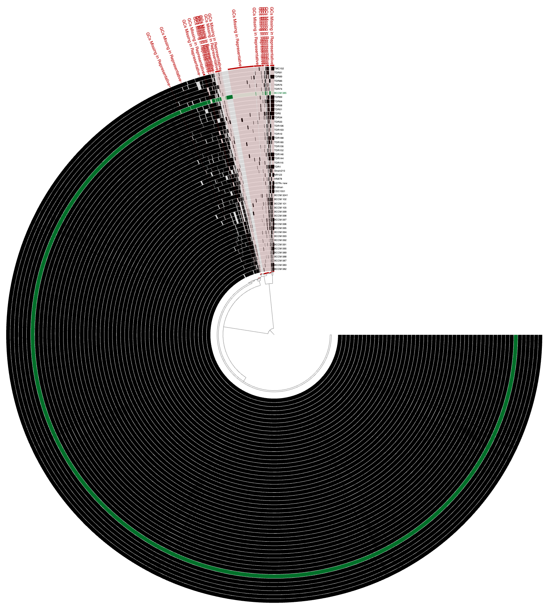
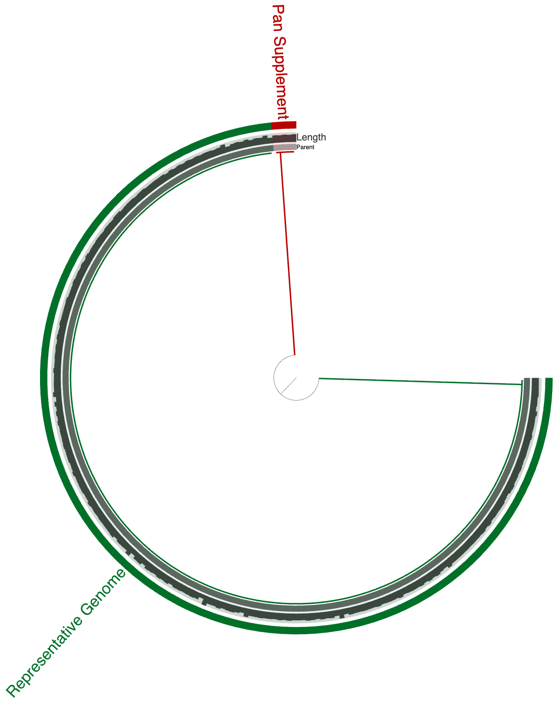

Generates a pangenome-supplemented representative genome from a pangenome.

🔙 **[To the main page](../../)** of anvi'o programs and artifacts.



<div id="svg" class="subnetwork"></div>
{{ "network.json" }}
{{ 300 }}



## Authors

<div class="anvio-person"><div class="anvio-person-info"><div class="anvio-person-photo"></div><div class="anvio-person-info-box"><a href="/people/med1bel" target="_blank"><span class="anvio-person-name">Ahmed Belfaqih</span></a><div class="anvio-person-social-box"><a href="mailto:mr.medbel@gmail.com" class="person-social" target="_blank"><i class="fa fa-fw fa-envelope-square"></i>Email</a><a href="http://github.com/med1bel" class="person-social" target="_blank"><i class="fa fa-fw fa-github"></i>Github</a></div></div></div></div>

<div class="anvio-person"><div class="anvio-person-info"><div class="anvio-person-photo"></div><div class="anvio-person-info-box"><a href="/people/sarilog" target="_blank"><span class="anvio-person-name">Sarahi L. Garcia</span></a><div class="anvio-person-social-box"><a href="http://miint.org" class="person-social" target="_blank"><i class="fa fa-fw fa-home"></i>Web</a><a href="mailto:sarilog@gmail.com" class="person-social" target="_blank"><i class="fa fa-fw fa-envelope-square"></i>Email</a><a href="http://github.com/sarilog" class="person-social" target="_blank"><i class="fa fa-fw fa-github"></i>Github</a></div></div></div></div>


## Requires


<p style="text-align: left" markdown="1"><span class="artifact-r">[pan-db](../../artifacts/pan-db) </span> <span class="artifact-r">[genomes-storage-db](../../artifacts/genomes-storage-db) </span> <span class="artifact-r">[external-genomes](../../artifacts/external-genomes) </span></p>


## Provides


<p style="text-align: left" markdown="1"><span class="artifact-p">[contigs-db](../../artifacts/contigs-db) </span></p>


## Usage


<span class="artifact-p">[anvi-gen-pan-representative](/help/main/programs/anvi-gen-pan-representative)</span> generates a **pangenome-supplemented representative genome** as a <span class="artifact-n">[contigs-db](/help/main/artifacts/contigs-db)</span>. The output keeps all contigs from a single representative genome intact, and appends a single supplementary contig that contains one representative gene for every gene cluster in the pangenome that was absent from the representative genome. The result is a single <span class="artifact-n">[contigs-db](/help/main/artifacts/contigs-db)</span> that captures the full gene repertoire of the pangenome.



By doing so, <span class="artifact-p">[anvi-gen-pan-representative](/help/main/programs/anvi-gen-pan-representative)</span> offers a tractable solution to a fundamental problem in comparative genomics and genome-resolved metagenomics: selecting a single representative for a set of closely related genomes that does not represent the entirety of the gene pool. Selecting representatives is a necessary step for a broad range of analyses in microbiology, typically performed by (1) clustering all genomes using an arbitrary similarity threshold (such as 95%), or by identifying a clade of very closely related organisms after a phylogenomic analysis, and then (2) choosing a representative genome to stand in for the entire group in downstream analyses.

The problem <span class="artifact-p">[anvi-gen-pan-representative](/help/main/programs/anvi-gen-pan-representative)</span> solves arises from the fact that pangenomes almost always contain genes distributed unevenly across member genomes, making it extremely unlikely for any single genome to carry all the genes present in the group. The program addresses this by supplementing the chosen representative with a single additional contig (so called 'the supplementary contig') that carries one representative gene sequence per missing gene cluster. The result is a <span class="artifact-n">[contigs-db](/help/main/artifacts/contigs-db)</span> that retains the full genomic integrity of the representative while extending its gene content to cover the entire pangenome, enabling downstream analyses (read recruitment, functional annotation, phylogenomics, and more) that would otherwise miss genes present in the group but absent from the representative.

## A real example

Here is an example using a *Mycobacterium tuberculosis* pangenome (which is an extremely closed pangenome, as expected from the lifestyle of this particular organism):



The green layer in this anvi'o visualization marks the representative genome, and red selections mark the gene clusters (which contain one or more genes from one or more genomes in the collectoin of all *M. tuberculosis* genomes) that are *absent* in the representative. Running <span class="artifact-p">[anvi-gen-pan-representative](/help/main/programs/anvi-gen-pan-representative)</span> on this pangenome results in a single <span class="artifact-n">[contigs-db](/help/main/artifacts/contigs-db)</span>, visualization of which shows two contigs:



While the genome is intact, representative genes from each gene cluster marked red in the previous figure now represented in a single contig where genes can be traced back to the original genome they were encoded. Using <span class="artifact-p">[anvi-export-contigs](/help/main/programs/anvi-export-contigs)</span>, one can generate a <span class="artifact-n">[fasta](/help/main/artifacts/fasta)</span> file for this representative genome with pangenome supplemented contig of missing genes for a comprehensive, but not inflated representatiion of the gene pool of the *Mycobacterium tuberculosis* pangenome considered here.

## Prerequisites

Before running this program you will need:

* A <span class="artifact-n">[pan-db](/help/main/artifacts/pan-db)</span> and <span class="artifact-n">[genomes-storage-db](/help/main/artifacts/genomes-storage-db)</span> produced by <span class="artifact-p">[anvi-pan-genome](/help/main/programs/anvi-pan-genome)</span>.

* A <span class="artifact-n">[contigs-db](/help/main/artifacts/contigs-db)</span> for each genome, created with <span class="artifact-p">[anvi-gen-contigs-database](/help/main/programs/anvi-gen-contigs-database)</span> from a <span class="artifact-n">[contigs-fasta](/help/main/artifacts/contigs-fasta)</span> with simple deflines. If your FASTA files do not have simple deflines, use <span class="artifact-p">[anvi-script-reformat-fasta](/help/main/programs/anvi-script-reformat-fasta)</span> to fix them first.

* An <span class="artifact-n">[external-genomes](/help/main/artifacts/external-genomes)</span> file listing all genomes and their contigs database paths, which you can generate with <span class="artifact-p">[anvi-script-gen-genomes-file](/help/main/programs/anvi-script-gen-genomes-file)</span>.

Optionally, each <span class="artifact-n">[contigs-db](/help/main/artifacts/contigs-db)</span> may carry functional annotations from programs such as <span class="artifact-p">[anvi-run-kegg-kofams](/help/main/programs/anvi-run-kegg-kofams)</span>, <span class="artifact-p">[anvi-run-ncbi-cogs](/help/main/programs/anvi-run-ncbi-cogs)</span>, <span class="artifact-p">[anvi-run-hmms](/help/main/programs/anvi-run-hmms)</span>, or <span class="artifact-p">[anvi-run-scg-taxonomy](/help/main/programs/anvi-run-scg-taxonomy)</span>. When present, these annotations are carried over into the output database.

## Basic usage

<div class="codeblock" markdown="1">
anvi&#45;gen&#45;pan&#45;representative &#45;p <span class="artifact&#45;n">[pan&#45;db](/help/main/artifacts/pan&#45;db)</span> \
                            &#45;g <span class="artifact&#45;n">[genomes&#45;storage&#45;db](/help/main/artifacts/genomes&#45;storage&#45;db)</span> \
                            &#45;e <span class="artifact&#45;n">[external&#45;genomes](/help/main/artifacts/external&#45;genomes)</span> \
                            &#45;o PATH/TO/OUTPUT.db
</div>

## Selection of the representative genome

By default, the program scores each genome using a weighted combination of genome quality and assembly contiguity:

```
score = alpha × normalized(completeness − redundancy) + (1 − alpha) × (1 − normalized(number of contigs))
```

Both terms are normalized independently across all candidate genomes before combining. The default `--alpha` of `0.8` strongly favors completeness and low redundancy while still penalizing fragmented assemblies. An alpha of `1.0` considers only completeness and redundancy; a value of `0.0` selects only on the basis of the fewest contigs. In the case of a tie, the genome with the most genes wins.

* `--alpha FLOAT` adjusts the weight of the completeness/redundancy term relative to assembly contiguity. Default is `0.8`.

* `--max-num-contigs INT` restricts the candidate pool before scoring. Any genome with more contigs than this threshold is excluded from consideration entirely.

To bypass automatic selection, and exclusively name the representative yourself, you can use the parameter `--representative`:

<div class="codeblock" markdown="1">
anvi&#45;gen&#45;pan&#45;representative &#45;p <span class="artifact&#45;n">[pan&#45;db](/help/main/artifacts/pan&#45;db)</span> \
                            &#45;g <span class="artifact&#45;n">[genomes&#45;storage&#45;db](/help/main/artifacts/genomes&#45;storage&#45;db)</span> \
                            &#45;e <span class="artifact&#45;n">[external&#45;genomes](/help/main/artifacts/external&#45;genomes)</span> \
                            &#45;&#45;representative GENOME_NAME \
                            &#45;o PATH/TO/OUTPUT.db
</div>

`GENOME_NAME` should match the name of the genome in the <span class="artifact-n">[external-genomes](/help/main/artifacts/external-genomes)</span> file.

## Creation of the supplementary contig

Once the representative genome is chosen, the program builds the supplementary contig using a greedy covering strategy: it repeatedly selects the donor genome that covers the most gene clusters not yet represented, extracts the representative gene sequences for those uncovered gene clusters from that donor genome, then moves on to the next best donor until every gene cluster in the pangenome is accounted for. All extracted gene sequences are concatenated into a single supplementary contig, separated by stretches of `N` characters (20 by default, controlled by `--gap-size`).

By default, each gene is extracted individually from its start codon to its stop codon. Two additional modes offer finer control over what flanking sequence is included:

* `--keep-synteny` Consecutive unrepresented genes from the same source contig are extracted as a single block (i.e., from the start codon of the first gene to the stop codon of the last) and thereby their relative arrangement instead of isolating each gene.


* `--keep-promoter` Extends each extracted block outward to the intergenic boundaries: from the stop codon of the preceding gene (or the contig start if there is none) to the start codon of the following gene (or the contig end if there is none). This captures flanking regulatory regions and implies `--keep-synteny` automatically.

* `--gap-size INT` controls the number of `N` characters inserted between sequences in the supplementary contig. Default is `20`.

Please see the program help menu to see the most up-to-date parameters and output options.

## Gene provenance annotations

Every gene in the output <span class="artifact-n">[contigs-db](/help/main/artifacts/contigs-db)</span> receives a functional annotation under the source name **`PanRepresentative`**. These annotations serve as a permanent record of each gene's origin, so the database remains interpretable long after it has been separated from the pangenome it was built from. The annotation text follows a labeled, semicolon-delimited format:

```
Source genome: GENOME_NAME; Source contig: CONTIG_NAME; Gene id in source genome: GENE_ID; Source gene cluster in pangenome: GC_XXXXX; Num genes in source cluster: N
```

A real example looks like this:

```
Source genome: TDR89; Source contig: TDR89_00000000412; Gene id in source genome: 3581; Source gene cluster in pangenome: GC_00003665; Num genes in source cluster: 22
```

The fields are:

* **Source genome** — the name of the genome from which this gene sequence was taken.
* **Source contig** — the contig in that genome where the gene resides.
* **Gene id in source genome** — the gene caller ID assigned to this gene in its original <span class="artifact-n">[contigs-db](/help/main/artifacts/contigs-db)</span>.
* **Source gene cluster in pangenome** — the gene cluster in the pangenome this gene represents (absent for genes in the representative genome that did not belong to any gene cluster).
* **Genes in cluster** — the total number of genes across all genomes that belong to that gene cluster, giving a sense of how conserved or rare the cluster is.

These annotations are visible in the anvi'o interactive interface and are accessible via <span class="artifact-p">[anvi-export-functions](/help/main/programs/anvi-export-functions)</span> using `--annotation-sources PanRepresentative`.


{:.notice}
Edit [this file](https://github.com/merenlab/anvio/tree/master/anvio/docs/programs/anvi-gen-pan-representative.md) to update this information.


## Additional Resources


{:.notice}
Are you aware of resources that may help users better understand the utility of this program? Please feel free to edit [this file](https://github.com/merenlab/anvio/blob/master/anvio/cli/gen_pan_representative.py) on GitHub. If you are not sure how to do that, find the `__resources__` tag in [this file](https://github.com/merenlab/anvio/blob/master/anvio/cli/interactive.py) to see an example.
