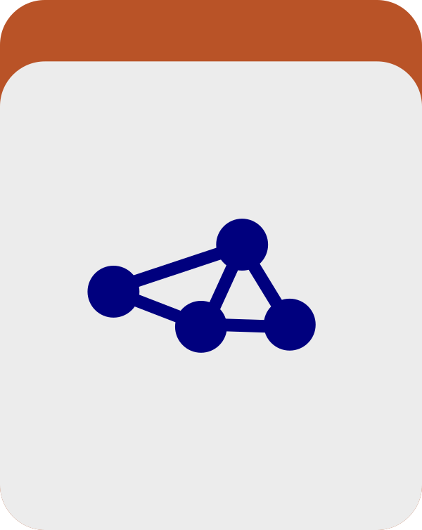

Generate a table that comprehensively summarizes the variability of nucleotide, codon, or amino acid positions. We call these single nucleotide variants (SNVs), single codon variants (SCVs), and single amino acid variants (SAAVs), respectively.

🔙 **[To the main page](../../)** of anvi'o programs and artifacts.



{{ "network.json" }}
{{ 300 }}


## Authors

<a href="/people/ekiefl" target="_blank">Evan Kiefl</a>
<a href="http://ekiefl.github.io" class="person-social" target="_blank"><i class="fa fa-fw fa-home"></i>Web</a><a href="mailto:kiefl.evan@gmail.com" class="person-social" target="_blank"><i class="fa fa-fw fa-envelope-square"></i>Email</a><a href="http://twitter.com/evankiefl" class="person-social" target="_blank"><i class="fa fa-fw fa-twitter-square"></i>Twitter</a><a href="http://github.com/ekiefl" class="person-social" target="_blank"><i class="fa fa-fw fa-github"></i>Github</a>

<a href="/people/meren" target="_blank">A. Murat Eren (Meren)</a>
<a href="http://merenlab.org" class="person-social" target="_blank"><i class="fa fa-fw fa-home"></i>Web</a><a href="mailto:a.murat.eren@gmail.com" class="person-social" target="_blank"><i class="fa fa-fw fa-envelope-square"></i>Email</a><a href="http://twitter.com/merenbey" class="person-social" target="_blank"><i class="fa fa-fw fa-twitter-square"></i>Twitter</a><a href="http://github.com/meren" class="person-social" target="_blank"><i class="fa fa-fw fa-github"></i>Github</a>

<a href="/people/shaiberalon" target="_blank">Alon Shaiber</a>
<a href="mailto:alon.shaiber@gmail.com" class="person-social" target="_blank"><i class="fa fa-fw fa-envelope-square"></i>Email</a><a href="http://twitter.com/alon_shaiber" class="person-social" target="_blank"><i class="fa fa-fw fa-twitter-square"></i>Twitter</a><a href="http://github.com/shaiberalon" class="person-social" target="_blank"><i class="fa fa-fw fa-github"></i>Github</a>

## Can consume

[contigs-db](../../artifacts/contigs-db)  [profile-db](../../artifacts/profile-db)  [structure-db](../../artifacts/structure-db)  [bin](../../artifacts/bin)  [variability-profile](../../artifacts/variability-profile)  [splits-txt](../../artifacts/splits-txt)  [genes-of-interest-txt](../../artifacts/genes-of-interest-txt) 

## Can provide

[variability-profile-txt](../../artifacts/variability-profile-txt) 

## Usage

This program takes the variability data stored within a [profile-db](/help/main/artifacts/profile-db) and compiles it from across samples into a single matrix that comprehensively describes your SNVs, SCVs or SAAVs (a [variability-profile-txt](/help/main/artifacts/variability-profile-txt)).

This program is described in detail in [this blog post](http://merenlab.org/2015/07/20/analyzing-variability/#the-anvio-way), which also covers the biological motivation, output column definitions, and example use cases.

## A note on default filtering of variability signal during profiling

Before this program even runs, anvi'o applies a dynamic, coverage-dependent filter during the profiling step (i.e., when you run [anvi-profile](/help/main/programs/anvi-profile) on your BAM files) to reduce the reporting of variation due to sequencing errors and other factors that are difficult to distinguish frmo noise. Specifically, the base frequencies observed at a position in the read recruitment data are only stored in the [profile-db](/help/main/artifacts/profile-db) *if* `departure_from_reference` value for that position, which quantifies the fraction of reads that differ from the reference nucleotide at a given position, meets or exceeds a coverage-dependent minimum threshold defined by:

$$y = \left(\frac{1}{b}\right)^{x^{\frac{1}{b}} - m} + c$$

where $x$ is the coverage depth and the model parameters are $b = 2$, $m = 1.45$, $c = 0.05$. This gives a threshold of approximately 0.17 at 20X coverage, 0.07 at 50X, and asymptotically approaches 0.05 at very high coverage. Positions that do not meet this threshold are silently excluded from the database and will never appear in the output of this program.

The user can bypass this filter entirely and store all observed variation regardless of frequency by including `--report-variability-full` when running [anvi-profile](/help/main/programs/anvi-profile). But the use of this parameter will dramatically increase database size, and should only be used with extreme care and attention (this is a very politically correct way to say "please do not use this parameter unless you are certain that this is what you need").

## Basic usage

Here is a basic run with no bells or whistles:

anvi&#45;gen&#45;variability&#45;profile &#45;p [profile&#45;db](/help/main/artifacts/profile&#45;db) \
                             &#45;c [contigs&#45;db](/help/main/artifacts/contigs&#45;db) \
                             &#45;C DEFAULT \
                             &#45;b EVERYTHING

Note that this program requires you to specify a subset of the data to focus on, so to work with everything in the databases, first run [anvi-script-add-default-collection](/help/main/programs/anvi-script-add-default-collection) and use the resulting [collection](/help/main/artifacts/collection) and [bin](/help/main/artifacts/bin) as shown above.

You can also specify an output file path, which is useful when running multiple times with different `--engine` settings:

anvi&#45;gen&#45;variability&#45;profile &#45;p [profile&#45;db](/help/main/artifacts/profile&#45;db) \
                             &#45;c [contigs&#45;db](/help/main/artifacts/contigs&#45;db) \
                             &#45;C DEFAULT \
                             &#45;b EVERYTHING \
                             &#45;&#45;output&#45;file /path/to/your/variability.txt

## Choosing what to analyze

### Focusing on a subset of the input

Instead of a collection and bin, there are three alternatives:

1. Provide gene caller IDs directly or as a file:

    

    anvi&#45;gen&#45;variability&#45;profile &#45;p [profile&#45;db](/help/main/artifacts/profile&#45;db) \
                                 &#45;c [contigs&#45;db](/help/main/artifacts/contigs&#45;db) \
                                 &#45;&#45;gene&#45;caller&#45;ids 1,2,3
    

    

    anvi&#45;gen&#45;variability&#45;profile &#45;p [profile&#45;db](/help/main/artifacts/profile&#45;db) \
                                 &#45;c [contigs&#45;db](/help/main/artifacts/contigs&#45;db) \
                                 &#45;&#45;genes&#45;of&#45;interest [genes&#45;of&#45;interest&#45;txt](/help/main/artifacts/genes&#45;of&#45;interest&#45;txt)
    

2. Provide a [splits-txt](/help/main/artifacts/splits-txt) to focus on a specific set of splits:

    

    anvi&#45;gen&#45;variability&#45;profile &#45;p [profile&#45;db](/help/main/artifacts/profile&#45;db) \
                                 &#45;c [contigs&#45;db](/help/main/artifacts/contigs&#45;db) \
                                 &#45;&#45;splits&#45;of&#45;interest [splits&#45;txt](/help/main/artifacts/splits&#45;txt)
    

3. Provide any [collection](/help/main/artifacts/collection) and [bin](/help/main/artifacts/bin):

    

    anvi&#45;gen&#45;variability&#45;profile &#45;p [profile&#45;db](/help/main/artifacts/profile&#45;db) \
                                 &#45;c [contigs&#45;db](/help/main/artifacts/contigs&#45;db) \
                                 &#45;C [collection](/help/main/artifacts/collection) \
                                 &#45;b [bin](/help/main/artifacts/bin)
    

### Restricting to specific samples

You can limit the analysis to a subset of samples by providing a file with one sample name per line:

anvi&#45;gen&#45;variability&#45;profile &#45;p [profile&#45;db](/help/main/artifacts/profile&#45;db) \
                             &#45;c [contigs&#45;db](/help/main/artifacts/contigs&#45;db) \
                             &#45;C [collection](/help/main/artifacts/collection) \
                             &#45;b [bin](/help/main/artifacts/bin) \
                             &#45;&#45;samples&#45;of&#45;interest my_samples.txt

where `my_samples.txt` looks like:

DAY_17A
DAY_18A
DAY_22A
...

### Excluding intergenic positions

For nucleotide-level analyses, you can restrict output to positions that fall within gene calls:

anvi&#45;gen&#45;variability&#45;profile &#45;p [profile&#45;db](/help/main/artifacts/profile&#45;db) \
                             &#45;c [contigs&#45;db](/help/main/artifacts/contigs&#45;db) \
                             &#45;C [collection](/help/main/artifacts/collection) \
                             &#45;b [bin](/help/main/artifacts/bin) \
                             &#45;&#45;exclude&#45;intergenic

## Choosing the variability type (engine)

Which type of variants you analyze depends on the `--engine` parameter:

| Engine | Variant type | Requires |
|--------|-------------|---------|
| `NT` (default) | Single nucleotide variants (SNVs) | standard profiling |
| `CDN` | Single codon variants (SCVs) | `--profile-SCVs` at profiling time |
| `AA` | Single amino acid variants (SAAVs) | `--profile-SCVs` at profiling time |

To analyze SAAVs:

anvi&#45;gen&#45;variability&#45;profile &#45;p [profile&#45;db](/help/main/artifacts/profile&#45;db) \
                             &#45;c [contigs&#45;db](/help/main/artifacts/contigs&#45;db) \
                             &#45;C [collection](/help/main/artifacts/collection) \
                             &#45;b [bin](/help/main/artifacts/bin) \
                             &#45;&#45;engine AA

To analyze SCVs:

anvi&#45;gen&#45;variability&#45;profile &#45;p [profile&#45;db](/help/main/artifacts/profile&#45;db) \
                             &#45;c [contigs&#45;db](/help/main/artifacts/contigs&#45;db) \
                             &#45;C [collection](/help/main/artifacts/collection) \
                             &#45;b [bin](/help/main/artifacts/bin) \
                             &#45;&#45;engine CDN

## Adding structural annotations

You can add structural annotations by providing a [structure-db](/help/main/artifacts/structure-db):

anvi&#45;gen&#45;variability&#45;profile &#45;p [profile&#45;db](/help/main/artifacts/profile&#45;db) \
                             &#45;c [contigs&#45;db](/help/main/artifacts/contigs&#45;db) \
                             &#45;C DEFAULT \
                             &#45;b EVERYTHING \
                             &#45;s [structure&#45;db](/help/main/artifacts/structure&#45;db)

When a [structure-db](/help/main/artifacts/structure-db) is provided, you can also limit your analysis to only genes that have structures in the database:

anvi&#45;gen&#45;variability&#45;profile &#45;p [profile&#45;db](/help/main/artifacts/profile&#45;db) \
                             &#45;c [contigs&#45;db](/help/main/artifacts/contigs&#45;db) \
                             &#45;s [structure&#45;db](/help/main/artifacts/structure&#45;db) \
                             &#45;&#45;only&#45;if&#45;structure

## Filtering the output

### By departure from reference or consensus

`departure_from_reference` is the fraction of reads at a position that differ from the reference nucleotide. `departure_from_consensus` is similar but measured against the most frequent allele in that sample. You can set minimum and maximum bounds on either:

anvi&#45;gen&#45;variability&#45;profile &#45;p [profile&#45;db](/help/main/artifacts/profile&#45;db) \
                             &#45;c [contigs&#45;db](/help/main/artifacts/contigs&#45;db) \
                             &#45;C [collection](/help/main/artifacts/collection) \
                             &#45;b [bin](/help/main/artifacts/bin) \
                             &#45;&#45;min&#45;departure&#45;from&#45;reference 0.05 \
                             &#45;&#45;max&#45;departure&#45;from&#45;reference 0.90

### By minimum occurrence across samples

To keep only positions that are variable in at least N samples (useful for reducing stochastic noise):

anvi&#45;gen&#45;variability&#45;profile &#45;p [profile&#45;db](/help/main/artifacts/profile&#45;db) \
                             &#45;c [contigs&#45;db](/help/main/artifacts/contigs&#45;db) \
                             &#45;C [collection](/help/main/artifacts/collection) \
                             &#45;b [bin](/help/main/artifacts/bin) \
                             &#45;&#45;min&#45;occurrence 3

### By coverage across all samples

To remove any position that has insufficient coverage in even one sample (requires `--quince-mode` to have coverage data for all samples at all positions):

anvi&#45;gen&#45;variability&#45;profile &#45;p [profile&#45;db](/help/main/artifacts/profile&#45;db) \
                             &#45;c [contigs&#45;db](/help/main/artifacts/contigs&#45;db) \
                             &#45;C [collection](/help/main/artifacts/collection) \
                             &#45;b [bin](/help/main/artifacts/bin) \
                             &#45;&#45;quince&#45;mode \
                             &#45;&#45;min&#45;coverage&#45;in&#45;each&#45;sample 10

### By number of positions per split

To randomly subsample variable positions and keep at most N per split:

anvi&#45;gen&#45;variability&#45;profile &#45;p [profile&#45;db](/help/main/artifacts/profile&#45;db) \
                             &#45;c [contigs&#45;db](/help/main/artifacts/contigs&#45;db) \
                             &#45;C [collection](/help/main/artifacts/collection) \
                             &#45;b [bin](/help/main/artifacts/bin) \
                             &#45;&#45;num&#45;positions&#45;from&#45;each&#45;split 100

## Special reporting modes

### --quince-mode

By default, if a position is variable in only some samples, the other samples will have no entry for that position in the output. With `--quince-mode`, the program goes back to the raw data and fills in allele frequencies for every sample at every reported position, even those where no variation was detected. This is essential for statistical approaches that require a complete matrix.

anvi&#45;gen&#45;variability&#45;profile &#45;p [profile&#45;db](/help/main/artifacts/profile&#45;db) \
                             &#45;c [contigs&#45;db](/help/main/artifacts/contigs&#45;db) \
                             &#45;C [collection](/help/main/artifacts/collection) \
                             &#45;b [bin](/help/main/artifacts/bin) \
                             &#45;&#45;quince&#45;mode

Note that `--quince-mode` substantially increases runtime and output file size.

### --kiefl-mode

When using `--engine AA` or `--engine CDN`, the default behavior reports only positions that had detectable variation during profiling. With `--kiefl-mode`, all positions in the analyzed genes are reported, with invariant positions given a reference allele frequency of 1. This is useful for analyses that need a complete picture of every codon or amino acid position, not just the variable ones. Incompatible with `--quince-mode`.

anvi&#45;gen&#45;variability&#45;profile &#45;p [profile&#45;db](/help/main/artifacts/profile&#45;db) \
                             &#45;c [contigs&#45;db](/help/main/artifacts/contigs&#45;db) \
                             &#45;C [collection](/help/main/artifacts/collection) \
                             &#45;b [bin](/help/main/artifacts/bin) \
                             &#45;&#45;engine CDN \
                             &#45;&#45;kiefl&#45;mode

This flag was added in this [pull request](https://github.com/merenlab/anvio/pull/1794) where you can read about the tests performed to validate its behavior.

## Additional output columns

### Contig and split names

anvi&#45;gen&#45;variability&#45;profile &#45;p [profile&#45;db](/help/main/artifacts/profile&#45;db) \
                             &#45;c [contigs&#45;db](/help/main/artifacts/contigs&#45;db) \
                             &#45;C [collection](/help/main/artifacts/collection) \
                             &#45;b [bin](/help/main/artifacts/bin) \
                             &#45;&#45;include&#45;contig&#45;names \
                             &#45;&#45;include&#45;split&#45;names

Contig names are excluded by default since they can nearly double file size.

### Gene-level coverage statistics

anvi&#45;gen&#45;variability&#45;profile &#45;p [profile&#45;db](/help/main/artifacts/profile&#45;db) \
                             &#45;c [contigs&#45;db](/help/main/artifacts/contigs&#45;db) \
                             &#45;C [collection](/help/main/artifacts/collection) \
                             &#45;b [bin](/help/main/artifacts/bin) \
                             &#45;&#45;compute&#45;gene&#45;coverage&#45;stats

This appends per-gene coverage statistics to each row. It is computationally expensive and off by default.

### Per-site pN/pS values (CDN engine only)

anvi&#45;gen&#45;variability&#45;profile &#45;p [profile&#45;db](/help/main/artifacts/profile&#45;db) \
                             &#45;c [contigs&#45;db](/help/main/artifacts/contigs&#45;db) \
                             &#45;C [collection](/help/main/artifacts/collection) \
                             &#45;b [bin](/help/main/artifacts/bin) \
                             &#45;&#45;engine CDN \
                             &#45;&#45;include&#45;site&#45;pnps

This adds 12 columns of per-site synonymous and nonsynonymous substitution information, computed relative to the reference, the consensus, and the most common consensus across samples.

### Additional data from the database

anvi&#45;gen&#45;variability&#45;profile &#45;p [profile&#45;db](/help/main/artifacts/profile&#45;db) \
                             &#45;c [contigs&#45;db](/help/main/artifacts/contigs&#45;db) \
                             &#45;C [collection](/help/main/artifacts/collection) \
                             &#45;b [bin](/help/main/artifacts/bin) \
                             &#45;&#45;engine AA \
                             &#45;&#45;include&#45;additional&#45;data

This appends any data stored in the `amino_acid_additional_data` table as extra columns. Currently only supported for the `AA` engine.

{:.notice}
Edit [this file](https://github.com/merenlab/anvio/tree/master/anvio/docs/programs/anvi-gen-variability-profile.md) to update this information.

## Additional Resources

* [All about SNVs, SCVs, and SAAVs](http://merenlab.org/2015/07/20/analyzing-variability/)

* [This program in action in the anvi&#x27;o structure tutorial](http://merenlab.org/2018/09/04/getting-started-with-anvio-structure/#supplying-anvi-display-structure-with-sequence-variability)

{:.notice}
Are you aware of resources that may help users better understand the utility of this program? Please feel free to edit [this file](https://github.com/merenlab/anvio/blob/master/anvio/cli/gen_variability_profile.py) on GitHub. If you are not sure how to do that, find the `__resources__` tag in [this file](https://github.com/merenlab/anvio/blob/master/anvio/cli/interactive.py) to see an example.
