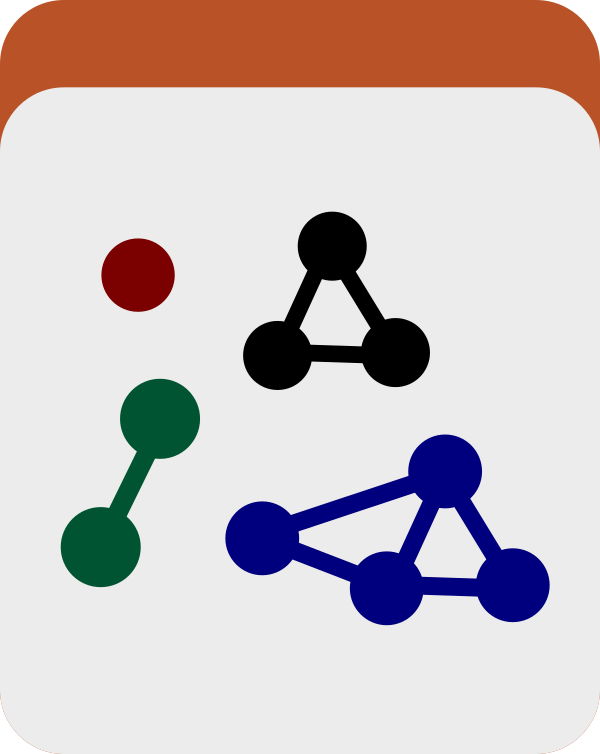

Import contig-level classification data (domain, virus, plasmid, etc.) into a contigs database from a user-prepared tab-delimited file.

🔙 **[To the main page](../../)** of anvi'o programs and artifacts.



{{ "network.json" }}
{{ 300 }}


## Authors

<a href="/people/tucker4" target="_blank">Sarah Tucker</a>
<a href="https://sarahjtucker.com/" class="person-social" target="_blank"><i class="fa fa-fw fa-home"></i>Web</a><a href="mailto:stucker@mbl.edu" class="person-social" target="_blank"><i class="fa fa-fw fa-envelope-square"></i>Email</a><a href="http://github.com/tucker4" class="person-social" target="_blank"><i class="fa fa-fw fa-github"></i>Github</a>

<a href="/people/ivagljiva" target="_blank">Iva Veseli</a>
<a href="mailto:iva.veseli@gmail.com" class="person-social" target="_blank"><i class="fa fa-fw fa-envelope-square"></i>Email</a><a href="http://twitter.com/ivaglj1va" class="person-social" target="_blank"><i class="fa fa-fw fa-twitter-square"></i>Twitter</a><a href="http://github.com/ivagljiva" class="person-social" target="_blank"><i class="fa fa-fw fa-github"></i>Github</a>

<a href="/people/u-xixi" target="_blank">Xi Chen (Xixi)</a>
<a href="mailto:xi.chen@hifmb.de" class="person-social" target="_blank"><i class="fa fa-fw fa-envelope-square"></i>Email</a><a href="http://github.com/u-xixi" class="person-social" target="_blank"><i class="fa fa-fw fa-github"></i>Github</a>

<a href="/people/avihuene" target="_blank">Avril Hoyningen-Huene</a>
<a href="mailto:avril.hoyningen@hifmb.de" class="person-social" target="_blank"><i class="fa fa-fw fa-envelope-square"></i>Email</a><a href="http://github.com/avihuene" class="person-social" target="_blank"><i class="fa fa-fw fa-github"></i>Github</a>

<a href="/people/ahenoch" target="_blank">Alexander Henoch</a>
<a href="mailto:alexander.henoch@hifmb.de" class="person-social" target="_blank"><i class="fa fa-fw fa-envelope-square"></i>Email</a><a href="http://github.com/ahenoch" class="person-social" target="_blank"><i class="fa fa-fw fa-github"></i>Github</a>

<a href="/people/guille0387" target="_blank">Guillermo Rangel-Pineros</a>
<a href="mailto:guillermo.pineros@sund.ku.dk" class="person-social" target="_blank"><i class="fa fa-fw fa-envelope-square"></i>Email</a><a href="http://github.com/guille0387" class="person-social" target="_blank"><i class="fa fa-fw fa-github"></i>Github</a>

## Requires

[contigs-db](../../artifacts/contigs-db)  [contig-classification-txt](../../artifacts/contig-classification-txt) 

## Provides

[contig-classification](../../artifacts/contig-classification) 

## Usage

This program **takes in one or more [contig-classification-txt](/help/main/artifacts/contig-classification-txt) files and stores the contig-level classification data in a [contigs-db](/help/main/artifacts/contigs-db)**, producing a [contig-classification](/help/main/artifacts/contig-classification) artifact.

There are many software tools available for classifying contigs according to their predicted domain of origin, and the point of this program is to put those classifications within a [contigs-db](/help/main/artifacts/contigs-db) for use in downstream programs such as [anvi-split](/help/main/programs/anvi-split). In order for this to work, you'll need to convert the output of whichever tool you have used to the standardized tabular format accepted by this program. Once you have a [contig-classification-txt](/help/main/artifacts/contig-classification-txt) containing the classification data, you can import that data like this:

anvi&#45;import&#45;contig&#45;classification &#45;c [contigs&#45;db](/help/main/artifacts/contigs&#45;db) \
                                   &#45;i [contig&#45;classification&#45;txt](/help/main/artifacts/contig&#45;classification&#45;txt)

Multiple classification sources can coexist in the same contigs database, as described by the `source` column in the input file. If you want to import multiple sources, you can put all their classifications into one [contig-classification-txt](/help/main/artifacts/contig-classification-txt).

That said, in case you created a different table for each classification tool that you used, you can import from multiple files at once:

anvi&#45;import&#45;contig&#45;classification &#45;c [contigs&#45;db](/help/main/artifacts/contigs&#45;db) \
                                   &#45;i genomad_out.tsv tiara_out.tsv

If your input file contains classifications from a source that is already stored in the contigs database, anvi'o will raise an error to protect existing data. To overwrite a source, re-run with the `--just-do-it` flag, which will delete all existing rows for that source before inserting the new data:

anvi&#45;import&#45;contig&#45;classification &#45;c [contigs&#45;db](/help/main/artifacts/contigs&#45;db) \
                                   &#45;i [contig&#45;classification&#45;txt](/help/main/artifacts/contig&#45;classification&#45;txt) \
                                   &#45;&#45;just&#45;do&#45;it

{:.notice}
Edit [this file](https://github.com/merenlab/anvio/tree/master/anvio/docs/programs/anvi-import-contig-classification.md) to update this information.

## Additional Resources

{:.notice}
Are you aware of resources that may help users better understand the utility of this program? Please feel free to edit [this file](https://github.com/merenlab/anvio/blob/master/anvio/cli/import_contig_classification.py) on GitHub. If you are not sure how to do that, find the `__resources__` tag in [this file](https://github.com/merenlab/anvio/blob/master/anvio/cli/interactive.py) to see an example.
