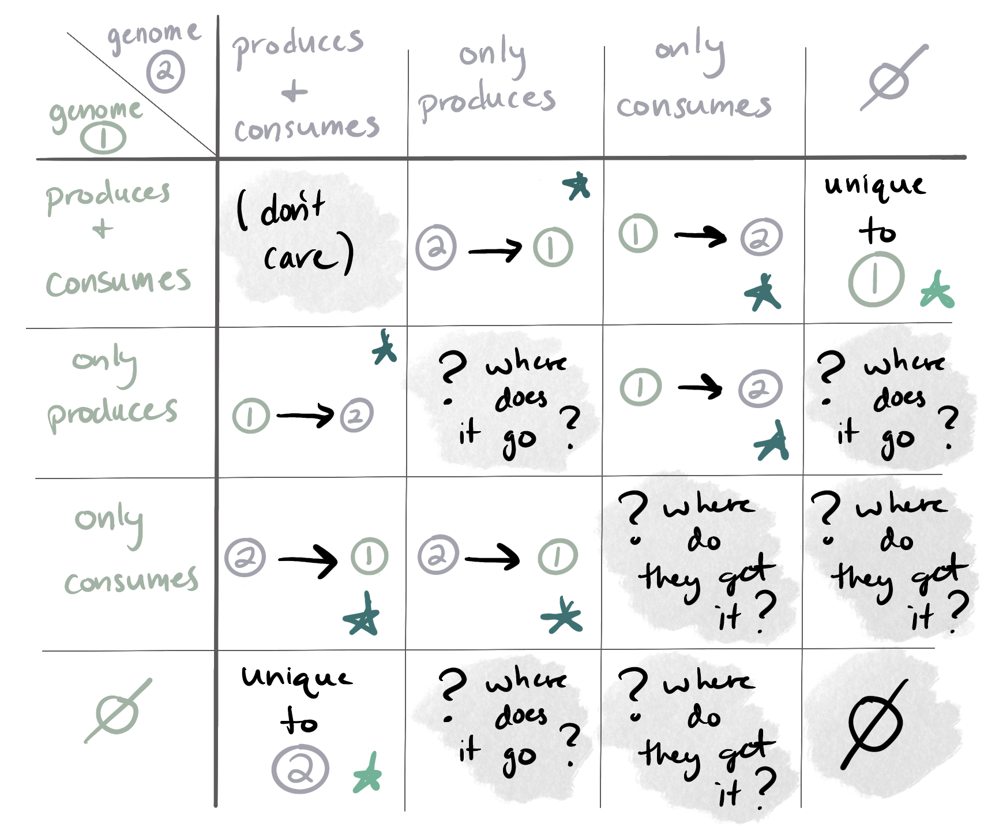
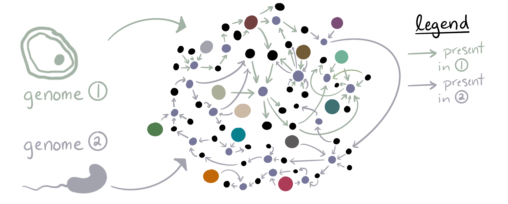
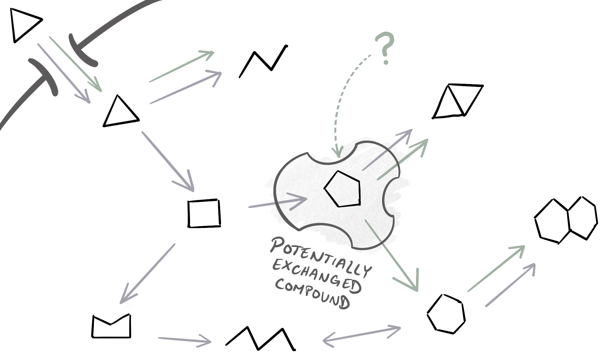
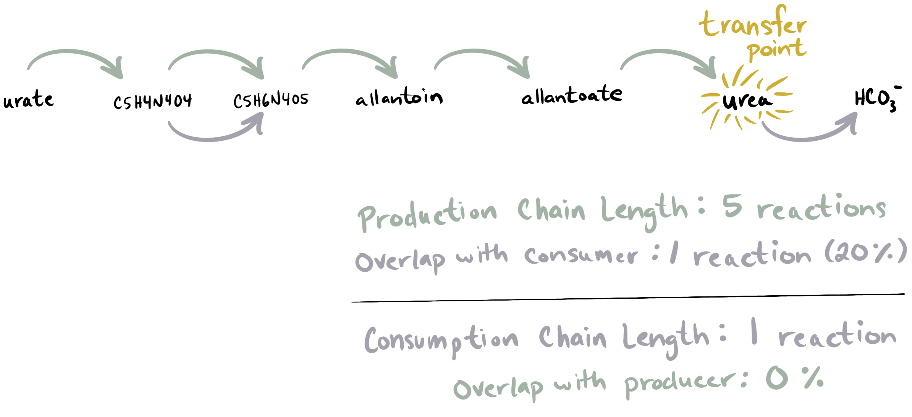

Predicts metabolic exchanges between microbes based on the reaction network.

🔙 **[To the main page](../../)** of anvi'o programs and artifacts.



{{ "network.json" }}
{{ 300 }}


## Authors

<a href="/people/ivagljiva" target="_blank">Iva Veseli</a>
<a href="mailto:iva.veseli@gmail.com" class="person-social" target="_blank"><i class="fa fa-fw fa-envelope-square"></i>Email</a><a href="http://twitter.com/ivaglj1va" class="person-social" target="_blank"><i class="fa fa-fw fa-twitter-square"></i>Twitter</a><a href="http://github.com/ivagljiva" class="person-social" target="_blank"><i class="fa fa-fw fa-github"></i>Github</a>

## Can consume

[contigs-db](../../artifacts/contigs-db)  [reaction-network](../../artifacts/reaction-network)  [equivalent-compounds-txt](../../artifacts/equivalent-compounds-txt)  [external-genomes](../../artifacts/external-genomes)  [genome-pairs](../../artifacts/genome-pairs)  [reaction-ref-data](../../artifacts/reaction-ref-data)  [kegg-data](../../artifacts/kegg-data) 

## Can provide

[metabolite-exchange-predictions](../../artifacts/metabolite-exchange-predictions) 

## Usage

[anvi-predict-metabolic-exchanges](/help/main/programs/anvi-predict-metabolic-exchanges) uses the metabolic capacity encoded in two genomes to predict which metabolites could be exchanged between two organisms, and which metabolites are unique to one of the organisms. The output files produced by the program are described in [metabolite-exchange-predictions](/help/main/artifacts/metabolite-exchange-predictions).

By leveraging the [reaction-network](/help/main/artifacts/reaction-network) infrastructure of anvi'o, the program examines the overlap between the metabolic reactions that each of the two organisms can catalyze and identifies which metabolic compounds fall into one of the following categories:

1. can be produced by only one organism but consumed by the other (or both)
2. can be consumed by only one organism but produced by the other (or both)
3. can be produced and/or consumed by only one organism

It reports the metabolites in categories 1 and 2 as 'potentially-exchanged compounds', and the metabolites in category 3 as 'unique' compounds. Here is a table of what it looks for (everything marked with a star is reported by the program, and everything with a gray background is ignored):

{:.center-img .width-70}

Briefly, the program works by checking for these conditions for every metabolite in the genomes' (merged) reaction networks. It does so in two orthogonal ways:

1. **Walking over KEGG Pathway Maps.** For each compound that is part of a KEGG Pathway Map, we examine the chains of reactions that produce or consume the compound within the Pathway Map for each organism. This not only allows us to identify the aforementioned situations of potentially-exchanged or unique compounds, but also allows us to compute evidence for a given prediction (such as length and overlap of reaction chains) that can help you filter and interpret the output.
2. **Isolating metabolites in the merged reaction network.** For each compound that is part of the genomes' merged reaction network, we examine the subset of the network centered around it and determine whether it fits into one of the situations described above. This strategy currently doesn't offer any supporting evidence for a given prediction (we only look at the potential 'transfer point' of the compound), but it does allow predictions for compounds that are not included in any KEGG Pathway Maps.

Either of these strategies can be skipped, in case you prefer to use only one method. If you want to know more, check the Technical Details section.

## Prerequisites to using this program

This program uses the [reaction-network](/help/main/artifacts/reaction-network) stored in each [contigs-db](/help/main/artifacts/contigs-db) to search for potentially-exchanged or unique compounds. Since the [reaction-network](/help/main/artifacts/reaction-network) and this program both rely on the [ModelSEED](https://modelseed.org/) and [KEGG](https://www.kegg.jp/) databases (especially KEGG Pathway Maps and KOfam annotation profiles for KEGG Orthlogs), you need to have access to that data on your computer. You also need to have KEGG Ortholog (KO) annotations ([kegg-functions](/help/main/artifacts/kegg-functions)) in your input genomes (which translates to having the functional annotation source 'KOfam' in the [contigs-db](/help/main/artifacts/contigs-db)s).

Here are the steps you need to run before this program:
1. [anvi-setup-kegg-data](/help/main/programs/anvi-setup-kegg-data) to get data from KEGG onto your computer. This step only needs to be done once -- if you've already ran this setup program in the past, you normally don't have to do it again. When in doubt, skip this step and let anvi'o tell you if you are missing something.
2. [anvi-setup-modelseed-database](/help/main/programs/anvi-setup-modelseed-database) to get data from ModelSEED onto your computer. Like the previous step, this only needs to be done once.
3. [anvi-run-kegg-kofams](/help/main/programs/anvi-run-kegg-kofams) to annotate _each_ of your [contigs-db](/help/main/artifacts/contigs-db)s with KEGG Ortholog protein families.
4. [anvi-reaction-network](/help/main/programs/anvi-reaction-network) to create a reaction network for _each_ of of your [contigs-db](/help/main/artifacts/contigs-db)s.

If you've done all that, you are good to go.

## How to run this program

### Running on a single pair of genomes

Provide both contigs databases for your genomes and a prefix for the output files:

anvi&#45;predict&#45;metabolic&#45;exchanges &#45;c1 [contigs&#45;db](/help/main/artifacts/contigs&#45;db) &#45;c2 [contigs&#45;db](/help/main/artifacts/contigs&#45;db) \
                                 &#45;O ANY_PREFIX

The [metabolite-exchange-predictions](/help/main/artifacts/metabolite-exchange-predictions) output file names will start using the prefix you provided.

### MULTI-MODE: Running on multiple pairs of genomes

There are two ways for running this program in 'multi-mode' so that it predicts exchanges between multiple pairs of genomes. Both of them involve using an [external-genomes](/help/main/artifacts/external-genomes) file to point the program towards each contigs database. You will get one set of output files containing the predictions from all pairs.

If possible for your computer setup, we recommend increasing the number of threads using the `--num-threads` or `-T` parameter so that multiple pairs of genomes can be processed in parallel.

**All-vs-all comparisons**

If you provide only an [external-genomes](/help/main/artifacts/external-genomes) file, the program will determine all possible pairs of genomes and predict exchanges between all of them.

anvi&#45;predict&#45;metabolic&#45;exchanges &#45;e [external&#45;genomes](/help/main/artifacts/external&#45;genomes) \
                                 &#45;O ANY_PREFIX \
                                 &#45;&#45;num&#45;threads 1

**Specific pairwise comparisons**

If you only want to predict exchanges between specific pairs of genomes, then you can enumerate those pairs in a [genome-pairs](/help/main/artifacts/genome-pairs) file and provide that to the program (in addition to the [external-genomes](/help/main/artifacts/external-genomes) file).

anvi&#45;predict&#45;metabolic&#45;exchanges &#45;e [external&#45;genomes](/help/main/artifacts/external&#45;genomes) \
                                 &#45;&#45;genome&#45;pairs&#45;txt [genome&#45;pairs](/help/main/artifacts/genome&#45;pairs) \
                                 &#45;O ANY_PREFIX \
                                 &#45;&#45;num&#45;threads 1

**Additional steps to run this program on internal genomes (bins)**

If you have a [collection](/help/main/artifacts/collection) of [bin](/help/main/artifacts/bin) in a metagenome assembly, commonly described in an [internal-genomes](/help/main/artifacts/internal-genomes) file, then you have to first run the program [anvi-split](/help/main/programs/anvi-split) to extract those bins into their own individual contigs databases. You will then need to run [anvi-reaction-network](/help/main/programs/anvi-reaction-network) on each bin's individual contigs database, because running [anvi-split](/help/main/programs/anvi-split) does not split any reaction network made for the entire metagenome into subnetworks for each bin (at least, it did not do so at the time of writing this documentation).

Once you have a [reaction-network](/help/main/artifacts/reaction-network) in each bin's [contigs-db](/help/main/artifacts/contigs-db), you can create an [external-genomes](/help/main/artifacts/external-genomes) to use as input for [anvi-predict-metabolic-exchanges](/help/main/programs/anvi-predict-metabolic-exchanges) as described above.

## Adjustable Parameters

### Setting some compound IDs as equivalent

The ModelSEED database sometimes has multiple compound ID numbers for what (we think) should be the same metabolite, at least for the purposes of predicting exchanges. A prime example of this is amino acids, which can have compounds where their chirality is specified (as in `L-Lysine (cpd00039)`) and where the chirality is generic (as in `Lysine (cpd19182)`). This is not so much a problem when we are using KEGG Pathway Maps to predict exchanges, but can lead to missing predictions when using the reaction network.

For amino acids, the program can automatically detect which compound IDs should be considered equivalent, and take that into account when looking for potentially-exchanged compounds. If you use the `--use-equivalent-amino-acids` flag, the program will search through the ModelSEED database for any conventional amino acids (plus Selenocysteine and Pyrrolysine) that have both an 'L-' version and a chiral-unspecific version, and set those two compounds equivalent to each other.

anvi&#45;predict&#45;metabolic&#45;exchanges &#45;c1 [contigs&#45;db](/help/main/artifacts/contigs&#45;db) &#45;c2 [contigs&#45;db](/help/main/artifacts/contigs&#45;db) \
                                 &#45;O ANY_PREFIX \
                                 &#45;&#45;use&#45;equivalent&#45;amino&#45;acids

If you do this, you will get an output file listing the amino acid compounds that were deemed equivalent, so you can make sure you agree with them.

If you want to specify a custom set of equivalent compound IDs, you can instead provide an [equivalent-compounds-txt](/help/main/artifacts/equivalent-compounds-txt) file to the `--custom-equivalent-compounds-file` parameter:

anvi&#45;predict&#45;metabolic&#45;exchanges &#45;c1 [contigs&#45;db](/help/main/artifacts/contigs&#45;db) &#45;c2 [contigs&#45;db](/help/main/artifacts/contigs&#45;db) \
                                 &#45;O ANY_PREFIX \
                                 &#45;&#45;custom&#45;equivalent&#45;compounds&#45;file [equivalent&#45;compounds&#45;txt](/help/main/artifacts/equivalent&#45;compounds&#45;txt)

### Using only one prediction method

If you want to skip the first prediction step of walking over KEGG Pathway Maps to find potential exchanges, use the `--no-pathway-walk` flag:

anvi&#45;predict&#45;metabolic&#45;exchanges &#45;c1 [contigs&#45;db](/help/main/artifacts/contigs&#45;db) &#45;c2 [contigs&#45;db](/help/main/artifacts/contigs&#45;db) \
                                 &#45;O ANY_PREFIX \
                                 &#45;&#45;no&#45;pathway&#45;walk

If you want to skip the second prediction step of examining the local reaction network around each compound, use the `--pathway-walk-only` flag:

anvi&#45;predict&#45;metabolic&#45;exchanges &#45;c1 [contigs&#45;db](/help/main/artifacts/contigs&#45;db) &#45;c2 [contigs&#45;db](/help/main/artifacts/contigs&#45;db) \
                                 &#45;O ANY_PREFIX \
                                 &#45;&#45;pathway&#45;walk&#45;only

It is hopefully understandable that these two flags are incompatible with each other.

### Skipping some Pathway Maps

By default, this program will process all regular-type KEGG Pathway Maps (those with map IDs starting with prefix '00') which have Reaction ('RN') type KGML files available in the KEGG data directory. If there are some Pathway Maps that you _don't want_ used for prediction (because they are irrelevant to your system, or you think they lead to misleading results, or they take too long to process, whatever), you can use the `--exclude-pathway-maps` option to provide a comma-separated list of Pathway Map ID numbers (just the numbers, no string prefix of any kind).

In the example below, we exclude two Pathway Maps: [map 00195 (Photosynthesis)](https://www.kegg.jp/dbget-bin/www_bget?map00195) and [map 00190 (Oxidative Phosphorylation)](https://www.kegg.jp/dbget-bin/www_bget?map00190). Both of these describe several enzyme complexes and do not explicitly contain any chemical reactions; hence, they do not have 'RN'-type KGML files and would be skipped by the program anyway. The only effect of using the flag in this case would be that you don't see any warnings on the terminal about those two Pathway Maps. However, if you use the flag to exclude a map that _does_ have an 'RN'-type KGML file, such as [map 00470 (D-amino acid biosynthesis)](https://www.kegg.jp/pathway/map00470), the effect would be to remove any predictions (and accompanying evidence) that come from that Pathway Map.

anvi&#45;predict&#45;metabolic&#45;exchanges &#45;c1 [contigs&#45;db](/help/main/artifacts/contigs&#45;db) &#45;c2 [contigs&#45;db](/help/main/artifacts/contigs&#45;db) \
                                 &#45;O ANY_PREFIX \
                                 &#45;&#45;exclude&#45;pathway&#45;maps 00195,00190

This option is only relevant if you allow the Pathway Map Walk prediction strategy (i.e., you didn't use `--no-pathway-walk`).

### Changing the number of allowed gaps in the Pathway Map walks

The `--maximum-gaps` parameter applies to the first prediction step of walking over KEGG Pathway Maps, and allows a certain number of missing enzyme annotations in the reaction chains. By default, we don't allow any gaps, but if you think missing annotations in either genome might be throwing off your predictions, you can set this parameter to an integer greater than 0:

anvi&#45;predict&#45;metabolic&#45;exchanges &#45;c1 [contigs&#45;db](/help/main/artifacts/contigs&#45;db) &#45;c2 [contigs&#45;db](/help/main/artifacts/contigs&#45;db) \
                                 &#45;O ANY_PREFIX \
                                 &#45;&#45;maximum&#45;gaps 1

Changing this parameter will mostly affect the evidence attributed to a given prediction (i.e., length and overlap of reaction chains), but there could be some cases where increasing the gap number enables new predictions to be made.

### Using non-default data directories

If you set up your KEGG or ModelSEED data in a custom directory, you can make sure this program knows where to find it by providing the paths:

anvi&#45;predict&#45;metabolic&#45;exchanges &#45;c1 [contigs&#45;db](/help/main/artifacts/contigs&#45;db) &#45;c2 [contigs&#45;db](/help/main/artifacts/contigs&#45;db) \
                                 &#45;O ANY_PREFIX \
                                 &#45;&#45;kegg&#45;data&#45;dir /path/to/directory/KEGG \
                                 &#45;&#45;modelseed&#45;data&#45;dir /path/to/directory/MODELSEED

The data directories are relevant for loading the [reaction-network](/help/main/artifacts/reaction-network) in the contigs database, so it is best to use the same data directories that were utilized when running [anvi-reaction-network](/help/main/programs/anvi-reaction-network).

### Adjusting number of threads and processes

If you have a lot of computational resources, you can make this program work faster by parallelizing some of the tasks. For instance:
- when processing a single pair of genomes, multiple Pathway Map Walks can be done at once according to the number of threads set using the parameter `--num-threads`
- when processing multiple pairs of genomes (i.e., 'MULTI-MODE'), multiple pairs of genomes can be processed at once according to the number of threads set using the `--num-threads` parameter. Each comparison, however, will internally utilize one thread, UNLESS...
- since MULTI-MODE internally does multiple 'single pair' comparisons, you can increase the number of threads each comparison uses for Pathway Map walks by setting _both_ the `--num-parallel-processes` parameter _and_ the `--num-threads` parameter

Confused? Let's see a few examples.

**Multithreading 'single' mode**

In this example, the program will predict exchanges between one pair of genomes, and it will be able to do Pathway Map walks for 4 Pathway Maps at once.

anvi&#45;predict&#45;metabolic&#45;exchanges &#45;c1 [contigs&#45;db](/help/main/artifacts/contigs&#45;db) &#45;c2 [contigs&#45;db](/help/main/artifacts/contigs&#45;db) \
                                 &#45;O ANY_PREFIX \
                                 &#45;&#45;num&#45;threads 4

Resource requirement: Your computer (or the job you submitted to a high-performance computing cluster) must have **>4 threads** available to run this example. 

{:.notice}
Why >4 and not >=4? I'm glad you asked. You see, the program itself has to run on one thread and it will start 4 child processes to work on the Pathway Map walks, bringing the total usage up to n=5 threads. Why not spawn `n-1` child processes so that the _total_ thread usage of the program is exactly equal to the `--num-threads` number? Well, that is a good idea. But in practice, the program (parent process) is not doing very much while waiting for its child processes to send their data back. And it seemed less confusing this way to begin with. If you think that extra thread will cause issues, now you know and you can set `--num-threads` a bit lower accordingly. And if you are upset about this, you know who to complain to. 😇

**Multithreading multi-mode (multiple single-threaded comparisons at once)**

In this example, the program will predict exchanges between all possible pairs of genomes in the provided [external-genomes](/help/main/artifacts/external-genomes) file, and it will be able to process 4 genome pairs at once. Each genome pair comparison is single-threaded in this case, meaning that there is no parallel processing of Pathway Map walks.

anvi&#45;predict&#45;metabolic&#45;exchanges &#45;e [external&#45;genomes](/help/main/artifacts/external&#45;genomes) \
                                 &#45;O ANY_PREFIX \
                                 &#45;&#45;num&#45;threads 4

Resource requirement: Your computer (or the job you submitted to a high-performance computing cluster) must have **>4 threads** available to run this example. 

**Multiprocessing multi-mode (multiple multithreaded comparisons at once)**

Finally, in this example, the program will process multiple pairs of genomes, but each genome pair comparison is multithreaded. Specifically, here we allow it to process 3 genome pairs in parallel, and each parallel process can in turn use 4 threads (so the Pathway Map Walk is multithreaded).

anvi&#45;predict&#45;metabolic&#45;exchanges &#45;e [external&#45;genomes](/help/main/artifacts/external&#45;genomes) \
                                 &#45;O ANY_PREFIX \
                                 &#45;&#45;num&#45;threads 4 \
                                 &#45;&#45;num&#45;parallel&#45;processes 3

Resource requirement: Your computer (or the job you submitted to a high-performance computing cluster) must have **>12 threads** available to run this example.

{:.notice}
Why >12 threads? Well, 4 * 3 = 12, plus there is one additional thread on which the main program is running while waiting for its child processes for a total usage of n=13 threads (confused? read the yellow box under the first example). If you are paying _really_ close attention, you might realize that each child process needs to run on its own thread while spawning its own set of (grand)child processes. Good catch! We account for this by allowing each child process to create `t-1` threads (where `t` is the `--num-threads` value) so that the total per-process footprint is equal to `--num-threads`. So in this example, technically only 3 Pathway Map walks are done at once for each genome pair comparison even though we set `--num-threads` to 4. At large scales, we cannot necessarily afford to ignore an extra thread per child process like we do for the parent process.

## Technical Details

This section describes how the predictions of metabolic exchanges are done, for a given pair of genomes.

### Cases we are looking for

You might recall the table of metabolite production vs consumption possibilities at the top of this documentation page. Here it is again so that you don't have to scroll up:

{:.center-img .width-70}

To identify potentially-exchanged compounds, we look for all the cases marked by a dark green star; that is, compounds for which one of the genomes can either only produce or only consume the metabolite, such that it is possible that this genome is passing the metabolite to the other genome or receiving it from the other genome, respectively.

To identify unique compounds, we look for all the cases marked by a light green star in the table; that is, compounds for which production and/or consumption can only be done by one of the two genomes. We ignore all the other possibilities (gray background in the table) because the genomes either have no biological motivation to share the metabolite (that we can detect) or the situation raises questions that we simply cannot answer computationally.

#### How do we determine which organism is the 'primary producer' and which organism is the 'primary consumer' for potentially-exchanged compounds?

In some cases, more than one of the organisms can produce/consume a metabolite, but we have to pick just one of the two as the 'primary' producer or consumer of the compound. This is how we do that for a compound that is potentially-exchanged:

- if only one of the organisms can produce the compound, it is considered the 'primary producer' and the other organism is assigned by default to the role of 'primary consumer' (even if the first organism can also consume the compound)
- if only one of the organisms can consume the compound, it is considered the 'primary consumer' and the other organism is assigned by default to the role of 'primary producer' (even if the first organism can also produce the compound)

This role assignment is mostly relevant for interpreting the Pathway Walk evidence (described in a later section). The output of the program will describe all genomes that can 'produce' or 'consume' a compound when relevant, so you won't be missing any information about who can do what.

### Using reaction networks to identify exchanged and unique compounds

In order to start searching for the cases described above, we need to first identify the capacity for _production_ or _consumption_ of a metabolite by looking for the enzymes that can catalyze chemical reactions with the metabolite as a _product_ or as a _substrate_, respectively. This is done using the [reaction-network](/help/main/artifacts/reaction-network)s generated by [anvi-reaction-network](/help/main/programs/anvi-reaction-network). Each genome's [reaction-network](/help/main/artifacts/reaction-network) matches the KEGG KOfam annotations of the genome to chemical reactions in the ModelSEED database, and includes all the enzymes/reactions/metabolites that are theoretically usable by the organism.

[anvi-predict-metabolic-exchanges](/help/main/programs/anvi-predict-metabolic-exchanges) therefore starts by merging the two genome's reaction networks together, to make one big network that tracks which reactions are catalyzable by each genome:

{:.center-img .width-70}

We can then iterate over every single metabolite within the merged network to identify whether it represents into one of our cases of interest from the table. Conceptually, this means looking at the production/consumption reactions surrounding the metabolite within the network and asking which genome(s) can produce/consume the compound. Here is an example in which the compound is considered 'potentially-exchanged' because only one genome (the purple one) can produce the compound, while both genomes have consumption reactions for it (purple and green arrows):

{:.center-img .width-70}

Essentially, the program examines the potential _transfer point_ of the metabolite, meaning the point during the chemical transformations of the compound at which it could be transferred from one genome to another. However, there are two different strategies for examining this transfer point and its surrounding network of reactions, which result in predictions with different levels of accuracy and confidence. These two approaches are described in the next two sections (in order of their complexity).

### The "Reaction Network Subset" approach

This approach implements almost exactly the 'transfer point' examination described in the previous section: for a given compound, we subset the merged reaction network to keep only the reactions immediately surrounding the compound (ie, production and/or consumption reactions). This allows us to designate the role of each genome using the following rules:
- if a genome's reaction network includes a production reaction for the compound, then it is considered a 'producer'
- if a genome's reaction network includes a consumption reaction for the compound, then it is considered a 'consumer'
- a genome can be both a 'producer' and a 'consumer', or it can be neither

Then we can check if only one genome can participate in those reactions (a 'unique' compound), if the production or consumption is one-sided (a 'potentially-exchanged' compound), or if we have one of those other situations from the table that we ignore (no prediction).

**Advantages of this approach:** 
- it is relatively fast, because it is so simple and looks at only the potential 'transfer point' of a given compound.
- it covers more metabolites, because ModelSEED contains many compounds that are not described in KEGG Pathway Maps and the _only_ way to predict exchanges of these metabolites is through this approach.

**Caveats to this approach:**
- it can lead to many, but potentially less-accurate predictions. Because this approach primarily relies on the chemical reaction and metabolite information stored in ModelSEED, which is (in our experience) more expansive yet less curated than KEGG, we have to be a bit careful with the information we use to make predictions, and this can lead to missing or spurious predictions. For example, we have observed that this strategy can fail to predict some known metabolic exchanges simply because there are no explicit 'production' (or 'consumption') reactions for the compound in ModelSEED -- instead there might be a single reaction presented in one direction, but marked as a 'reversible' reaction in the database. We did try considering both possible directions for 'reversible' reactions in ModelSEED as part of this approach, yet doing so eliminated almost all predictions (especially for our test set of known exchanges) because the very expansive set of 'reversible' reactions made it look like each genome was both a producer and a consumer of everything. So in the current implementation of the Reaction Network Subset approach, we do not take reaction reversibility as described in ModelSEED into account (reaction reversibility in KEGG Pathway Maps, on the other hand, is considered as part of the Pathway Map Walk approach). Another example: ModelSEED can include many versions of the same or similar compound with separate compound ID numbers, which can prevent this approach from properly chaining together all reactions related to a given metabolite and can thus lead to mistakes (either predicting an exchange that is not real, or failing to identify an exchange). In theory, this issue can be circumvented by using `--custom-equivalent-compounds-file` to match all of the compound IDs that should be considered equivalent to each other. However, the scale of ModelSEED was too large for us to automatically identify matches for anything other than common amino acids (see the flag `--use-equivalent-amino-acids` described above).
- there is no evidence associated with a prediction, and hence no way to filter the results. Since this approach only looks at the transfer point, and not upstream or downstream of that point within the reaction network, we don't collect any contextual information that might be useful for interpreting the prediction -- we don't know if a given reaction is isolated within the network (potentially a spurious annotation) or part of a longer chain of reactions. In theory, we could be looking for this evidence by walking over the merged reaction network similar to the Pathway Map Walk strategy, but in practice, the number of possible paths through the network is too large for this to be computationally tractable (if we figure out a way to do it, we will certainly update the information here).

Bottom line: you have to be extra careful with interpreting any predictions labeled with the `Reaction_Network_Subset` prediction method in the output of this program.

Provided you run `anvi-predict-metabolic-exchanges` _without_ the `--pathway-walk-only` flag, it will use the Reaction Network Subset approach. Normally, this strategy is the second stage of prediction. If you allow the Pathway Map Walk strategy to run, then that will run first to make a limited yet likely more accurate set of predictions for any compounds that participate in a KEGG Pathway Map. Afterwards, the Reaction Network Subset approach will process any reminaing compounds from the merged reaction network that do _not_ participate in a KEGG Pathway Map.

If the Pathway Map Walk strategy is skipped (for instance, with the `--no-pathway-walk`), then the Reaction Network Subset approach will process all compounds from the merged reaction network.

### The "Pathway Map Walk" approach

This prediction approach is more complex, utilizes additional information from the [KEGG PATHWAY database](https://www.genome.jp/kegg/pathway.html), and adds evidence associated with each prediction that enables one to filter for more reasonable-looking results.

It starts by associating compounds from the merged reaction network with KEGG Pathway Maps, and for each of the resulting Pathway Maps, it finds all possible 'walks' through a Map for a given compound within the context of each genome's reaction network. Briefly, a 'walk' starts from a compound and chains together the set of subsequent (or previous) reactions that are present in the genome's network, until it finds a reaction that the genome cannot catalyze (due to the absence of required enzymes). A 'walk' can be done in either the 'production' direction (all reactions leading up to the production of the compound in the current organism) or the 'consumption' direction (all reactions leading away from the consumption of the compound in the current organism), and results in one or more reaction chains that describe the possible ways this metabolite can be generated or utilized by the organism. When there are branch points in the Pathway Map, all these branches are fully explored (potentially resulting in multiple reaction chains for either 'production' or 'consumption' of the compound). By default, we don't allow any gaps in the chain (meaning that we stop exploring a branch once we reach a reaction that is not present in the reaction network), but you can change this using the parameter `--maximum-gaps`, in which case the walk will continue past these gaps until it reaches the maximum allowed number of missing reactions. The resulting reaction chains are _specific to a given compound, Pathway Map, genome, and direction_ ('production' vs 'consumption'). 

To summarize, this Pathway Walk strategy gives us 'production' reaction chains and 'consumption' reaction chains for a compound within each organism. For example, if the compound in question is urea, and we are walking over Pathway Map [map00230 (Purine Metabolism)](https://www.kegg.jp/pathway/map00230), we might end up with the following set of reaction chains:

{:.center-img .width-80}

In this example, the purple arrows represent the reactions found in the predicted 'producer' organism (who can generate urea from urate using a production chain of 5 reactions, and who cannot consume urea) while the green arrows represent the reactions found in the predicted 'consumer' organism. The consumer does not have a production chain because there are a lot of gaps in its network (in fact, we would not find a production chain in this genome unless we set `--maximum-gaps` to at least 3). However, it does have a consumption reaction chain of length 1 (the reaction converting urea to bicarbonate).

{:.notice}
The Pathway Map walking functionality works directly with KGML files and was recently implemented by [Dr. Sam Miller](https://anvio.org/people/semiller10). It is a powerful subsystem of anvi'o that will hopefully be further described elsewhere in our documentation pages eventually. In the meantime, for the technically curious, you can check out the code in the [`kgml.py`](https://github.com/merenlab/anvio/blob/master/anvio/kgml.py) and [`kgmlnetworkops.py`](https://github.com/merenlab/anvio/blob/master/anvio/kgmlnetworkops.py) modules in the anvi'o Github repository.

Prediction of potential exchanges from the Pathway Map walk results is then fairly straightforward:
- if an organism has a 'production' chain for a compound from at least one Pathway Map, then it is considered a 'producer'
- if an organism has a 'consumption' chain for a compound from at least one Pathway Map, then it is considered a 'consumer'
- a genome can be both a 'producer' and a 'consumer', or it can be neither

And from there, we can decide which situation the compound falls into based on our prediction table, just like we do in the Reaction Network Subset approach. But unlike the Reaction Network Subset approach, we do not stop at prediction.

The final step of this approach is using the reaction chains returned by the Pathway Map walk to compute evidence that supports or opposes each prediction. We calculate the length of the longest production chain in the 'primary producer' of the compound, and compare this chain to any production chains in the 'primary consumer' to compute how much overlap there is (if any). We do the same thing on the other side of the transfer point, by computing the length of the longest consumption chain in the 'primary consumer' and evaluating the overlap from consumption chains in the 'primary producer'. Overlap is described in both length form (number of overlapping reactions) and proportion form (relative to the length of the reaction chain). You can see examples of these values in the example reaction chain image above. 

If a compound is found in multiple Pathway Maps, we aggregate the evidence from all of those maps and report the most informative Pathway Maps (one for production, one for consumption) in the main `*-potentially-exchanged-compounds.txt` output file. 'Most informative' here means the map with the longest reaction chain. And if there are multiple maps with the same maximum chain length, then we report the map with the smallest (real-number) proportion of overlap ('real-number' just means we try to avoid reporting None overlap values when possible). Detailed evidence from all Pathway Maps considered for a given compound is reported in the `*-evidence.txt` output file in case you need to take a closer look.

**Advantages of this approach:**
- higher confidence in the predictions. KEGG Pathway Maps are highly curated and tend to contain information about compounds and reactions that we can trust, leading us to make better decisions when predicting exchanges.
- evidence for filtering the results. For each potentially-exchanged compound, you can see whether the transfer point was surrounded by isolated reactions or longer chains of chemical transformations, whether the two organisms involved had lots of overlapping reactions related to the production (or consumption) of the compound, and which Pathway Maps this evidence comes from. All of these can help you decide whether a prediction looks reasonable or not.

**Caveats to this approach:**
- only a (relatively small) subset of known metabolites are described in KEGG Pathway Maps. We can't make predictions for other compounds using this strategy.
- we cannot use all KEGG Pathway Maps for this strategy. A Pathway Map must have a 'reaction'-type KGML file in order for us to do the walk, so we are forced to skip those that do not have such a file. ('Reaction'-type KGML files have the prefix 'RN' for those that like to look at the database files themselves.) We explicitly exclude some Pathway Maps (for instance, [map00470](https://www.kegg.jp/pathway/map00470), which mostly makes connections between other, more specific maps), but for any map we do not explicitly exclude and which does not meet the requirement, you will likely see a warning on the terminal (these warnings are disabled in multi-mode, but you can use the `--debug` flag to see if any Pathway Maps caused issues).
- it is slow. Walking over Pathway Maps (especially big and/or complex Pathway Maps) is computationally intensive because it requires examining all possible branch points.

Bottom Line: you should probably focus on predictions from the prediction method `Pathway_Map_Walk` whenever possible

Provided you run `anvi-predict-metabolic-exchanges` _without_ the `--no-pathway-walk` flag, it will use the Pathway Map Walk approach _first_ to make predictions for any compound associated with at least one KEGG Pathway Map.

#### Which Pathway Maps do we use?

In order for the Pathway Map walk to work, we need the map to (1) include Kegg Orthologs (KOs) so that we can link up the reaction network information with the Pathway Map information, and (2) have a Reaction ('RN') type KGML file available in the KEGG data directory. This means we only process regular KEGG Pathway Maps categorized under 'Metabolism', whose map IDs start with the prefix '00' -- you can see a list of all Maps on [the KEGG PATHWAY webpage](https://www.kegg.jp/kegg/pathway.html) if you are curious what falls under this category. And out of those maps, we have to skip any map that doesn't have an 'RN'-type KGML file. The program detects and skips any non-'RN' maps automatically and warns the user on the terminal about them.

If you want to exclude a subset of these KEGG Pathway Maps, you can do so with the `--exclude-pathway-maps` as described previously on this page.

{:.notice}
Edit [this file](https://github.com/merenlab/anvio/tree/master/anvio/docs/programs/anvi-predict-metabolic-exchanges.md) to update this information.

## Additional Resources

{:.notice}
Are you aware of resources that may help users better understand the utility of this program? Please feel free to edit [this file](https://github.com/merenlab/anvio/tree/master/bin/anvi-predict-metabolic-exchanges) on GitHub. If you are not sure how to do that, find the `__resources__` tag in [this file](https://github.com/merenlab/anvio/blob/master/bin/anvi-interactive) to see an example.
