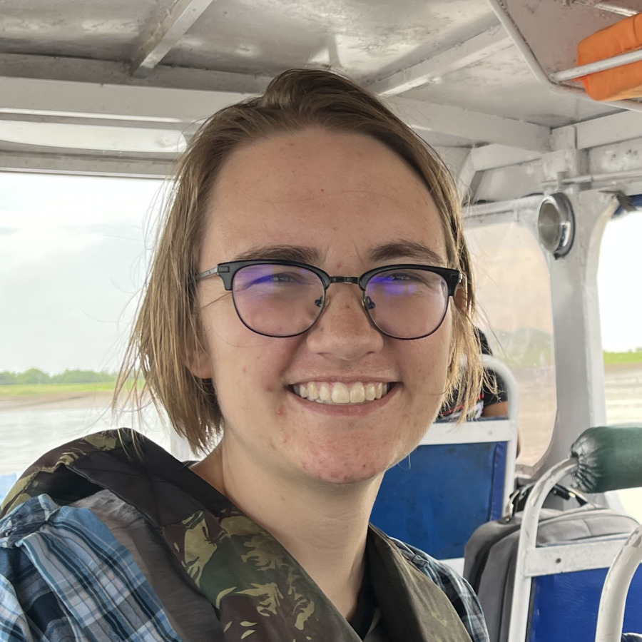

<i>Infer a phylogeny from homologous protein sequences</i>

This workflow is for users who want to infer a phylogeny from homologous protein sequences extracted from anvi&#x27;o genome inputs. It uses the contigs workflow to prepare the underlying contigs databases, retrieves single-copy core genes or other HMM hits from those genomes, aligns the sequences, trims the alignment, and generates a phylogenetic tree that can be used downstream as a phylogeny artifact.

🔙 **[To the main page](../../)** of anvi'o programs and artifacts.

## Authors

<div class="anvio-person"><div class="anvio-person-info"><div class="anvio-person-photo"></div><div class="anvio-person-info-box"><a href="/people/kekananen" target="_blank"><span class="anvio-person-name">Kathryn Kananen</span></a><div class="anvio-person-social-box"><a href="https://bradleylab.science/author/kathryn-kananen/" class="person-social" target="_blank"><i class="fa fa-fw fa-home"></i>Web</a><a href="mailto:kekananen@gmail.com" class="person-social" target="_blank"><i class="fa fa-fw fa-envelope-square"></i>Email</a><a href="http://github.com/kekananen" class="person-social" target="_blank"><i class="fa fa-fw fa-github"></i>Github</a></div></div></div></div>


## Artifacts accepted

The phylogenomics can typically be initiated with the following artifacts:

<p style="text-align: left" markdown="1"><span class="artifact-p">[workflow-config](../../artifacts/workflow-config) </span> <span class="artifact-p">[internal-genomes](../../artifacts/internal-genomes) </span> <span class="artifact-p">[external-genomes](../../artifacts/external-genomes) </span></p>

## Artifacts produced

The phylogenomics typically produce the following anvi'o artifacts:

<p style="text-align: left" markdown="1"><span class="artifact-p">[phylogeny](../../artifacts/phylogeny) </span></p>

## Third party programs

This is a list of programs that may be used by the phylogenomics workflow depending on the user settings in the <span class="artifact-p">[workflow-config](../../artifacts/workflow-config/) </span>:

<ul>
<li><a href="https://github.com/inab/trimal" target="_blank">trimal</a> (Trim multiple sequence alignment)</li><li><a href="https://github.com/Cibiv/IQ-TREE" target="_blank">IQ-TREE</a> (Calculate phylogenetic tree)</li>
</ul>

An anvi'o installation that follows the recommendations on the <a href="https://anvio.org/install/" target="_blank">installation page</a> will include all these programs. But please consider your settings, and cite these additional tools from your methods sections.

## Workflow description and usage


The phylogenomics workflow starts with one or more <span class="artifact-n">[contigs-db](/help/main/artifacts/contigs-db)</span> files and extracts a set of genes defined by HMMs. It then concatenates the recovered sequences, aligns them, trims the alignment, and infers a phylogenomic tree.

The workflow is meant for cases where you want to build a tree from homologous genes already annotated in anvi'o contigs databases. It can use internal genomes, external genomes, or a mix of both, as long as they are provided through the workflow config.

## Required input

The phylogenomics workflow requires a <span class="artifact-n">[workflow-config](/help/main/artifacts/workflow-config)</span> file. You can generate a default config like this:

<div class="codeblock" markdown="1">
anvi&#45;run&#45;workflow &#45;w phylogenomics \
                  &#45;&#45;get&#45;default&#45;config config.json
</div>

The workflow config typically includes:

1. `project_name`, which is used as the prefix for workflow outputs.
2. `internal_genomes` and/or `external_genomes`, which point to the genomes or metagenomes that should be used.
3. Parameters for `anvi_get_sequences_for_hmm_hits`, `trimal`, and `iqtree`.

An example minimal config looks like this:

```json
{
    "workflow_name": "phylogenomics",
    "config_version": "3",
    "project_name": "phylo_project",
    "internal_genomes": "internal-genomes.txt",
    "external_genomes": "external-genomes.txt",
    "anvi_get_sequences_for_hmm_hits": {
        "--return-best-hit": true,
        "--align-with": "famsa",
        "--concatenate-genes": true,
        "--get-aa-sequences": true,
        "--hmm-sources": "Bacteria_71"
    },
    "trimal": {
        "-gt": 0.5
    },
    "iqtree": {
        "threads": 8,
        "-m": "WAG",
        "-bb": 1000
    },
    "output_dirs": {
        "PHYLO_DIR": "01_PHYLOGENOMICS",
        "LOGS_DIR": "00_LOGS"
    }
}
```

The `project_name` is mandatory. The workflow uses it to name the output FASTA, alignment, and tree files.

## Run it

Create a workflow graph first if you want to inspect the plan:

<div class="codeblock" markdown="1">
anvi&#45;run&#45;workflow &#45;w phylogenomics \
                  &#45;c config.json \
                  &#45;&#45;save&#45;workflow&#45;graph
</div>

Then run the workflow:

<div class="codeblock" markdown="1">
anvi&#45;run&#45;workflow &#45;w phylogenomics \
                  &#45;c config.json
</div>

If everything completes successfully, you should end up with a concatenated amino acid FASTA, a trimmed alignment, and a final tree in the phylogenomics output directory.

## Output structure

The workflow writes its main outputs under `01_PHYLOGENOMICS/` by default.

Typical files include:

```text
01_PHYLOGENOMICS/
├── PROJECT-proteins.fa
├── PROJECT-proteins_GAPS_REMOVED.fa
└── PROJECT-proteins_GAPS_REMOVED.fa.contree
```

The intermediate files represent the main stages:

1. `anvi-get-sequences-for-hmm-hits` extracts the target proteins.
2. `trimal` trims the multiple sequence alignment.
3. `iqtree` infers the phylogenomic tree.

Workflow logs are written under `00_LOGS/phylogenomics` by default. Logs are organized by rule name, and the workflow also writes a tab-delimited manifest named `00_LOGS/phylogenomics/phylogenomics-workflow-manifest.tsv` that records whether each job succeeded or failed and points to the relevant rule log.

## Notes

This workflow inherits the contigs workflow, so the same contigs database setup and log organization conventions apply. If you are building your phylogeny from anvi'o HMM hits, the `--return-best-hit` and `--concatenate-genes` settings are usually the important ones to review first.


{:.notice}
Edit [this file](https://github.com/merenlab/anvio/tree/master/anvio/docs/workflows/phylogenomics.md) to update this information.

